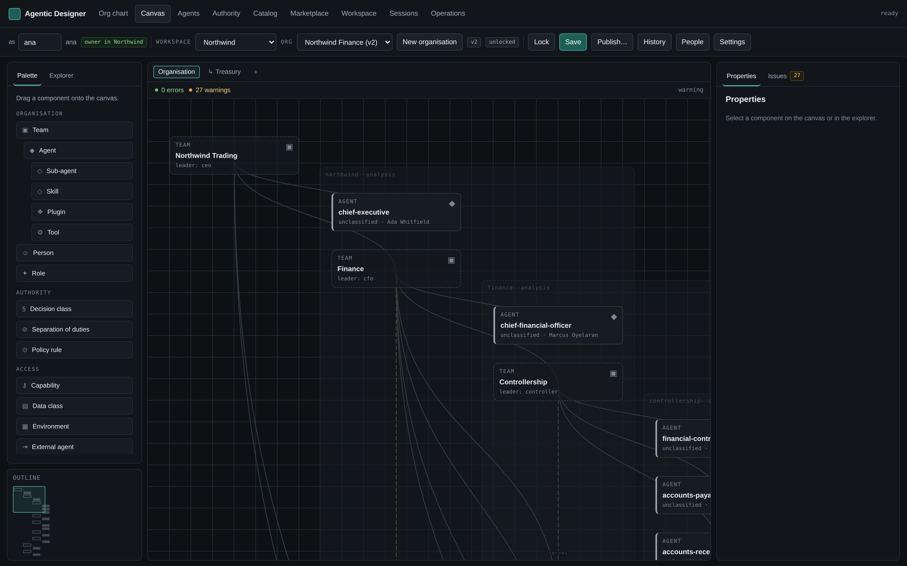
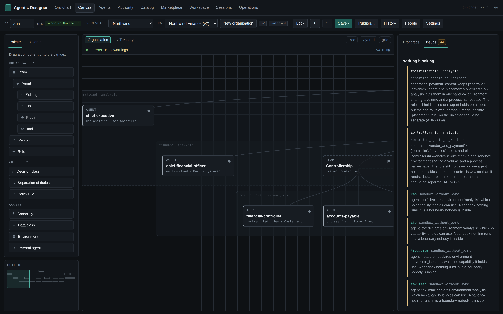
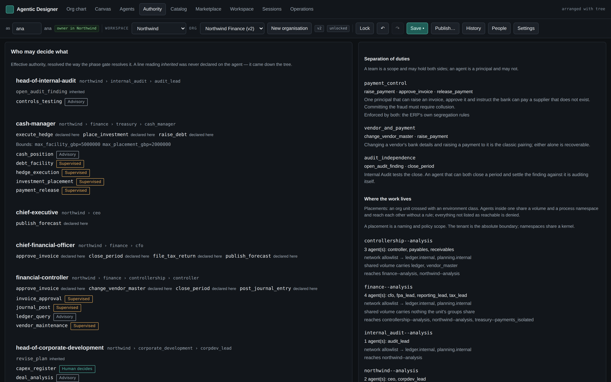
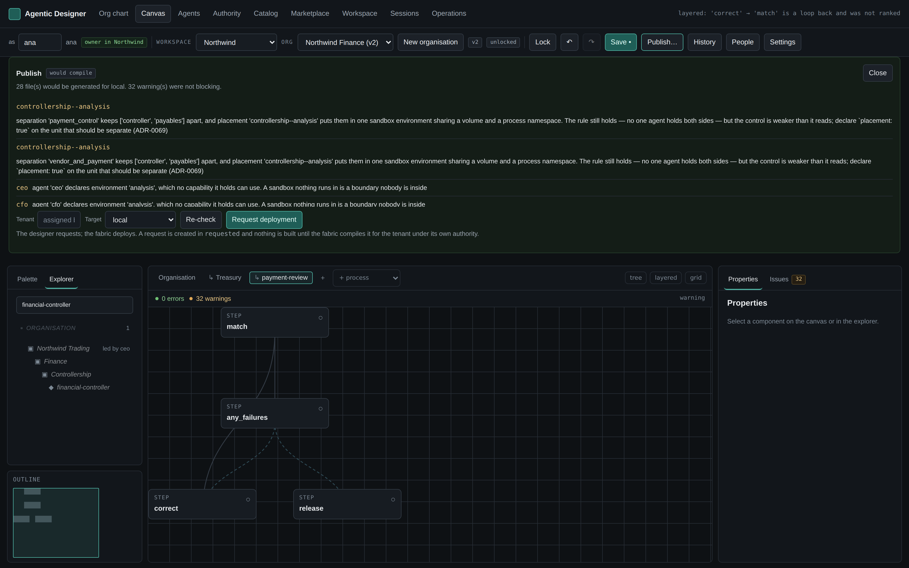

# agent-ai — an agentic system designer and compiler

Define an organization of agents **once, abstractly** — through a UI or an SDK —
then generate the agent code *and* the infrastructure to run it, on a laptop or
in your own cloud account (ADR-0003).

Every agent mirrors a role in the company org chart: it has an accountable human
counterpart, belongs to a team with one leader, delegates down the tree, runs
encoded workflows, and reaches systems of record through an MCP harness — all
under RBAC, data classification, sandbox and approval policy that is **declared
in the spec and compiled into every target**, never improvised per deployment.

The designer has two explicit phases with a **checkable gate** between them
(ADR-0019): you describe the organization abstractly, and only then choose how
it is built.

```
  DEFINITION PHASE                 gate            IMPLEMENTATION PHASE
  ────────────────            ─────────────        ────────────────────
  teams · leaders · roles     orgagents            framework · images · cloud
  responsibilities            phase                MCP servers · workspaces
  capabilities · data classes  ✓ 21 checks         scheduler · secret backend
  environments · policies      ✗ with fixes        region · state backend
  triggers · channels                                      │
  knowledge · lifecycle                                    ▼
  budgets · compliance   ──────────────────────►  IR (resolved once)  ──► targets
      (names no vendor)                            permissions,           local
                                                   identities,            tf:gcp
                                                   fire times,            tf:aws
                                                   routing plans          tf:azure
```

```bash
$ orgagents phase examples/acme/acme.system.yaml --binding examples/acme/acme.binding.yaml \
    --target terraform:gcp
── definition phase ───────────────────────────
  ✓ [def] Every agent has a human counterpart
  ✓ [def] Approvals have a channel to land on
  ✓ [def] Spend is bounded
  …
definition: 21 pass, 0 warn, 0 fail | implementation: 14 pass, 0 warn, 0 fail
ready to compile for 'terraform:gcp': yes
```

Teams nest, and each has exactly one leader agent who is also a member of it —
`examples/acme/acme.system.yaml` is four levels deep:

```
Acme Corp                     leader: ceo         (human: Dana Whitfield)
├── Finance                   leader: cfo         (owner: Priya Raman)
│   ├── analyst               owner: Tom Becker · reviewer: Priya Raman
│   │                         env: analysis · 3 sub-agents · memory: 2 namespaces
│   └── reconciler            owner: Ana Silva · approvers: Ana, Priya
│                             env: isolated_review · long-term memory: off
├── Technology                leader: cto         (human: Iris Nakamura)
│   └── Platform Engineering  leader: platform_lead
│       ├── platform_engineer role: platform_engineer      env: build
│       └── sre               shared service — callable from anywhere
└── Revenue                   leader: cro         ⟷ peer link ⟷ cfo
```

## Quick start

```bash
pip install -e '.[dev]'         # add '[langgraph]' or '[openai]' for real runtimes

# Design → compile → run
orgagents spec validate examples/acme/acme.system.yaml
orgagents spec show     examples/acme/acme.system.yaml       # resolved org at a glance
orgagents targets                                       # what we can generate
orgagents compile examples/acme/acme.system.yaml \
  --binding examples/acme/acme.binding.yaml \
  --target local --target terraform:gcp --out build
cd build/local && make up                               # or `make single`

# Or explore the runtime directly
orgagents seed && orgagents serve                       # UI on localhost:8000

# Phase gate, scheduling and governance
orgagents phase    examples/acme/acme.system.yaml --binding examples/acme/acme.binding.yaml \
                   --target terraform:gcp    # definition + implementation readiness
orgagents schedule examples/acme/acme.system.yaml --simulate-days 7
orgagents catalogs models                    # the approved model shelf
orgagents records  validate                  # ADR/WS graph integrity
pytest                                       # the whole suite, no network or API keys

# Design in a browser: drag-and-drop canvas, multi-user, with history
orgagents serve      # then open http://localhost:8000/ui/#/canvas
```

### The worked examples

`acme` exercises every field the spec has. The other four are organisations,
each built around a different family of control — and each is validated and
compiled by the test suite, so a broken one breaks the build rather than
waiting to be copied.

| Example | The organisation | The control it exists to exercise |
|---|---|---|
| [`northwind.finance`](examples/northwind/northwind.finance.system.yaml) | A CFO function: controllership, treasury, FP&A, tax, internal audit | Segregation of duties over a payment — raise, approve and release are three principals, and internal audit does not report to the CFO |
| [`meridian.lending`](examples/meridian/meridian.lending.system.yaml) | A consumer lender under three lines of defence | A declined applicant has a statutory right to a human, so `adverse_decision` is held by a person and no agent may claim it. Financial-crime casework is unreachable from the business the alert is about |
| [`lumiere.beauty`](examples/lumiere/lumiere.beauty.system.yaml) | A beauty and salon products company | What an agent may *say*: a cosmetic claim is legal and a medicinal one is not, and a reported reaction must never be closed with a refund |
| [`northbeam.marketing`](examples/northbeam/northbeam.marketing.system.yaml) | A marketing function | Consent as a legal basis rather than a preference, and measurement that cannot grade its own campaigns |
| [`sentinel.secops`](examples/sentinel/sentinel.secops.system.yaml) | A security operations centre | An agent in **two sandboxes** — triage in `analysis`, malware detonation in an offline `detonation` range (ADR-0082) — and every agent authored with its own **instructions** (ADR-0083) |
| [`helios.pharma`](examples/helios/helios.pharma.system.yaml) | A clinical-stage pharma company: R&D, clinical, manufacturing, regulatory, commercial | The large one — four levels deep, 13 agents, **three multi-sandbox** (patient data stays in an offline `phi_enclave`), a scoped sub-agent, and a trial readout as a mission. Passes the **phase gate** under a production platform policy |
| [`atlas.bank`](examples/atlas/atlas.bank.system.yaml) | A multinational universal bank: consumer, markets, banking, risk, financial crime, audit, technology | The largest, and the **feature-coverage** example — it exercises *every* top-level block. Five levels, the three lines of defence, information barriers as separations, three multi-sandbox agents. Compiles to **Google ADK on Gemini** (`adk`) and to **GCP** (`terraform:gcp`) |

```bash
orgagents spec show examples/meridian/meridian.lending.system.yaml
orgagents compile   examples/lumiere/lumiere.beauty.system.yaml --target local --out build

# One design taken the whole distance — validate → IR → compile → run —
# showing the multi-sandbox and instructions features end to end:
PYTHONPATH=src python3 examples/sentinel/end_to_end.py

# The larger walk-through: the pharma design through the phase gate (against a
# platform policy and binding), compiled to three targets, and run:
PYTHONPATH=src python3 examples/helios/end_to_end_pharma.py

# The largest: a multinational bank that uses every feature, deployed to
# Google Cloud on Gemini (the `adk` and `terraform:gcp` targets):
PYTHONPATH=src python3 examples/atlas/end_to_end_bank_gcp.py
```

Open <http://localhost:8000/ui/> for the **Agentic Designer**: org chart,
agent/harness designer, marketplace, session traces and the operations console.

## Three planes

The platform is three applications, not one (ADR-0049):

| Plane | Owns | Who uses it |
|---|---|---|
| **Designer** | System Specs, canvas, catalog — authoring an agentic organization | Designers |
| **Fabric** | Tenants, isolation, deployments, common services, operations | Platform operators, via the command centre |
| **Tenant** | A designed organization actually running, in its own infrastructure | Nobody logs in; it does the work |

A design is not a deployment — publishing is a *request* to the fabric.
Operator and designer are different principals in both directions: an operator
can stop, quarantine or re-deploy a tenant but never edit its organization.
Isolation belongs to the fabric, not the design, so a spec carries no tenancy
and stays portable (ADR-0050).

The whole system, with diagrams: **[docs/ARCHITECTURE.md](docs/ARCHITECTURE.md)**.

## Running the designer in Docker

```bash
docker compose up --build                    # UI at http://localhost:8000/ui/
ORGAGENTS_SEED=1 docker compose up --build   # ...with the demo organization
```

This is the **designer application** — the workshop you build agentic systems
in. It is not the Compose stack the compiler *generates* for a system you
design (`orgagents compile --target local`); those are separate artifacts and
are not meant to be merged. State lives on a `/data` volume, the container runs
as a non-root user, seeding is opt-in and first-start only, and the trigger
scheduler sits behind a Compose profile because unattended execution should be
something you asked for. Anything that is not `serve` is passed to the CLI, so
`docker compose run --rm designer spec validate examples/acme/acme.system.yaml`
works from the same image. Details and limits: **[docs/DOCKER.md](docs/DOCKER.md)**,
ADR-0048.

**The image has not been built or run here** — there is no Docker daemon in the
environment it was written in. `tests/test_docker_assets.py` keeps the assets
from drifting from the application, but that is not the same as a successful
`docker build`.

## The designer

[](docs/images/designer-canvas.png)

*The designer. **Diagram tabs** across the top — one model, many diagrams,
and a `↳` marks one that is a drill-down of a single unit. Below them the four
views.**Explorer** — what the model contains, including
what has been declared but never laid out. **Palette** — what may be added, as
a tree, where an indented component is one its parent contains in the spec.
**Outline** — the whole diagram with the viewport on it. **Properties** — what
the selection says, with the Issues tab beside it. On the canvas: teams and
agents as the spec defines them, dashed **placement regions** behind the nodes
(ADR-0069), edges derived from the spec rather than stored, containment drawn
apart from association (ADR-0081), and live validation.*

| | |
|---|---|
| [](docs/images/designer-issues.png) | [](docs/images/designer-authority.png) |
| **Issues** — one finding per problem, each naming the rule that fired and the component it is about; clicking the name takes you to it on the canvas. | **Authority** — what each agent may *decide*, resolved the way the phase gate resolves it, with autonomy postures, separation rules, placements and people. |

| | |
|---|---|
| [](docs/images/designer-publish.png) | |
| **Publish** — validate, compile, request. The verdict names the stage, and the refusal is the deliverable. | |

There is also the [org chart](docs/images/designer-org-chart.png).

> Captured from the running application with a real browser, against the worked
> finance example in `examples/northwind/northwind.finance.system.yaml`. Regenerate them
> with `scripts/screenshots.py`; drive the UI with
> `scripts/interaction_check.py`, which drags a component off the palette,
> edits its form, moves a node and saves; and `scripts/concurrency_check.py`,
> which runs two people at once through the locks, the three-way merge and
> breaking a lock.
> Between them those scripts found six defects that 1,400 passing tests did
> not — one data loss on every keystroke, one a 500 that ate a save — and
> established that locking and conflict resolution are correct. See
> `docs/DESIGNER.md`, which also records the one gap they could not close: a
> person is not told when their lock is taken.

`http://localhost:8000/ui/#/canvas` is a drag-and-drop canvas: drop a **Team**,
drop **Agents** onto it, fill in the inspector forms, and watch validation
update as you work. Edges are **derived from the spec**, so the picture cannot
disagree with what would compile, and **layout never enters the spec** — moving
a box does not change a byte of the design (ADR-0034).

Behind it is a service, not a browser (ADR-0031). Many systems, many
workspaces, and persistence you choose: **JSON files** laid out for git, a
**relational** store, or **memory** for previews. Every write captures an
immutable revision, so history and restore come free.

Several people can work on one design (ADR-0032, ADR-0033):

- five workspace roles — viewer, reviewer, editor, admin, owner — deny by
  default, with every refusal naming the role and the missing permission;
- **advisory, expiring locks** at system or component scope, so two people can
  edit different agents at once and an abandoned tab unfreezes itself;
- **optimistic versions plus a three-way structural merge**: independent edits
  to a design merge silently, and the same field edited twice produces a
  conflict with both values and a choice — never a guess, never a silent loss.

## Landscape

[docs/LANDSCAPE.md](docs/LANDSCAPE.md) analyses what comparable systems do well
— OpenClaw's channel gateway, Microsoft's Agent 365 registry and per-agent
identity lifecycle, Claude Cowork's scheduled tasks, Agency Swarm's directional
flows, LangGraph's durable execution, and 2026 human-in-the-loop practice —
with a capability matrix, the gaps it exposed, and an explicit list of what we
**decline** (consumer messengers, mesh topology, one identity provider, a
hosted-only control plane, unbounded spend). Seven decisions came out of it:
ADR-0019 through ADR-0025.

A second pass read the three frameworks our adapters target — the **OpenAI
Agents SDK**, **deepagents** and **Agency Swarm** — for primitives we had not
modelled. It found four: guardrails on what may *pass* (we only governed what
an agent may *reach*), context management (offloading large tool results and
compacting long threads), checkable output contracts, and shared operating
instructions. ADR-0035 through ADR-0038. A planning primitive, OpenAPI-derived
tools and voice as a modality are recorded as backlog, not built.

## Decisions and delivery

Architecture is recorded, not remembered (ADR-0001). Sixty-one decision records
and thirty-one workstream records, machine-validated in CI:

- [docs/decisions/index.md](docs/decisions/index.md) — **ADRs**: why, who, what,
  where, how, when, advantages *and* disadvantages, with statuses, semver,
  changelogs and explicit supersession.
- [docs/workstreams/index.md](docs/workstreams/index.md) — **WS records**: the
  delivery side, owned and dated, cross-linked to the decisions they implement.

`orgagents records validate` fails the build on a dangling reference, an
asymmetric supersession, a missing section or a changelog that disagrees with
its version. Two decisions were already corrected and versioned by writing the
implementation: [ADR-0006 v1.1.0](docs/decisions/ADR-0006-recursive-teams-with-leader-agents.md)
(implicit parent-team participation) and
[ADR-0008 v1.1.0](docs/decisions/ADR-0008-deny-by-default-rbac-with-policies.md)
(the explicit `unless` guard).

## What the platform gives you

| Capability | Where |
|---|---|
| Implementation-neutral System Spec + bindings | `spec/`, [docs](docs/SPEC.md) |
| Two-phase designer with a mechanical gate | `phases.py` |
| Scheduling, event, webhook and message triggers | `scheduling.py`, `runtime/scheduler.py` |
| Human channels: Teams, Slack, mail, SLA, escalation | `humans.py` |
| Channel bridge port + Mattermost adapter, clickable approvals | `channels/` |
| Task intake: a task port, a local backend, a conformance suite | `tasks/` |
| A2A over the governed endpoint path | `runtime/a2a.py` |
| Per-tenant NATS/JetStream bus and its inbound worker | `bus.py`, `runtime/bus_worker.py` |
| Evaluation runner and the `evaluations_passed` gate | `evaluations.py` |
| IR diffing: widening vs narrowing, ranked by consequence | `compiler/diff.py` |
| Pluggable sandbox providers with written boundary statements | `sandboxes/` |
| Generated agent registry for the whole fleet | `compiler/registry.py` |
| Lifecycle stages, promotion gates, evaluations, budgets | `spec/model.py` |
| Knowledge grounding sources | `spec/model.py`, `compiler/ir.py` |
| Many-to-many human pairing in named roles | `spec/model.py`, `compiler/registry.py` |
| Sub-agents callable as tools, narrow-only | `runtime/subagents.py` |
| Two-tier memory: session + governed long term | `memory.py` |
| Skills, plugins, wrapper tools, external endpoints | `spec/model.py`, `compiler/ir.py` |
| Guardrails on input, output and tool boundaries | `guardrails.py` |
| Context compaction and an artifact workspace | `context.py` |
| Drag-and-drop canvas designer | `web/canvas.js`, `designer/` |
| Multi-user designer: RBAC, locks, three-way merge | `designer/` |
| Pluggable designer persistence: files, relational, memory | `designer/repository.py` |
| Missions — short-lived teams with a leader and an end date | `spec/model.py` |
| Per-agent approved-model policy, enforced at compile time | `catalogs/service.py` |
| Platform catalog: models, MCPs, templates, permission sets | `catalogs/` |
| Spec validation incl. least-privilege rules | `spec/validate.py` |
| Two-phase compiler: spec → IR → target plugins | `compiler/` |
| Local target: Compose stack + single-process mode | `compiler/targets/local.py` |
| Terraform targets: GCP, AWS, Azure + mapping reports | `compiler/targets/terraform.py` |
| Deny-by-default RBAC, policies, auditable decisions | `security/rbac.py` |
| ADR / workstream records with validation and indexes | `records.py`, `docs/` |
| Org hierarchy, delegation and escalation rules | `org.py` |
| Agent, harness, session and catalog models | `models.py` |
| Private / protected / public data planes with ACLs | `data/planes.py` |
| MCP mounting (stdio, http, in-process) | `harness/mcp.py` |
| Relational DB access with SQL policy + column masking | `harness/relational.py` |
| Eight reviewed sandbox environment templates | `harness/sandbox.py`, [docs](docs/SANDBOX_TEMPLATES.md) |
| Toolset assembly, approval gates, prompt composition | `harness/builder.py` |
| Declarative LangGraph workflows + reference library | `workflows/` |
| Runtime adapters: deep agents, OpenAI Agents SDK, LangGraph, echo | `runtime/adapters.py` |
| Sessions with URLs, traces and delegation trees | `sessions.py` |
| Direct tool calls + Slack/Teams/email/bus messaging | `messaging.py` |
| Catalog with marketplace search, install and ratings | `catalog.py` |
| Logging, tracing, metrics, alerting | `observability.py` |
| REST API + designer UI | `api.py`, `web/` |

## Design in one page

**The spec is the source of truth.** One document describes the system in
capability terms; a binding says how each capability is realized for one target.
A test walks the spec schema and fails if a vendor, SDK or provider name leaks
into it, so neutrality is enforced rather than intended (ADR-0004).

**Everything is resolved exactly once.** Phase 1 turns the spec into an IR:
team inheritance, role expansion, effective permissions, environment narrowing,
delegation edges and one workload identity per agent. Phase 2 targets may only
render that IR — a test asserts no target imports the spec package, so the
permissions Terraform grants cannot drift from the ones the runtime enforces
(ADR-0005).

**Teams nest, with one leader each.** A leader is a member of the team it leads
and participates in its parent implicitly. Delegation follows the tree; declared
peers go sideways; shared services are callable from anywhere; everything else
escalates (ADR-0006).

**Roles carry accountability and authority together.** Responsibilities,
capabilities and permissions are one contract, so the prompt cannot describe
work the agent has no permission to do. A capability nobody's responsibility
mentions is a warning (ADR-0007).

**Security is deny-by-default and narrow-only.** Deny wins and cannot be
overridden; inheritance only narrows, leaders included; wildcards are errors in
production; every decision names the rule that produced it. Cloud IAM is derived
from the same resolved set, and where a provider's IAM is coarser, the target
says so in `MAPPING.md` rather than hiding it (ADR-0008, ADR-0012).

**Unattended work is designed, not bolted on.** A trigger — cadence, event,
webhook or inbound message — is a spec object carrying its own overlap,
catch-up, retry, escalation and delivery policy. Two invariants: a triggered
run has exactly the owning agent's identity and permissions (the scheduler
holds no credentials), and unattended work must report somewhere a human looks
(ADR-0020).

**Human contact is a contract, not a boolean.** A channel declares what it is
for, when its people are available, how long they have, who is tried next, and
what data it may never carry. An approval requested at 03:00 queues to 09:00,
escalates to the CFO at 10:00 and to the CEO at 13:00 — computed, not hoped
for. One bridge per channel holds the workspace credential, so a compromised
agent cannot post as the company (ADR-0021).

**An agent answers to people, plural.** Pairing is many-to-many and role-typed
— owner, approver, reviewer, escalation, operator, stakeholder — with exactly
one accountable owner and an approver for every gated action, so a holiday does
not stop the organization. The registry answers both "who owns this agent" and
"what is this person on the hook for" (ADR-0026).

**Sub-agents are tools, not hires.** `research`, `review`, `verify`,
`critique` and friends are declared inline, exposed as `subagent_<id>`, and run
under the parent's identity with a **subset** of its access. No reporting line,
no human of their own, no session, no memory beyond the call. Naming nothing
means reaching nothing (ADR-0027).

**Memory is two-tiered and governed.** Session memory is short term, private
and always expires. Long-term memory lives in classified namespaces with a
sharing scope, so who can recall what follows the same rules as who can read
what. The bridge is **promotion** — allowed by policy, permitted by the
namespace's classes, optionally approved by a human — so what an agent knows
permanently is deliberate rather than accidental (ADR-0028).

**Tools grant nothing.** Capabilities and endpoints grant access; skills
instruct; a tool is a named, narrowed wrapper over something already held, and
inherits its target's approval gate. If a spec line widens what an agent can
reach, it is reviewed as access (ADR-0029). External agents are trust-classified
endpoints: public data only may leave, and their answers are marked as data to
check, never instructions to follow (ADR-0030).

**Guardrails govern what may pass.** Permissions decide what an agent may
reach; guardrails decide what may leave it. Named checks — secrets, PII,
injection, data class, URL allowlist, length, shape — at four boundaries, with
four actions: block, redact, flag, escalate. Enforced **outside** the agent
loop, so a jailbroken prompt never reaches the check, and system guardrails can
be added to by an agent but never removed (ADR-0035).

**Long runs stay affordable.** Tool results over a threshold are written to a
declared **artifact store** and replaced by a reference the agent can read
back; past a token threshold, older turns compact while recent ones stay
verbatim — and compaction that would not actually save tokens is refused
(ADR-0036).

**The org chart is slow; missions are not.** A mission is a short-lived team
drawn from the standing organization: an objective, deliverables, a leader, and
always an end date — a mission that never ends is a reorganization and is
refused. Members keep their home team and their own permissions. Roles assigned
to a mission are **intersected** with what each member already holds, so a
mission can never be a permission side-door, and lateral reach never lets
someone task their own leader (ADR-0039). The reach a mission lends **expires
with it**: each member's mission peers are compiled together with the window
they are good for, and the runtime re-checks that window on every delegation,
so a mission left open past its end date confers nothing. `orgagents missions
<spec> list` shows each window's state and `... sweep` closes the records that
are over.

**Every agent is limited to approved models.** The spec asks for a *class* —
`frontier_reasoning`, `balanced`, `fast_cheap`, `long_context` — with
constraints on cost, context, region and whether the vendor trains on submitted
data. The **catalog** says which concrete models qualify. The compiler refuses
the build if the binding picks one outside the policy, and the refusal lists
what would work instead (ADR-0040).

**One governed catalog feeds the designer.** Models, MCP servers, plugins,
tools, environment templates, permission sets, guardrails and knowledge sources
— each with an owner, an approval status and entitlements. Only approved
entries are selectable; retiring one invalidates it everywhere at once
(ADR-0041).

**The fleet has a registry.** Every target generates `REGISTRY.md`: each agent
with its owner, identity, permissions, environment, triggers, channels and
budget, plus review flags naming unowned agents and unbounded spend (ADR-0022).

**Agents are org-shaped at runtime too.** `OrgChart.can_delegate` enforces the
same routing rule the spec declares: delegate down your own subtree, call
registered peers laterally, escalate up your chain, call shared-service agents
from anywhere.

**Every agent has a human.** `HumanCounterpart` carries the accountable person,
their notification channels, and the tool names that must stop for approval.
`ask_human` pauses the session (`waiting_human`) and notifies; `resume` picks it
back up with the decision recorded in the trace.

**Data lives in three planes.** Private (one agent), protected (a group),
public (org-wide, any agent may contribute). `DataPlanes` resolves the caller's
`DataGrant`s against each record and raises `AccessDenied` rather than silently
returning nothing, so refusals are visible in the trace.

**The harness is the governed unit.** Model, MCP mounts, relational grants,
data grants, tool approvals, budgets and sandbox — one reviewable object the
designer UI edits. `HarnessBuilder.build` turns it into callables; policy is
enforced there, so every runtime obeys the same rules.

**Databases are reached through MCP, never credentials.** A `RelationalGrant`
fixes the connection, reachable tables, allowed statement classes, row limit and
masked columns; `RelationalMCP` enforces them and exposes `list_tables`,
`describe_table` and `query`.

**Work happens in sandbox templates.** Eight published templates span reasoning,
analysis, software engineering, browser automation, documents, GPU training,
regulated clean rooms and integration. Agents instantiate a template and may
only *narrow* it. See [docs/SANDBOX_TEMPLATES.md](docs/SANDBOX_TEMPLATES.md).

**Processes that must be auditable are encoded.** Workflows are declarative
graphs (`tool`, `agent`, `workflow`, `human`, `branch`, `transform` nodes) that
compile onto LangGraph when installed, and run on a built-in interpreter
otherwise — so the same definition is testable without a model.

**Everything is catalogued.** Agents, skills, plugins, workflows, sandbox
templates and shareable sessions publish into one marketplace with
visibility-aware search, install, and ratings.

Further reading: [docs/SPEC.md](docs/SPEC.md) ·
[docs/ARCHITECTURE.md](docs/ARCHITECTURE.md) ·
[docs/DESIGNER.md](docs/DESIGNER.md) ·
[docs/SANDBOX_TEMPLATES.md](docs/SANDBOX_TEMPLATES.md) ·
[decisions](docs/decisions/index.md) · [workstreams](docs/workstreams/index.md)

## Runtimes

The agent definition is framework-neutral. Pick per agent via
`harness.runtime`:

- `langchain_deepagents` — LangChain deep agents (planning, virtual FS, sub-agents)
- `openai_agents_sdk` — OpenAI Agents SDK (`Agent` + `Runner`, handoffs as delegation)
- `langgraph_native` — a LangGraph ReAct loop
- `echo` — deterministic, no model call; used by the test suite and the
  designer's **Dry run**, which verifies wiring rather than model quality

Adapters import their framework lazily, so a deployment installs only what it uses.

## Status

Implemented and tested end to end: the record layer, the spec and its
validators, the compiler and IR, the local and three Terraform targets, the
RBAC engine, and loading a compiled system into the runtime — the whole suite
runs with no network and no API keys.

Tenancy is enforced by construction: the same spec compiled for two tenants
shares no identifier, volume, network, identity or secret reference, and each
target's `MAPPING.md` names what actually enforces the boundary there — a
per-tenant Compose project and networks locally, a project/account/subscription
per cloud provider — and says where that is coarser than the model claims.
**The prefix prevents collisions; it is not an access control**, and nobody has
attempted a breach against a running tenant (WS-028 M6).

The outstanding work is listed in **[docs/ROADMAP.md](docs/ROADMAP.md)**,
ordered, each item mapped to the workstream milestone that owns it.

Known gaps, tracked in the workstreams rather than glossed:

- **Evaluations run, on the `echo` adapter.** The declared cases are executed,
  results recorded and the gate answered (ADR-0060). "Never run" and "stale"
  are kept distinct from "failed", and a prose expectation is reported
  unverifiable rather than judged — there is no LLM judge here. What an echo
  run proves is the wiring, not whether a real model would have passed.
- **Channels reach a bridge, not a chat server.** There is a bridge port, an
  approval ledger that refuses stale, replayed, cross-tenant and unexpected
  callbacks, and a **Mattermost** adapter over an injected transport
  (ADR-0061). A bridge that cannot deliver an authenticated callback may not
  bind `approve` at all — reading the word "approve" out of chat text is not
  offered as a fallback. None of it has met a Mattermost server, and there is
  still no Slack or Teams client.
- **`freshness_seconds` on knowledge sources is declared but unenforced**
  (WS-015 M4), and step-level checkpointing is honoured only by the LangGraph
  adapter (ADR-0025).
- **Memory recall is token overlap, not embeddings.** It misses paraphrases and
  will return the wrong memory often enough to matter; embedding-backed recall
  is WS-018 M4. This is the honest limit of the memory feature today.
- **A2A is bound, and has never called a real peer.** The JSON-RPC binding
  with `SendMessage`, `GetTask`, `CancelTask` and agent-card discovery sits
  *beneath* the existing endpoint governance, so tenant, egress,
  classification, credential, approval and the tool-output guardrail all run
  before the transport is touched (ADR-0058). An agent card is untrusted data
  and changes nothing; `input-required` and `auth-required` go to a human, with
  no code path that forwards a credential to satisfy a remote prompt; the one
  credential waiver is a body-less fetch of a public card. gRPC, REST,
  streaming and the rest of the operation set refuse rather than guess a wire
  shape. Inbound endpoints — other organizations calling our agents — remain
  unaddressed, and the default is that no agent is exposed (WS-019 M5).
- **Work assigned by people reaches agents through a port, with no product
  behind it.** `TaskPort`, a local reference backend, a conformance suite,
  one-run-per-task with the session id written back, and divergence that is
  reported and never silently reconciled (ADR-0057). A backend that cannot give
  an agent its own principal is refused at bind time rather than worked around
  by borrowing a person's credentials. No real task service has been spoken to.
- **The message bus is generated, not started.** NATS with JetStream, one
  broker per tenant, tenant-prefixed subjects, and an inbound worker that
  re-runs the org-chart check because receiving on a subject is not proof the
  sender was allowed to send (ADR-0059). `nats-py` is not a dependency: the
  client is injected and the tests use a fake. The NATS service is generated
  into the Compose stack and parsed; no broker has ever run.
- **Human pairings name individuals and rot.** Nothing detects a departed
  employee still listed as an approver until directory integration lands
  (WS-016 M4).
- **Guardrail detection is pattern-based**, so it both misses real cases and
  fires on innocent ones; model-backed classifiers are WS-024 M5. Injection
  detection by phrase list is a trace signal, not a defence.
- **The default summarizer does not summarize** — without a model it keeps the
  first and last turns and counts the rest (WS-024 M5), and output-contract
  violations are recorded rather than retried (WS-024 M6).
- **The OIDC token verification is hand-rolled.** `PyJWT` and `cryptography`
  are both unimportable in this environment (a broken `_cffi_backend`), so
  RSASSA-PKCS1-v1_5 was implemented directly against `hashlib`. It is RSA-only
  — no EC or EdDSA — and hand-written signature verification in an auth path is
  not what you want in production. Replace it with a vetted library before
  anyone relies on it (ADR-0047). Header identity remains available as an
  explicit `trusted_proxy` mode, not a silent fallback.
- **Closing finished missions is manual** — expiry is enforced on every
  delegation, but nothing runs `missions sweep` on a schedule, so a stale
  `active` record misreports the organization until somebody closes it
  (WS-025). Missions are also not yet editable on the canvas (WS-025 M5) and
  success criteria go unverified (WS-025 M6).
- **Catalog figures go stale**: model pricing, context windows and regions are
  typed in, not fetched, so a cost ceiling can check an out-of-date number
  (WS-027 M6). Non-Anthropic model entries ship as proposals an operator must
  complete, rather than as guessed figures.
- **Terraform is generated but not applied or `terraform validate`-ed here** —
  the binary is not installed in this environment, so the tests check
  identifier validity and block balance instead. Real `plan`/`apply` against a
  scratch account is WS-007's exit criterion, and the provider mappings are
  first-cut.
- **The designer's *design* views now edit the spec** — org chart, agent
  editor and workspace read and write the System Spec the canvas owns, so a
  form edit and a canvas move are the same edit. Sessions and operations stay
  runtime-backed deliberately: they are observations of something running, and
  putting them on the spec would make them lie. SDK parity is still open.
- **The deep-agents and OpenAI Agents SDK adapters** are thin, lazily imported
  bindings needing their optional dependency and provider credentials; only the
  `echo` adapter is exercised in CI (WS-008 M3).
- **Compose cannot represent cloud IAM or real network policy**, so a local run
  does not verify those controls — stated in the generated README, not implied
  away (ADR-0011).
