# Architecture

This is the whole system in one document: what the planes are, what flows
between them, and where the load-bearing decisions sit. Every claim here is
anchored to an ADR; where the implementation is thinner than the design, this
document says so rather than describing the intent as if it were the state.

Diagrams are Mermaid and render on GitHub.

---

## 1. The three planes

The platform is not one application. It is three, with different jobs,
different access control and different failure domains (ADR-0049).

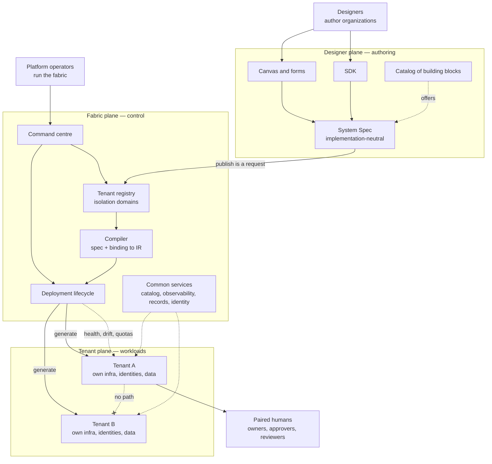

Three rules make the separation structural rather than decorative:

- **A design is not a deployment.** Publishing from the designer is a request
  to the fabric, which decides whether, where and for whom it runs.
- **Operator and designer are different principals**, in both directions. An
  operator can stop, quarantine or re-deploy a tenant; it cannot edit the
  tenant's organization. A designer cannot see across the tenant boundary.
- **Isolation belongs to the fabric, not the design** (ADR-0050). A spec never
  declares its own tenancy, so it stays portable and a tenant cannot widen its
  own boundary by editing a design.

> **State of play.** The designer plane is built and tested. The fabric plane
> is recorded (ADR-0049/0050/0051) with the tenancy core and operational model
> under construction in WS-028 and WS-030. The command centre (WS-029) is not
> started. No tenant has ever been deployed from here: there is no cloud
> account and no container daemon in the development environment.

---

## 2. The spine: spec → IR → artifacts

Everything the platform does passes through one pipeline. The spec is
implementation-neutral; vendors appear only in the binding; permissions resolve
exactly once, into the IR; every target reads the IR and nothing else
(ADR-0002, ADR-0003, ADR-0005).

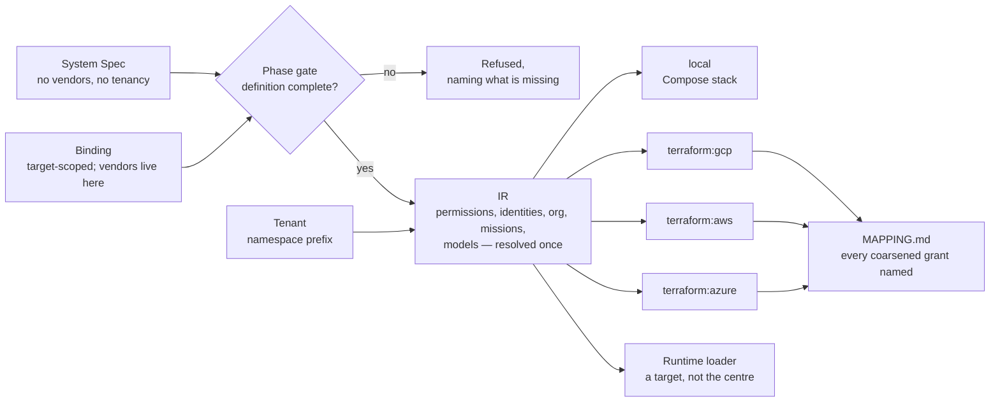

Why it matters that resolution happens **once**: the Terraform a cloud applies
and the permissions the runtime enforces are derived from the same resolved
structure, so they cannot drift into disagreeing about who may do what. A test
asserts no target module imports `orgagents.spec`.

### The two phases

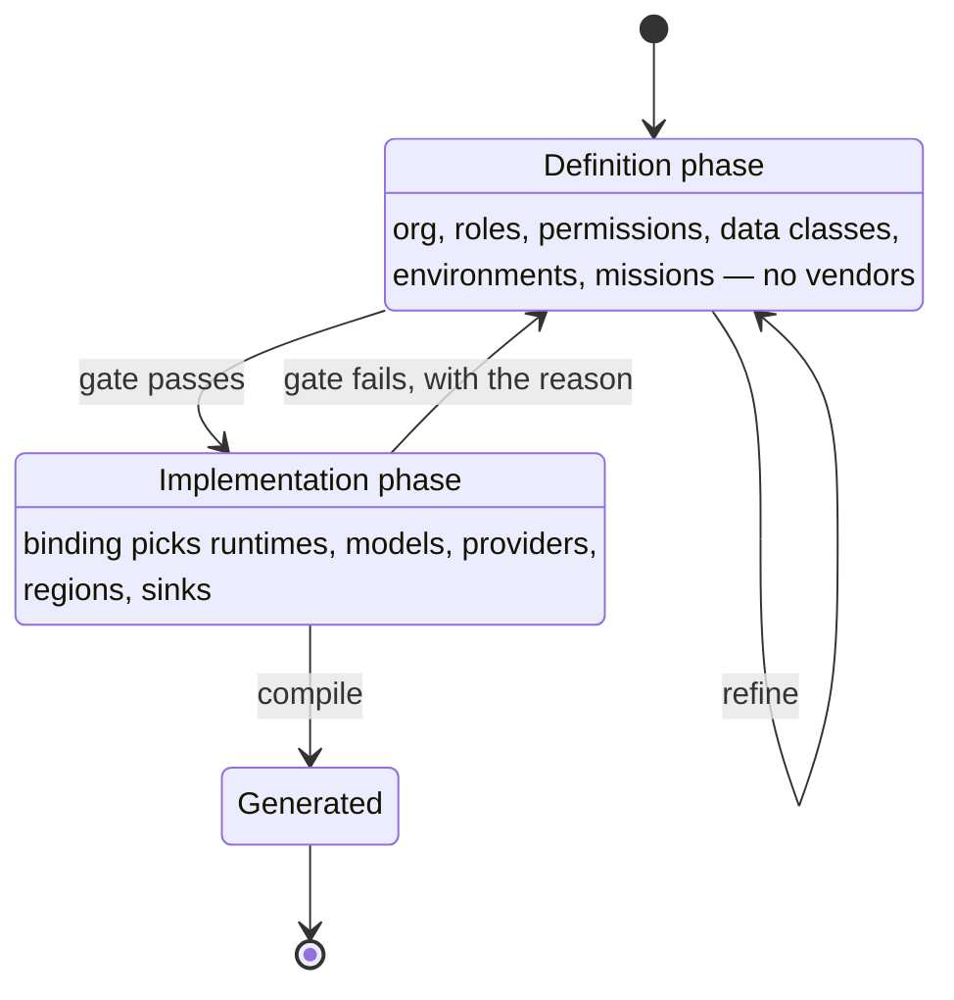

A definition that is incomplete cannot be compiled, and the refusal names what
is missing rather than emitting something half-bound (ADR-0019).

---

## 3. The organization model

Slow-changing structure, fast-changing work.

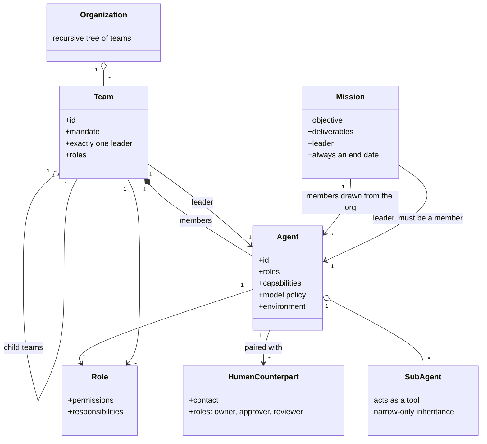

- **Every team has exactly one leader**, and a child team's leader participates
  in the parent implicitly through leadership rather than by double
  membership (ADR-0006).
- **A mission is a short-lived team** drawn from the standing organization,
  with an objective, deliverables and always an end date. Roles assigned to a
  mission are *intersected* with what members already hold, so a mission can
  never be a permission side-door, and lateral reach never lets someone task
  their own leader (ADR-0039).
- **Sub-agents are tools, not org members.** They have no reporting line, no
  human counterpart, no session and no memory of their own, and inherit only a
  narrowing of the parent's authority (ADR-0027).

### A mission's reach expires

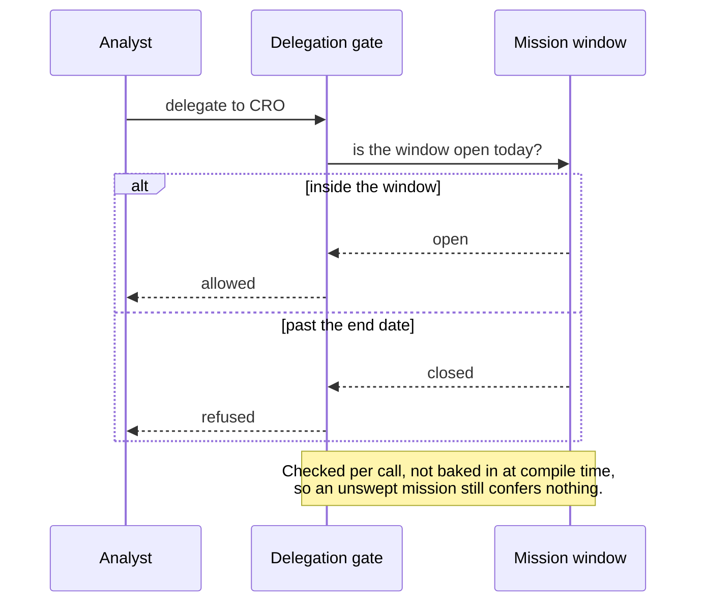

---

## 4. Security: how a permission is decided

Deny by default, narrow-only inheritance, and an explicit guard rather than an
ambiguous one (ADR-0008).

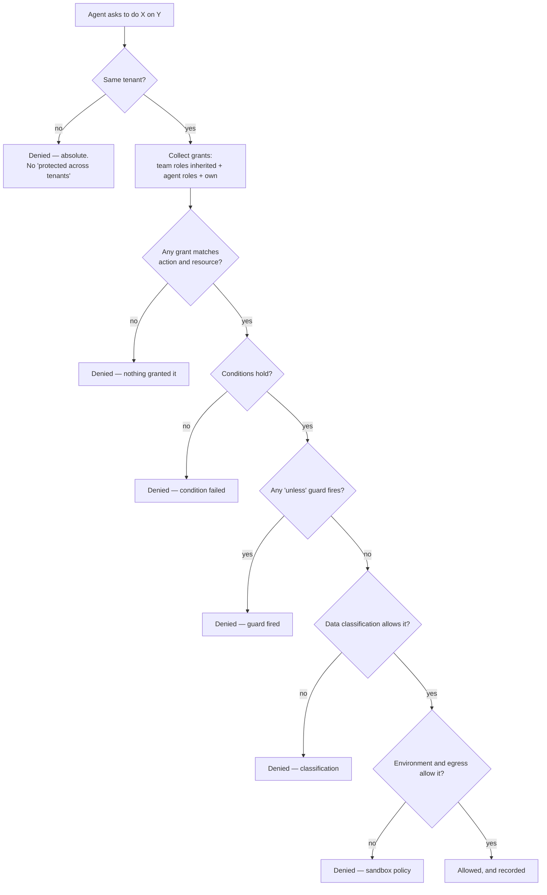

Inheritance only ever narrows: a child team cannot hold more than its parent,
and a mission cannot grant what a member lacked. Ambiguity on a deny fails
unsafe, which is why the `unless` guard is explicit (ADR-0008 v1.1.0).

---

## 5. An agent at runtime

What actually surrounds the model call.

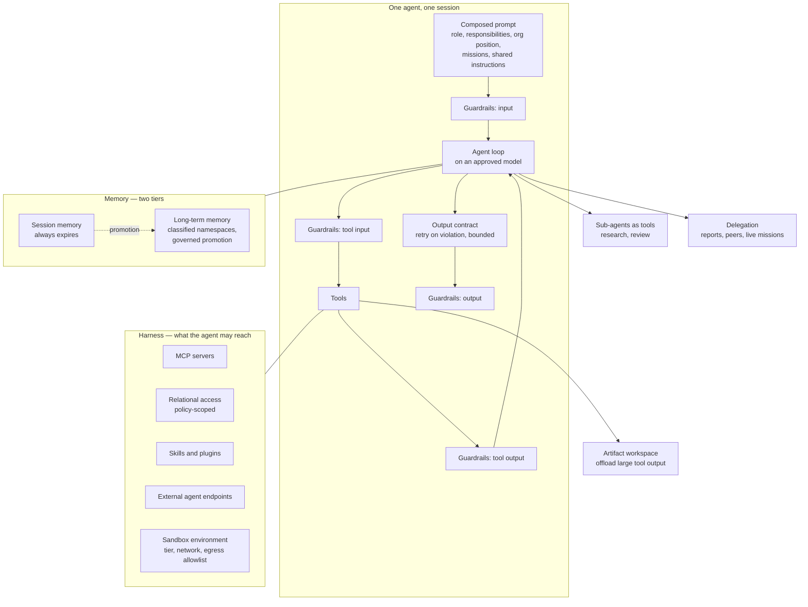

Guardrails run **outside** the agent loop, at four boundaries, so a compromised
prompt cannot argue its way past them (ADR-0035). Judgement at those boundaries
is pluggable: the deterministic pattern floor is the default, a model-backed
classifier can add findings but never clear one, and on a provider failure the
verdict degrades to the pattern floor and is marked degraded rather than
failing open to nothing (ADR-0045).

---

## 6. Data and memory

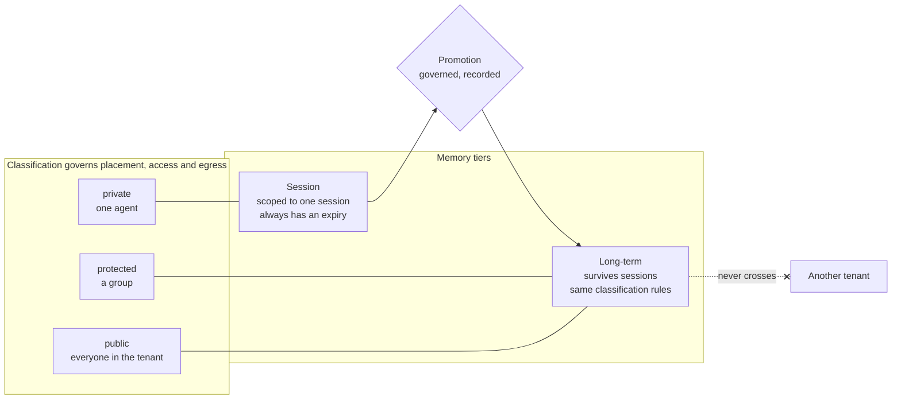

Memory namespaces reuse the classification rules rather than inventing a second
access model, so "what may this agent remember" and "what may this agent read"
are answered by the same engine (ADR-0028).

---

## 7. Tenancy and isolation

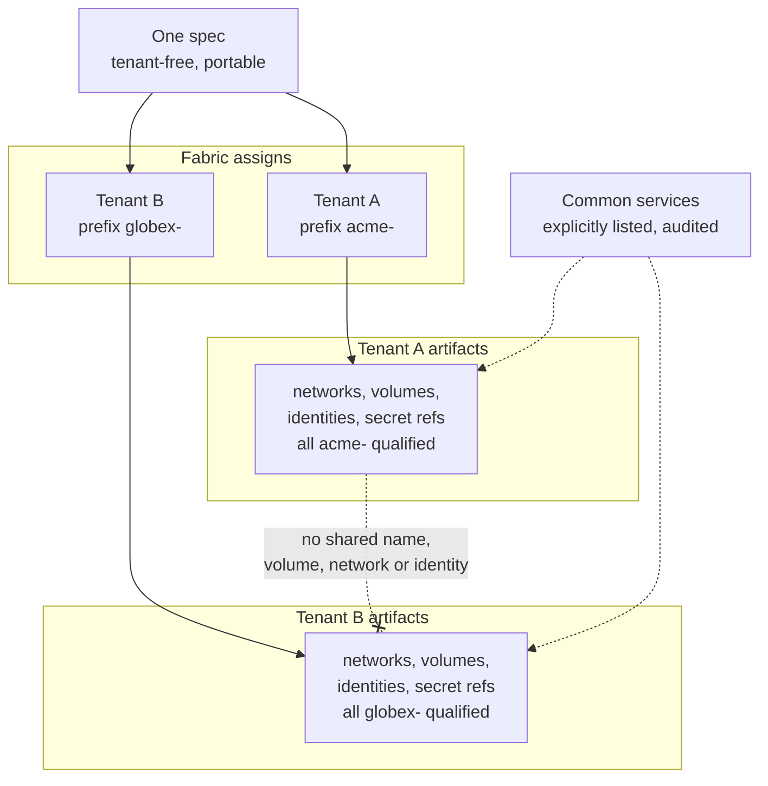

The same spec compiled for two tenants must share **no** identifier, volume,
network, identity or secret reference. What is shared between tenants is a
listed fabric decision — never an emergent consequence of naming.

> **The honest caveat.** A boundary is only as strong as the target enforces
> it. Where cloud IAM is coarser than the model, the generated grant is wider
> than ADR-0050 describes, and the mapping report has to say so in those words.
> And isolation nobody has attacked is a claim: generation tests prove
> artifacts differ, not that a breach fails. That test needs infrastructure
> this environment does not have — WS-028 M6.

---

## 8. Design to operation, end to end

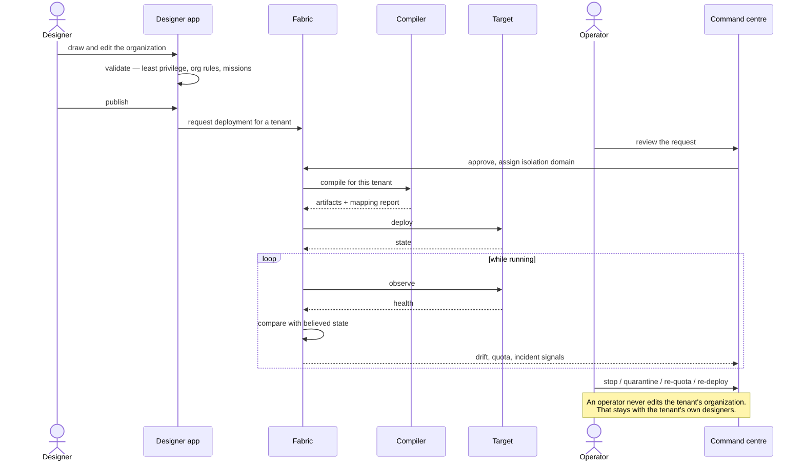

### Deployment lifecycle

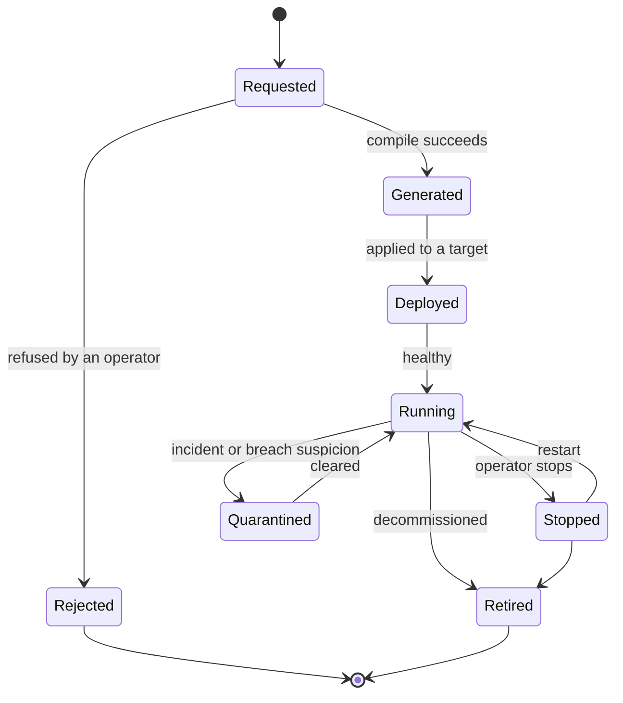

Transitions are explicit and audited; an illegal transition is refused rather
than coerced.

---

## 9. Unattended work and reaching humans

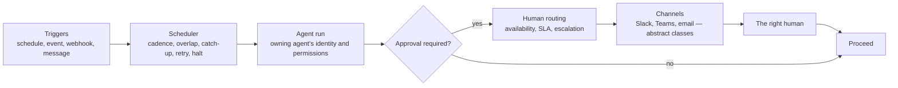

A scheduled run has exactly the owning agent's identity and permissions —
unattended work is not a way to acquire more. Channel *classes* live in the
spec; Slack and Teams appear only in the binding.

> Real Slack and Teams bridge clients are not built (WS-013 M4); routing plans
> are computed against an in-process bridge.

---

## 10. Governance: records as build artifacts

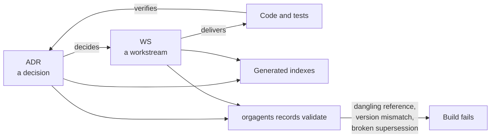

Decisions are versioned, superseded symmetrically and machine-validated. A
decision that changes gets a version bump and a changelog row rather than a
quiet edit — the record of *why* survives the change.

---

## 11. Module map

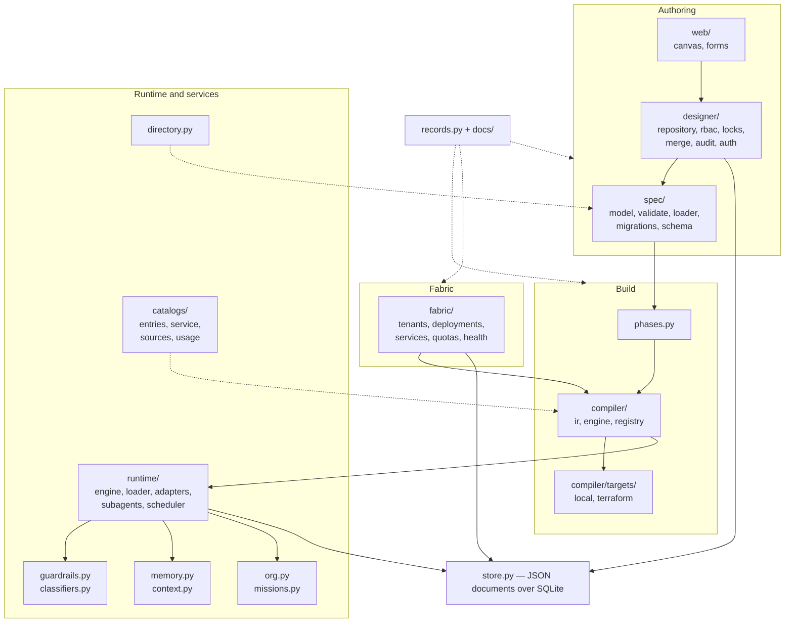

---

## 12. Where the design is ahead of the implementation

Kept here deliberately, so the diagrams above are not read as a description of
what runs today. The ordered list with owners is `docs/ROADMAP.md`.

| Area | Designed | Actually true today |
|---|---|---|
| Fabric plane | ADR-0049/0050/0051 | Tenancy core and operational model under construction; command centre not started |
| Tenant isolation | Absolute, fabric-assigned | Proven by generation tests only; no breach attempt, no running tenant |
| Cloud targets | Terraform for three providers | Generated and syntax-checked; never `terraform apply`-ed |
| Operations | Health, drift, quotas, incidents | Modelled against stubs; no adapter has met a real target |
| Guardrails | Pluggable judgement | Works; recall never measured against a labelled corpus |
| Designer identity | OIDC with group mapping | Works, but the JWT verification is hand-rolled RSA because no crypto library imports here — replace before production |
| Runtime adapters | Deep agents, OpenAI SDK, LangGraph | Thin bindings; only the `echo` adapter runs in CI |
| Human channels | Slack, Teams, approval routing | Routing computed; no real bridge client |
| Knowledge | Declared, governed sources | Not retrieved from |
