# Architecture

This is the whole system in one document: what the planes are, what flows
between them, and where the load-bearing decisions sit. Every claim here is
anchored to an ADR; where the implementation is thinner than the design, this
document says so rather than describing the intent as if it were the state.

Diagrams are Mermaid and render on GitHub.

---

## 1. The three planes

The platform is not one application. It is three, with different jobs,
different access control and different failure domains (ADR-0049).

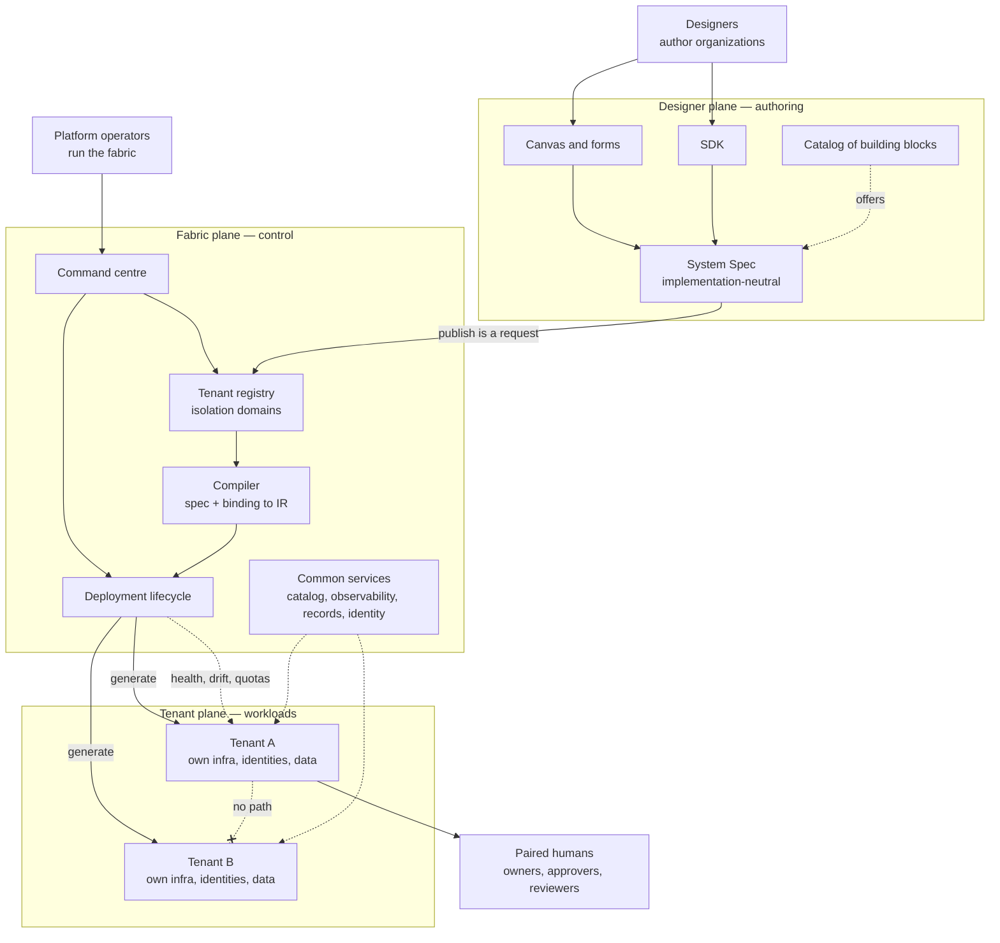
```mermaid
flowchart TB
    designers["Designers<br/>author organizations"]
    operators["Platform operators<br/>run the fabric"]
    people["Paired humans<br/>owners, approvers, reviewers"]

    subgraph DP["Designer plane — authoring"]
        canvas["Canvas and forms"]
        sdk["SDK"]
        spec["System Spec<br/>implementation-neutral"]
        catalog["Catalog of building blocks"]
        canvas --> spec
        sdk --> spec
        catalog -.offers.-> spec
    end

    subgraph FP["Fabric plane — control"]
        command["Command centre"]
        tenants["Tenant registry<br/>isolation domains"]
        compiler["Compiler<br/>spec + binding to IR"]
        deployments["Deployment lifecycle"]
        common["Common services<br/>catalog, observability, records, identity"]
        command --> tenants
        command --> deployments
        tenants --> compiler
        compiler --> deployments
    end

    subgraph TP["Tenant plane — workloads"]
        t1["Tenant A<br/>own infra, identities, data"]
        t2["Tenant B<br/>own infra, identities, data"]
    end

    designers --> canvas
    designers --> sdk
    operators --> command
    spec -- "publish is a request" --> tenants
    deployments -- generate --> t1
    deployments -- generate --> t2
    deployments -. "health, drift, quotas" .-> t1
    t1 -. "no path" .-x t2
    t1 --> people
    common -.-> t1
    common -.-> t2
```

Three rules make the separation structural rather than decorative:

- **A design is not a deployment.** Publishing from the designer is a request
  to the fabric, which decides whether, where and for whom it runs.
- **Operator and designer are different principals**, in both directions. An
  operator can stop, quarantine or re-deploy a tenant; it cannot edit the
  tenant's organization. A designer cannot see across the tenant boundary.
- **Isolation belongs to the fabric, not the design** (ADR-0050). A spec never
  declares its own tenancy, so it stays portable and a tenant cannot widen its
  own boundary by editing a design.

> **State of play.** The designer plane is built and tested, and its *design*
> views — org chart, agent editor, workspace — now read and write the System
> Spec itself rather than the runtime model, so editing an agent in a form and
> moving its box on the canvas are the same edit. Session and operations views
> stay runtime-backed on purpose: those are observations of a running system,
> and putting them on the spec would make them lie. The fabric plane is
> recorded (ADR-0049/0050/0051); the tenancy core, the operational model and
> the command centre (backend and front end) are all built. No tenant has ever
> been deployed from here: there is no cloud account and no container daemon in
> the development environment.

---

## 2. The spine: spec → IR → artifacts

Everything the platform does passes through one pipeline. The spec is
implementation-neutral; vendors appear only in the binding; permissions resolve
exactly once, into the IR; every target reads the IR and nothing else
(ADR-0002, ADR-0003, ADR-0005).

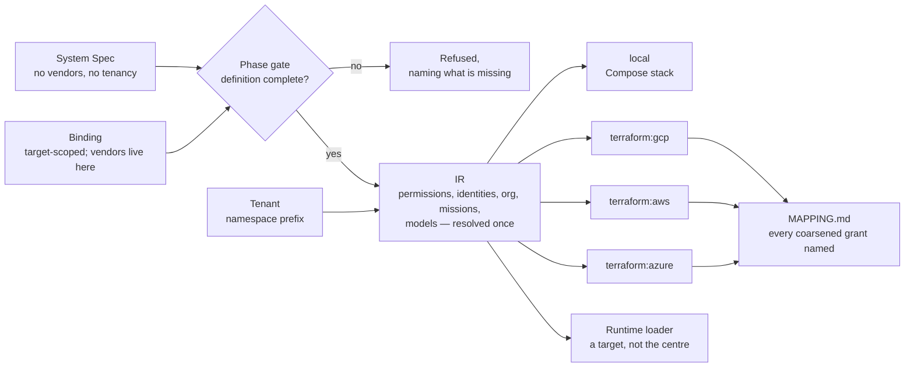
```mermaid
flowchart LR
    spec["System Spec<br/>no vendors, no tenancy"]
    binding["Binding<br/>target-scoped; vendors live here"]
    gate{"Phase gate<br/>definition complete?"}
    stop["Refused,<br/>naming what is missing"]
    tenant["Tenant<br/>namespace prefix"]
    ir["IR<br/>permissions, identities, org, missions,<br/>models — resolved once"]
    local["local<br/>Compose stack"]
    gcp["terraform:gcp"]
    aws["terraform:aws"]
    azure["terraform:azure"]
    runtime["Runtime loader<br/>a target, not the centre"]
    mapping["MAPPING.md<br/>every coarsened grant named"]

    spec --> gate
    binding --> gate
    gate -- no --> stop
    gate -- yes --> ir
    tenant --> ir
    ir --> local
    ir --> gcp
    ir --> aws
    ir --> azure
    ir --> runtime
    gcp --> mapping
    aws --> mapping
    azure --> mapping
```

Why it matters that resolution happens **once**: the Terraform a cloud applies
and the permissions the runtime enforces are derived from the same resolved
structure, so they cannot drift into disagreeing about who may do what. A test
asserts no target module imports `orgagents.spec`.

### Reviewing a change

A reviewer looking at a spec change sees the spec, not its consequences. One
line moved in a role widens resolved permissions three levels down the team
tree; one environment override adds an egress destination; a binding edit moves
an agent onto a model the catalog never approved. None of that is visible in a
source diff and all of it is visible in the IR — which is what resolving
exactly once buys. `orgagents spec diff <before> <after>` compiles both and
reports the difference in those terms.

Two properties make the report usable. It is **keyed by identity, not
position**, like the designer's structural merge, so reordering a list is not a
change and an id that moved is a move rather than a deletion plus an addition.
And it reports **direction, not just difference**: widening — the system can
now reach, send or trust something it could not — is a security finding;
narrowing is reported too, because it breaks things, but it is never ranked as
a risk. Severity follows consequence rather than field type: removing a
guardrail or widening an egress allowlist outranks adding an agent, and every
finding carries the rule that assigned its severity so a reviewer can argue
with the ranking rather than only with the verdict.

Two IRs that do not describe the same thing are **refused** rather than
compared. Different targets, different tenants or incompatible IR majors would
render as a long list of changes nobody made, and a reviewer would read
consequence into an artefact of the comparison. The refusal has its own exit
code: "I will not compare these" is not "these differ".

### The two phases

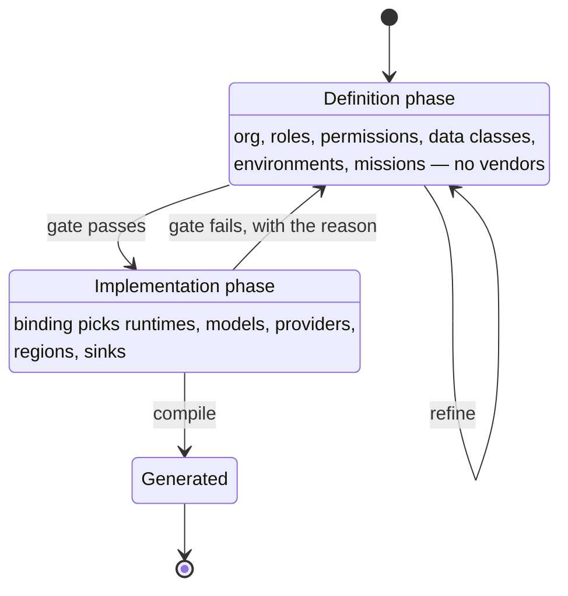
```mermaid
stateDiagram-v2
    [*] --> Definition
    Definition: Definition phase
    Definition: org, roles, permissions, data classes,<br/>environments, missions — no vendors
    Implementation: Implementation phase
    Implementation: binding picks runtimes, models, providers,<br/>regions, sinks
    Definition --> Definition: refine
    Definition --> Implementation: gate passes
    Implementation --> Definition: gate fails, with the reason
    Implementation --> Generated: compile
    Generated --> [*]
```

A definition that is incomplete cannot be compiled, and the refusal names what
is missing rather than emitting something half-bound (ADR-0019).

---

## 3. The organization model

Slow-changing structure, fast-changing work.

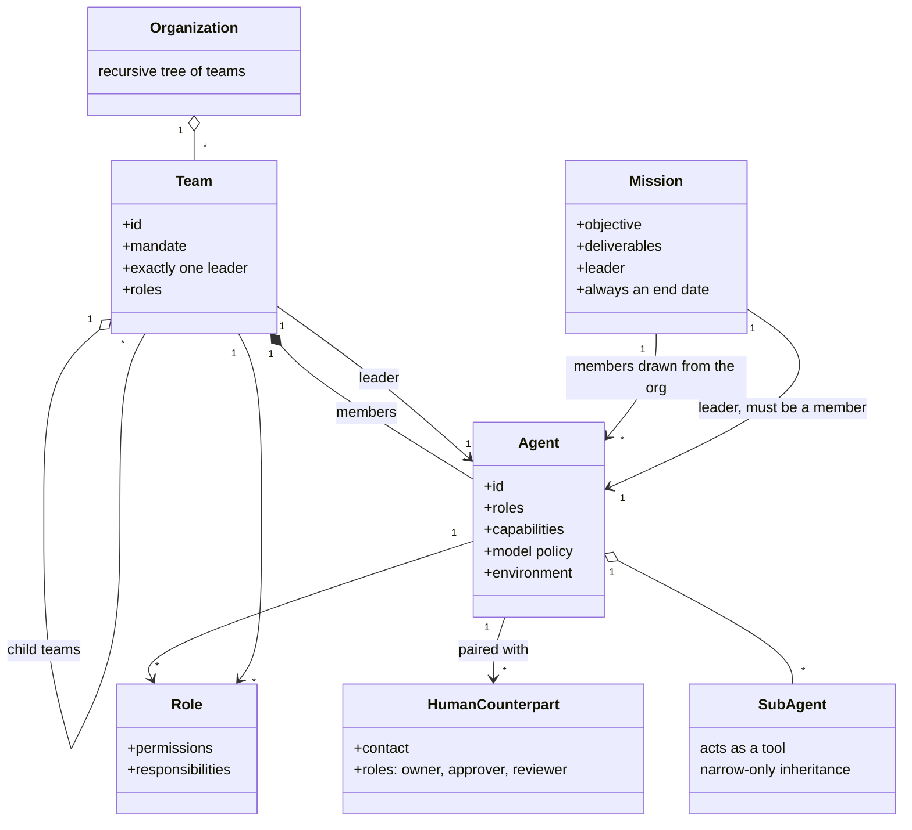
```mermaid
classDiagram
    class Organization {
        recursive tree of teams
    }
    class Team {
        +id
        +mandate
        +exactly one leader
        +roles
    }
    class Agent {
        +id
        +roles
        +capabilities
        +model policy
        +environment
    }
    class Mission {
        +objective
        +deliverables
        +leader
        +always an end date
    }
    class Role {
        +permissions
        +responsibilities
    }
    class HumanCounterpart {
        +contact
        +roles: owner, approver, reviewer
    }
    class SubAgent {
        acts as a tool
        narrow-only inheritance
    }

    Organization "1" o-- "*" Team
    Team "1" o-- "*" Team : child teams
    Team "1" *-- "*" Agent : members
    Team "1" --> "1" Agent : leader
    Agent "1" --> "*" Role
    Team "1" --> "*" Role
    Agent "1" --> "*" HumanCounterpart : paired with
    Agent "1" o-- "*" SubAgent
    Mission "1" --> "*" Agent : members drawn from the org
    Mission "1" --> "1" Agent : leader, must be a member
```

- **Every team has exactly one leader**, and a child team's leader participates
  in the parent implicitly through leadership rather than by double
  membership (ADR-0006).
- **A mission is a short-lived team** drawn from the standing organization,
  with an objective, deliverables and always an end date. Roles assigned to a
  mission are *intersected* with what members already hold, so a mission can
  never be a permission side-door, and lateral reach never lets someone task
  their own leader (ADR-0039).
- **Sub-agents are tools, not org members.** They have no reporting line, no
  human counterpart, no session and no memory of their own, and inherit only a
  narrowing of the parent's authority (ADR-0027).

### A mission's reach expires

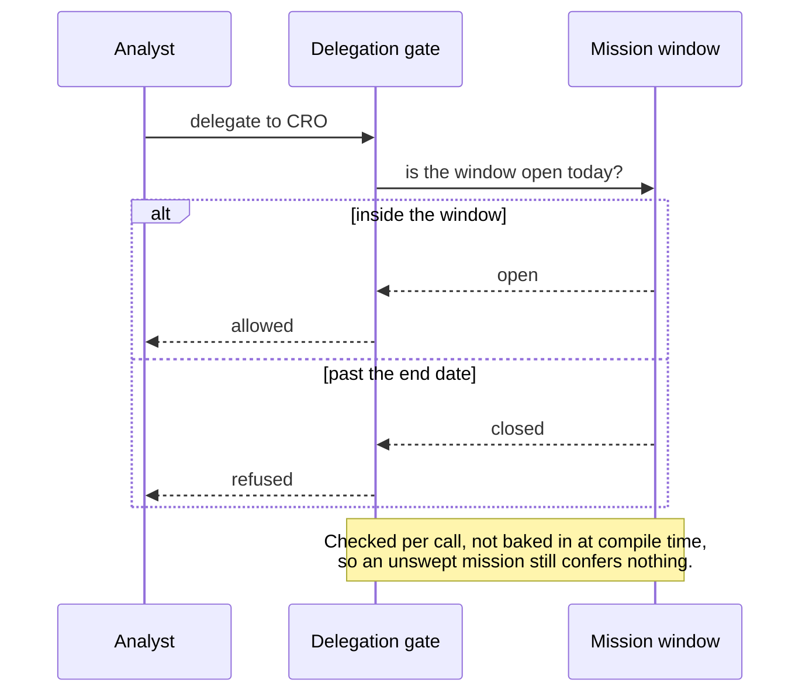
```mermaid
sequenceDiagram
    participant A as Analyst
    participant G as Delegation gate
    participant M as Mission window
    A->>G: delegate to CRO
    G->>M: is the window open today?
    alt inside the window
        M-->>G: open
        G-->>A: allowed
    else past the end date
        M-->>G: closed
        G-->>A: refused
    end
    Note over G,M: Checked per call, not baked in at compile time,<br/>so an unswept mission still confers nothing.
```

### Roles, responsibilities, mandates — and which of them decide anything

An organization is held together by four things, and today the platform
enforces one of them properly.

A **role** is a contract: responsibilities, capabilities and permissions bound
together (ADR-0007). Assigning it may narrow it and never widen it. The
capabilities and permissions are checkable; the **responsibilities beside them
are free-form prose**, so a role can promise work it holds no permission to do
and nothing notices.

A **mandate** is not a description of work — it is a scope of decision: what a
unit may settle without asking. It is declared on teams, agents and missions,
references a decision class the spec declares, and is resolved once at the
phase gate into the IR (ADR-0065). What binds is never the declaration: it is
the intersection with every unit above.

**Positional kind** — executive, manager, individual — is derived from the tree
and stored anyway, which lets a stored label contradict the structure it came
from. Of the five `AgentKind` values only `SERVICE` changes any behaviour, and
that one property is encoded twice: `shared_service` in the spec and
`AgentKind.SERVICE` in the runtime (ADR-0063).

Authority narrows downward exactly as permission already does, and conditions
**chain** rather than merge — every condition in the line applies, so a child
tightens a bound by adding one and dropping a parent's is not an operation the
structure has.

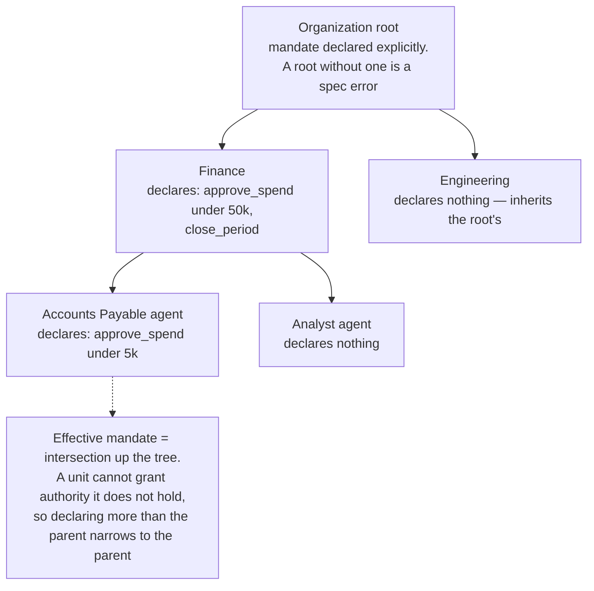
```mermaid
flowchart TB
    root["Organization root<br/>mandate declared explicitly.<br/>A root without one is a spec error"]
    fin["Finance<br/>declares: approve_spend under 50k,<br/>close_period"]
    eng["Engineering<br/>declares nothing — inherits the root's"]
    ap["Accounts Payable agent<br/>declares: approve_spend under 5k"]
    an["Analyst agent<br/>declares nothing"]
    note["Effective mandate = intersection up the tree.<br/>A unit cannot grant authority it does not hold,<br/>so declaring more than the parent narrows to the parent"]

    root --> fin
    root --> eng
    fin --> ap
    fin --> an
    ap -.-> note
```

Mandates are built (ADR-0065). Responsibilities are not: they remain prose
beside checkable capabilities, and ADR-0066 holds the question of what they
should reference instead — deliberately unscheduled, because a forced
vocabulary that fits nobody is worse than the prose it replaces.

---

## 4. Security: how a permission is decided

Deny by default, narrow-only inheritance, and an explicit guard rather than an
ambiguous one (ADR-0008).

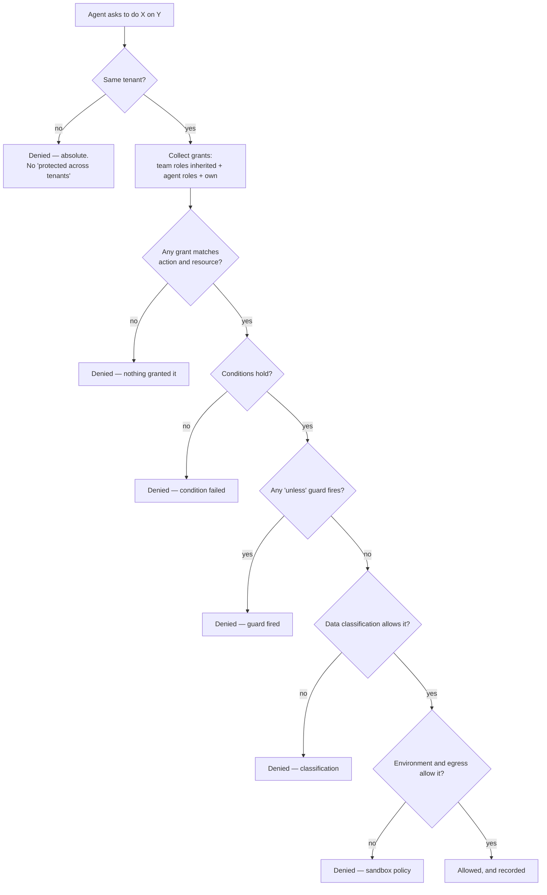
```mermaid
flowchart TB
    ask["Agent asks to do X on Y"]
    tenantq{"Same tenant?"}
    denyT["Denied — absolute.<br/>No 'protected across tenants'"]
    collect["Collect grants:<br/>team roles inherited + agent roles + own"]
    matchq{"Any grant matches<br/>action and resource?"}
    denyN["Denied — nothing granted it"]
    condq{"Conditions hold?"}
    denyC["Denied — condition failed"]
    unlessq{"Any 'unless' guard fires?"}
    denyU["Denied — guard fired"]
    classq{"Data classification allows it?"}
    denyD["Denied — classification"]
    envq{"Environment and egress allow it?"}
    denyE["Denied — sandbox policy"]
    allow["Allowed, and recorded"]

    ask --> tenantq
    tenantq -- no --> denyT
    tenantq -- yes --> collect --> matchq
    matchq -- no --> denyN
    matchq -- yes --> condq
    condq -- no --> denyC
    condq -- yes --> unlessq
    unlessq -- yes --> denyU
    unlessq -- no --> classq
    classq -- no --> denyD
    classq -- yes --> envq
    envq -- no --> denyE
    envq -- yes --> allow
```

Inheritance only ever narrows: a child team cannot hold more than its parent,
and a mission cannot grant what a member lacked. Ambiguity on a deny fails
unsafe, which is why the `unless` guard is explicit (ADR-0008 v1.1.0).

### Permission refuses; mandate escalates

The flow above answers *may this agent do X*. It does not answer *was this
agent the one to decide it* — the question a mandate exists for. They are
different, and the difference decides what happens on a "no": a missing
permission is a dead end, while a decision above your authority has somebody
it belongs to.

Order matters. Permission is checked first, so an action the agent could never
perform is refused outright rather than sent to a human who would have to
refuse it again.

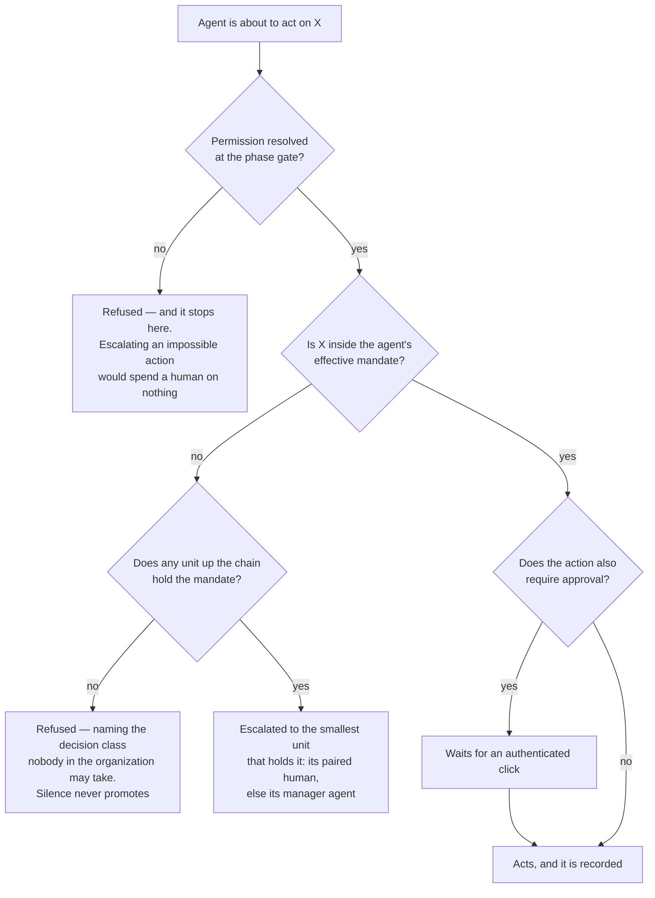
```mermaid
flowchart TB
    ask["Agent is about to act on X"]
    permq{"Permission resolved<br/>at the phase gate?"}
    refuse["Refused — and it stops here.<br/>Escalating an impossible action<br/>would spend a human on nothing"]
    mandq{"Is X inside the agent's<br/>effective mandate?"}
    holderq{"Does any unit up the chain<br/>hold the mandate?"}
    nobody["Refused — naming the decision class<br/>nobody in the organization may take.<br/>Silence never promotes"]
    escalate["Escalated to the smallest unit<br/>that holds it: its paired human,<br/>else its manager agent"]
    approvq{"Does the action also<br/>require approval?"}
    wait["Waits for an authenticated click"]
    act["Acts, and it is recorded"]

    ask --> permq
    permq -- no --> refuse
    permq -- yes --> mandq
    mandq -- no --> holderq
    holderq -- no --> nobody
    holderq -- yes --> escalate
    mandq -- yes --> approvq
    approvq -- yes --> wait --> act
    approvq -- no --> act
```

**Separation of duties is a second kind of constraint, and it contradicts the
first** (ADR-0070). Narrowing requires every parent to hold at least the union
of its children; segregation requires that no principal hold both sides of a
control. Modelling a real CFO organization found the collision empirically:
every leaf segregated correctly and the CFO held all of it, because authority
accumulates upward — and an accounts-payable agent attempting `release_payment`
escalated straight to the unit where the separation dissolved.

The resolution is that **a team is a scope, not a principal**: its mandate
bounds what its members may hold and nobody exercises it, so a unit may hold
both sides while no agent may. Separations are declared, checked at the phase
gate over effective *agent* mandates, and a violation is an error. A leader that
inherits its unit's mandate into a violation must declare a narrower one.
Escalation walks leader to leader, tests each leader's own mandate, and returns
an agent or refuses — and a refusal may name who does hold the decision without
routing to them, because reaching them is the process's job, not escalation's.

### The platform is not the system of record

An agentic organization does not replace its enterprise applications. The ERP
still owns the ledger, the treasury system still owns the sweep, the bank still
owns the payment, and agents use them the way people do — following the
organization's processes, reading the results and acting on them. Each of those
systems carries its own controls, and this platform has been accumulating
controls beside them as though it were the system of record.

Three decisions follow from taking that seriously.

**A control declares who enforces it** (ADR-0073): `application`, `platform` or
`both`. A `platform` control must be evaluable at our boundary or the spec is
refused; an `application` control may be described and may not be claimed; a
`both` control names an authoritative side and is always reported. The default
is `platform`, so claiming a control obliges us to evaluate it. This exists
because a bound that reads as enforced and is not is worse than no bound — the
mandate-condition ceiling that permitted ten 49m sweeps against a 50m limit was
one instance of a whole class.

**An agent operates an application as a named principal** (ADR-0074). Our
`IdentityIR` is a workload identity and says nothing about who the agent is
inside the ERP, so two permission systems sit side by side with nothing between
them. A binding names the application account and, where the application can
state it, the role it holds; one account per agent per application, because a
shared one destroys the audit trail an auditor actually accepts.

**A process is ordered steps with owners** (ADR-0075). Procure-to-pay spans the
ERP and the bank with a handoff at every step, and the platform could only see
a scatter of unrelated capabilities. Autonomy is per step, separation may be
declared between steps — and **instance-level segregation is declared here and
enforced by the application**, because the ERP holds the document and we do
not.

---

**Every activity declares how much of it an agent does alone** (ADR-0072):
`advisory` reads and models, `human_decides` prepares and recommends,
`supervised` decides and a person confirms, `autonomous` decides and acts. The
default is `advisory`, the most restrictive, and an advisory activity may not
change a system of record — so a mutation nobody has thought about cannot ship.

The declaration matters because the posture used to be *emergent*, falling out
of the action, the decision class, the mandate and the approval flag with no
stated intent. Classifying a real finance function found four writes governed by
nothing at all, and two controls that were autonomous only because nobody had
set a flag — including invoice approval, which is the accounts-payable control.
The gate now checks the mechanics against the declaration: autonomy needs a
decision class the agent holds and evaluation evidence behind it, supervision
needs an approver who is not the agent's own owner, and an assignment may
tighten a posture and never loosen it.

Mandate never widens permission — it is a bound on a grant already held, not a
grant. The per-action `requires_approval` flag survives alongside it and keeps
its own meaning: mandate answers *whose decision is this*, approval answers
*should anyone check it*.

The escalation path is the one that already exists for failures and guardrail
breaches (`org.escalation_target`, preferring the paired human). Exceeding your
authority is not a failure; it is the ordinary case escalation was invented
for, and routing it anywhere else is what produces either a silent overstep or
a refusal nobody can act on.

This is ADR-0065, and it is built. Two limits are worth stating plainly. A
mission's mandate is bounded by its **leader** rather than by the human
sponsor the record names. People now carry mandates (ADR-0079), so that bound
could move; the leader's authority is already narrowed by the standing tree
and is the stricter of the two, so it stays until somebody has a case where it
is wrong. And the root is the
one place authority is granted rather than inherited, so a root declaring no
mandate is a spec error: silence there would mean either "everything" or
"nothing", and a reader could not tell which.

---

## 5. An agent at runtime

What actually surrounds the model call.

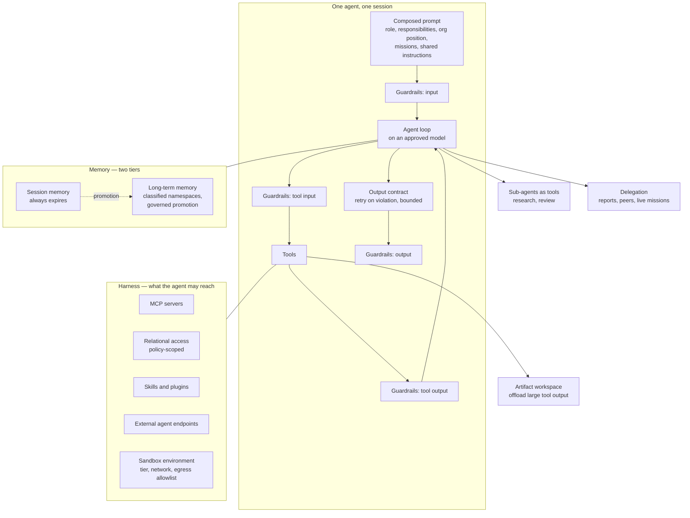
```mermaid
flowchart TB
    subgraph Agent["One agent, one session"]
        prompt["Composed prompt<br/>role, responsibilities, org position,<br/>missions, shared instructions"]
        gin["Guardrails: input"]
        loop["Agent loop<br/>on an approved model"]
        gtin["Guardrails: tool input"]
        tools["Tools"]
        gtout["Guardrails: tool output"]
        contract["Output contract<br/>retry on violation, bounded"]
        gout["Guardrails: output"]
    end

    subgraph Harness["Harness — what the agent may reach"]
        mcp["MCP servers"]
        sql["Relational access<br/>policy-scoped"]
        skills["Skills and plugins"]
        endpoints["External agent endpoints"]
        sandbox["Sandbox environment<br/>tier, network, egress allowlist"]
    end

    subgraph Memory["Memory — two tiers"]
        session["Session memory<br/>always expires"]
        longterm["Long-term memory<br/>classified namespaces,<br/>governed promotion"]
    end

    subagents["Sub-agents as tools<br/>research, review"]
    delegate["Delegation<br/>reports, peers, live missions"]
    workspace["Artifact workspace<br/>offload large tool output"]

    prompt --> gin --> loop
    loop --> gtin --> tools --> gtout --> loop
    loop --> contract --> gout
    tools --- Harness
    loop --- Memory
    session -. promotion .-> longterm
    loop --> subagents
    loop --> delegate
    tools --> workspace
```

### The adapter seam

The agent loop above is the one part of this the platform does not run itself.
A `RuntimeAdapter` hands a composed prompt, a name-to-callable map and a set of
limits to deep agents, the OpenAI Agents SDK, LangGraph or the dependency-free
echo runtime, and gets a turn back.

Where the seam falls is the whole design. Every check that decides anything —
permission, delegation legality, SQL grants, approval gates — lives inside the
tools, so it holds whichever framework is executing. The framework owns the
loop and nothing else. That is why `Runtime` can be chosen per agent, why one
organization can mix frameworks, and why swapping one does not re-open a
governance question.

Budgets are enforced at the seam rather than inside a framework, because a
harness limit written once in the spec must mean one thing everywhere. That is
a portability argument, not a claim that the frameworks have nothing: LangChain
ships `ModelCallLimitMiddleware` and `ToolCallLimitMiddleware`, and
`ModelCallLimitMiddleware(run_limit=…)` expresses `max_turns` more exactly than
the `recursion_limit` arithmetic below does. What no framework offers is a
token or wall-clock budget spanning the several turns of one run, which is what
`TurnBudget` holds.

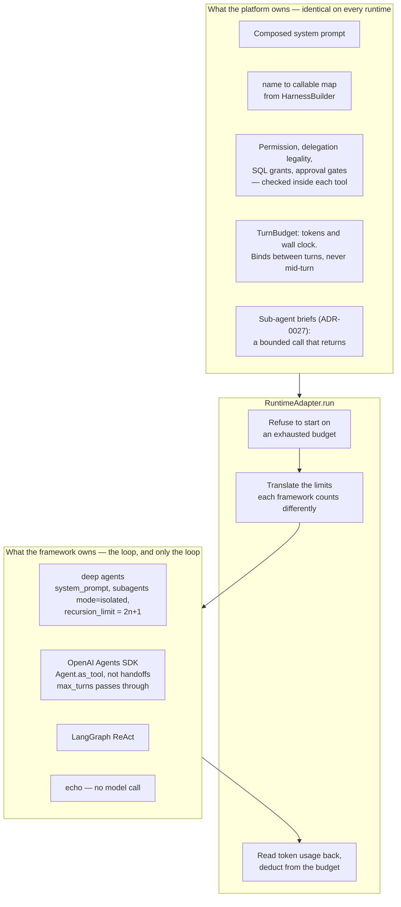
```mermaid
flowchart TB
    subgraph platform["What the platform owns — identical on every runtime"]
        prompt["Composed system prompt"]
        tools["name to callable map<br/>from HarnessBuilder"]
        checks["Permission, delegation legality,<br/>SQL grants, approval gates<br/>— checked inside each tool"]
        budget["TurnBudget: tokens and wall clock.<br/>Binds between turns, never mid-turn"]
        subs["Sub-agent briefs (ADR-0027):<br/>a bounded call that returns"]
    end

    subgraph adapter["RuntimeAdapter.run"]
        guard["Refuse to start on<br/>an exhausted budget"]
        translate["Translate the limits<br/>each framework counts differently"]
        meter["Read token usage back,<br/>deduct from the budget"]
    end

    subgraph frameworks["What the framework owns — the loop, and only the loop"]
        da["deep agents<br/>system_prompt, subagents mode=isolated,<br/>recursion_limit = 2n+1"]
        oa["OpenAI Agents SDK<br/>Agent.as_tool, not handoffs<br/>max_turns passes through"]
        lg["LangGraph ReAct"]
        echo["echo — no model call"]
    end

    platform --> adapter
    guard --> translate --> frameworks
    frameworks --> meter
```

Two translations in that diagram are load-bearing, and both were wrong until a
framework was actually installed and run. `max_turns` counts agent turns;
LangGraph's `recursion_limit` counts graph super-steps, and a ReAct turn is two
of them — so passing it through unchanged gave the same spec half the turns on
deep agents that it gave on the OpenAI SDK. And a sub-agent is a bounded call
that returns to its caller (ADR-0027), which is `Agent.as_tool`; the SDK's
`handoffs` *transfers control*, so the parent never resumes and the sub-agent
inherits a conversation the platform never decided to give it.

The budget's guarantee is deliberately narrow: **a turn never starts on an
exhausted budget.** Stopping a turn part-way would leave a tool call half
executed, so the overrun is bounded by one turn, and `max_turns` is what bounds
that turn from the inside. Exhaustion is recorded as its own session event, not
as an error — an agent that ran out of room did not break.

Guardrails run **outside** the agent loop, at four boundaries, so a compromised
prompt cannot argue its way past them (ADR-0035). Judgement at those boundaries
is pluggable: the deterministic pattern floor is the default, a model-backed
classifier can add findings but never clear one, and on a provider failure the
verdict degrades to the pattern floor and is marked degraded rather than
failing open to nothing (ADR-0045).

---

## 6. Data and memory

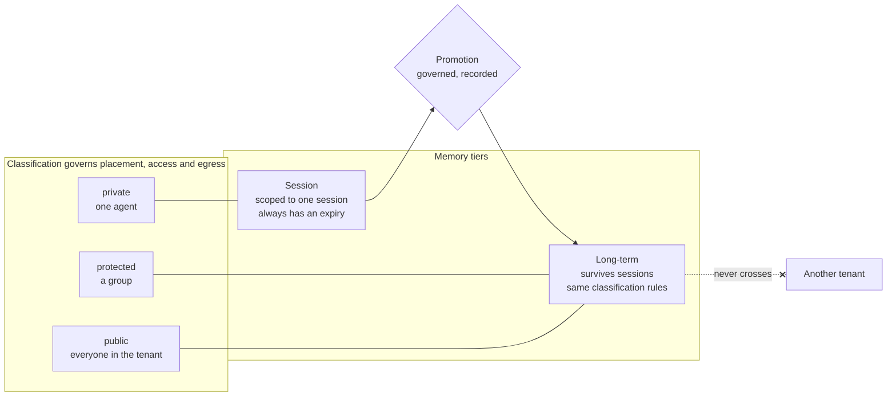
```mermaid
flowchart LR
    subgraph Classification["Classification governs placement, access and egress"]
        priv["private<br/>one agent"]
        prot["protected<br/>a group"]
        pub["public<br/>everyone in the tenant"]
    end
    subgraph Tiers["Memory tiers"]
        s["Session<br/>scoped to one session<br/>always has an expiry"]
        l["Long-term<br/>survives sessions<br/>same classification rules"]
    end
    promo{"Promotion<br/>governed, recorded"}
    s --> promo --> l
    priv --- s
    prot --- l
    pub --- l
    l -. "never crosses" .-x tenant["Another tenant"]
```

Memory namespaces reuse the classification rules rather than inventing a second
access model, so "what may this agent remember" and "what may this agent read"
are answered by the same engine (ADR-0028).

---

## 7. Tenancy and isolation

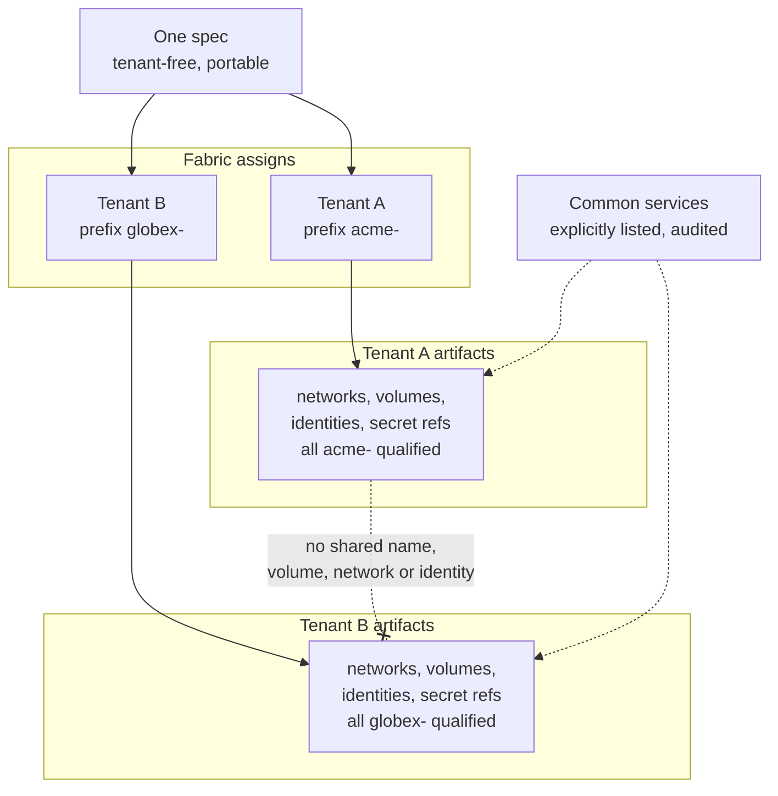
```mermaid
flowchart TB
    spec["One spec<br/>tenant-free, portable"]
    subgraph FabricAssign["Fabric assigns"]
        ta["Tenant A<br/>prefix acme-"]
        tb["Tenant B<br/>prefix globex-"]
    end
    subgraph A["Tenant A artifacts"]
        na["networks, volumes,<br/>identities, secret refs<br/>all acme- qualified"]
    end
    subgraph B["Tenant B artifacts"]
        nb["networks, volumes,<br/>identities, secret refs<br/>all globex- qualified"]
    end
    shared["Common services<br/>explicitly listed, audited"]

    spec --> ta --> na
    spec --> tb --> nb
    na -. "no shared name,<br/>volume, network or identity" .-x nb
    shared -.-> na
    shared -.-> nb
```

The same spec compiled for two tenants must share **no** identifier, volume,
network, identity or secret reference. What is shared between tenants is a
listed fabric decision — never an emergent consequence of naming.

> **The honest caveat.** A boundary is only as strong as the target enforces
> it. Where cloud IAM is coarser than the model, the generated grant is wider
> than ADR-0050 describes, and the mapping report has to say so in those words.
> And isolation nobody has attacked is a claim: generation tests prove
> artifacts differ, not that a breach fails. That test needs infrastructure
> this environment does not have — WS-028 M6.

---

## 8. Design to operation, end to end

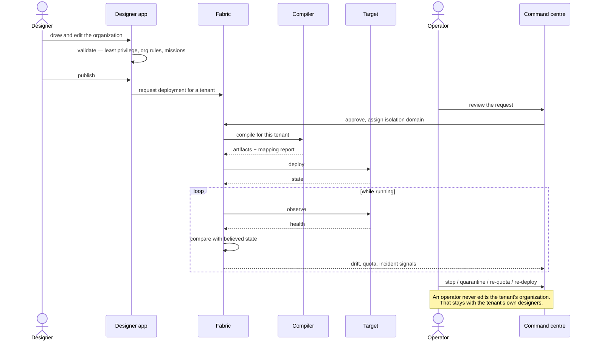
```mermaid
sequenceDiagram
    actor D as Designer
    participant UI as Designer app
    participant F as Fabric
    participant C as Compiler
    participant T as Target
    actor O as Operator
    participant CC as Command centre

    D->>UI: draw and edit the organization
    UI->>UI: validate — least privilege, org rules, missions
    D->>UI: publish
    UI->>F: request deployment for a tenant
    O->>CC: review the request
    CC->>F: approve, assign isolation domain
    F->>C: compile for this tenant
    C-->>F: artifacts + mapping report
    F->>T: deploy
    T-->>F: state
    loop while running
        F->>T: observe
        T-->>F: health
        F->>F: compare with believed state
        F-->>CC: drift, quota, incident signals
    end
    O->>CC: stop / quarantine / re-quota / re-deploy
    Note over O,CC: An operator never edits the tenant's organization.<br/>That stays with the tenant's own designers.
```

### Deployment lifecycle

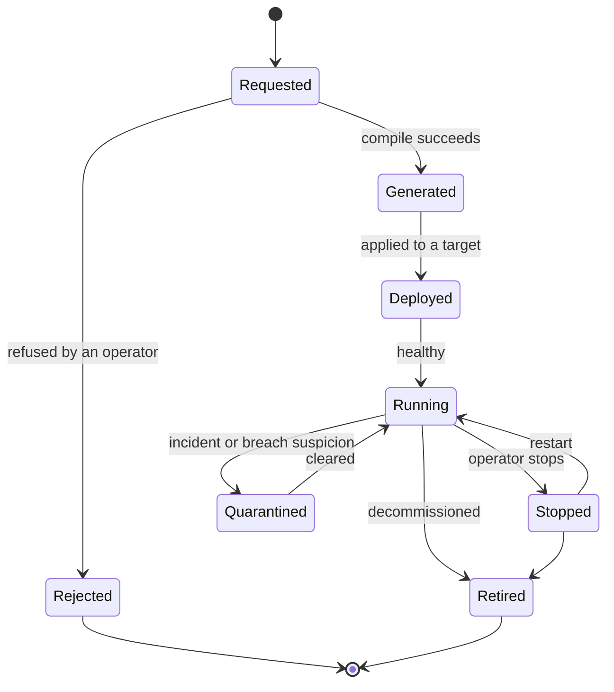
```mermaid
stateDiagram-v2
    [*] --> Requested
    Requested --> Generated: compile succeeds
    Requested --> Rejected: refused by an operator
    Generated --> Deployed: applied to a target
    Deployed --> Running: healthy
    Running --> Stopped: operator stops
    Running --> Quarantined: incident or breach suspicion
    Quarantined --> Running: cleared
    Stopped --> Running: restart
    Running --> Retired: decommissioned
    Stopped --> Retired
    Rejected --> [*]
    Retired --> [*]
```

Transitions are explicit and audited; an illegal transition is refused rather
than coerced.

---

## 9. Unattended work and reaching humans

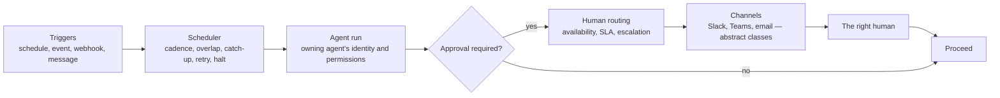
```mermaid
flowchart LR
    trig["Triggers<br/>schedule, event, webhook, message"]
    sched["Scheduler<br/>cadence, overlap, catch-up, retry, halt"]
    run["Agent run<br/>owning agent's identity and permissions"]
    approve{"Approval required?"}
    route["Human routing<br/>availability, SLA, escalation"]
    chan["Channels<br/>Slack, Teams, email — abstract classes"]
    human["The right human"]
    proceed["Proceed"]

    trig --> sched --> run --> approve
    approve -- yes --> route --> chan --> human --> proceed
    approve -- no --> proceed
```

A scheduled run has exactly the owning agent's identity and permissions —
unattended work is not a way to acquire more. Channel *classes* live in the
spec; Slack and Teams appear only in the binding.

> Routing answers *whether, when, how long* and *who*. What puts a question in
> front of a person, and what makes their answer count, is the channel bridge
> port in §10. Slack and Teams clients are still not built; Mattermost is the
> first adapter, and it has never met a server.

---

## 10. Reaching a human: the channel bridge

A routing plan says *who* to reach and *by when*. It does not put anything on a
screen. That is the bridge port's job (ADR-0061): five verbs and a declaration
— say who the bot is, post, reply in a thread, open an approval, resolve the
click that answers one. Reading history, listing channels, managing membership,
reactions and uploads are all things a chat product does and none of them is a
thing the platform needs, so none of them is on the port.

Two refusals happen at **bind time**, not on the first call, because by the
first call somebody is already waiting for an answer:

- a bridge that can only post as a **person's account** does not bind at all —
  an agent speaking through somebody's account makes every message in the
  channel a lie about who said it, and a bridge that cannot *mint* a bot
  principal is refused for the same reason one hand-made shared account is;
- a bridge without **authenticated interactive callbacks** binds `notify`,
  `report`, `ask` and `handoff` happily, and may not bind `APPROVE`. There is
  no fallback to matching the word "approve" in chat text, because that is
  forgeable by anyone who can type in the channel: a forged approval is worse
  than an unreachable one.

### The approval round trip

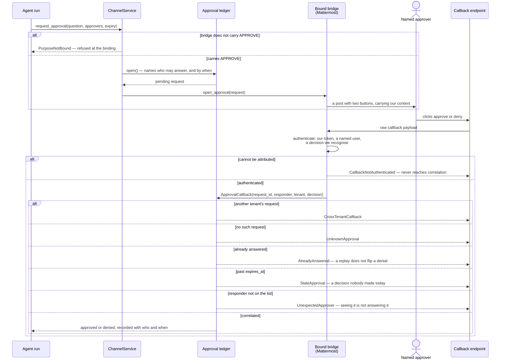
```mermaid
sequenceDiagram
    participant AG as Agent run
    participant SV as ChannelService
    participant LG as Approval ledger
    participant BR as Bound bridge<br/>(Mattermost)
    actor H as Named approver
    participant CB as Callback endpoint

    AG->>SV: request_approval(question, approvers, expiry)
    alt bridge does not carry APPROVE
        SV-->>AG: PurposeNotBound — refused at the binding
    else carries APPROVE
        SV->>LG: open() — names who may answer, and by when
        LG-->>SV: pending request
        SV->>BR: open_approval(request)
        BR->>H: a post with two buttons, carrying our context
    end
    H->>CB: clicks approve or deny
    CB->>BR: raw callback payload
    BR->>BR: authenticate: our token, a named user,<br/>a decision we recognise
    alt cannot be attributed
        BR-->>CB: CallbackNotAuthenticated — never reaches correlation
    else authenticated
        BR->>LG: ApprovalCallback(request_id, responder, tenant, decision)
        alt another tenant's request
            LG-->>CB: CrossTenantCallback
        else no such request
            LG-->>CB: UnknownApproval
        else already answered
            LG-->>CB: AlreadyAnswered — a replay does not flip a denial
        else past expires_at
            LG-->>CB: StaleApproval — a decision nobody made today
        else responder not on the list
            LG-->>CB: UnexpectedApprover — seeing it is not answering it
        else correlated
            LG-->>AG: approved or denied, recorded with who and when
        end
    end
```

An approval request that names no approvers is refused when it is opened:
"anyone in the channel" is the absence of an approver set, not one. An approval
that never expires is refused for the same kind of reason — a permission that
cannot go stale is a standing grant, not a decision. Every refusal above is
raised rather than swallowed, because a dropped callback looks to the human
like a button that did nothing and to the agent like a human who never
answered: two different wrong stories about one event.

Text a human types comes back the other way as untrusted input and is handed to
the runtime as a prompt, so it crosses the existing input guardrail (ADR-0035).
There is deliberately no second, channel-shaped screening path: two boundaries
would drift, and then one of them would be wrong.

> **State of play.** The port, the ledger, a Mattermost adapter over an
> injected transport, and a conformance suite the next adapter subclasses all
> exist and are tested against a fake server. **Nothing has been run against a
> Mattermost server**; the request and response shapes sit behind a stated
> `TODO(mattermost-wire)` boundary, and the riskiest assumption — whether a bot
> can obtain a `trigger_id` for an agent-initiated dialog out of band — is
> named in the adapter rather than hidden. `open_approval` deliberately does
> not depend on it.

---

## 11. Work that comes from people: the task port

An agent is a member of an organization, so work reaches it the way work
reaches anybody: somebody assigns it, in the tool they already use. `TaskPort`
(ADR-0057) is that seam — nine methods, and *creating* a task is not one of
them. We receive work; we do not open it.

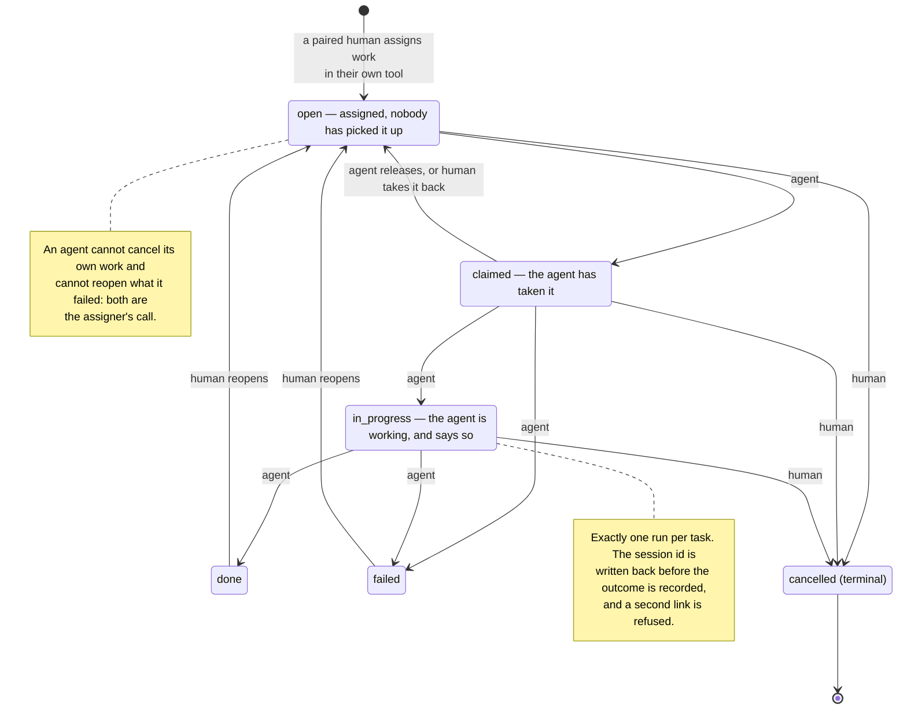
```mermaid
stateDiagram-v2
    [*] --> Open: a paired human assigns work<br/>in their own tool
    Open: open — assigned, nobody has picked it up
    Claimed: claimed — the agent has taken it
    InProgress: in_progress — the agent is working, and says so
    Done: done
    Failed: failed
    Cancelled: cancelled (terminal)

    Open --> Claimed: agent
    Open --> Cancelled: human
    Claimed --> InProgress: agent
    Claimed --> Open: agent releases, or human takes it back
    Claimed --> Failed: agent
    Claimed --> Cancelled: human
    InProgress --> Done: agent
    InProgress --> Failed: agent
    InProgress --> Cancelled: human
    Done --> Open: human reopens
    Failed --> Open: human reopens
    Cancelled --> [*]

    note right of InProgress
        Exactly one run per task. The session id is
        written back before the outcome is recorded,
        and a second link is refused.
    end note
    note right of Open
        An agent cannot cancel its own work and
        cannot reopen what it failed: both are
        the assigner's call.
    end note
```

Four rules carry the weight:

- **A backend that cannot give an agent its own principal is refused at bind
  time**, with the reason. An agent acts as itself or not at all; borrowing a
  person's credentials makes the audit trail a lie, and a refusal discovered on
  the first call is a refusal discovered after the deployment went live.
- **Being able to edit a board is not authority to direct an agent.**
  Assignment is checked against the pairing model on our side of the port —
  owner, approver and operator direct an agent; reviewers, stakeholders and
  escalation contacts do not. We cannot stop anyone creating a row on somebody
  else's board; we can refuse to act on it.
- **One task, at most one run.** The run's session id is written back so a
  person can get from the work they asked for to what the agent actually did,
  and linking a second run is refused — otherwise nobody can say which
  execution answered the request.
- **Divergence is reported, never reconciled.** A task closed while its run is
  live, a run finished against a task somebody reopened, a task naming a run
  this runtime has never heard of: each is surfaced as a report for a person.
  There is no `reconcile()` and there is not going to be one — a control plane
  that quietly makes its own state match somebody else's is one nobody can
  trust.

The task's text is handed to the runtime as a prompt and crosses the ordinary
input guardrail, exactly as a human's chat message does.

> **State of play.** The port, a local reference backend over the existing
> `Store`, the conformance suite an adapter subclasses, one-run-per-task and
> divergence reporting are built and tested. **No real product adapter
> exists** — the product choice is deliberately deferred — and identity has
> never been verified against a real task service (WS-031 M5/M6). The reference
> backend has no projects, columns, labels or priorities on purpose: if it
> grew a board, we would have written a task manager by accident.

---

## 12. Calling another organization's agent: A2A

External agent endpoints have been trust-classified and governed since
ADR-0030; what was missing was a protocol to actually speak. A2A is bound as
that protocol (ADR-0058) — and bound *beneath* the existing rules, not beside
them. Every outbound call, **including the agent-card fetch**, goes through
`runtime/endpoints.call_endpoint`, so the transport is the last thing that
happens, not the first.

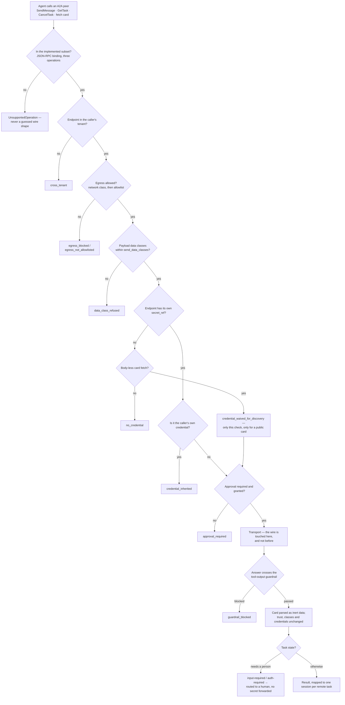
```mermaid
flowchart TB
    ask["Agent calls an A2A peer<br/>SendMessage · GetTask · CancelTask · fetch card"]
    impl{"In the implemented subset?<br/>JSON-RPC binding, three operations"}
    unsup["UnsupportedOperation —<br/>never a guessed wire shape"]
    tenantq{"Endpoint in the caller's tenant?"}
    dTen["cross_tenant"]
    egressq{"Egress allowed?<br/>network class, then allowlist"}
    dEgr["egress_blocked /<br/>egress_not_allowlisted"]
    dclassq{"Payload data classes<br/>within send_data_classes?"}
    dCls["data_class_refused"]
    credq{"Endpoint has its own secret_ref?"}
    discq{"Body-less card fetch?"}
    dCred["no_credential"]
    waive["credential_waived_for_discovery —<br/>only this check, only for a public card"]
    inheritq{"Is it the caller's own credential?"}
    dInh["credential_inherited"]
    apprq{"Approval required and granted?"}
    dApp["approval_required"]
    wire["Transport — the wire is touched here,<br/>and not before"]
    guardq{"Answer crosses the<br/>tool-output guardrail"}
    dGuard["guardrail_blocked"]
    cardnode["Card parsed as inert data;<br/>trust, classes and credentials unchanged"]
    stateq{"Task state?"}
    human["input-required / auth-required →<br/>routed to a human, no secret forwarded"]
    ok["Result, mapped to one session per remote task"]

    ask --> impl
    impl -- no --> unsup
    impl -- yes --> tenantq
    tenantq -- no --> dTen
    tenantq -- yes --> egressq
    egressq -- no --> dEgr
    egressq -- yes --> dclassq
    dclassq -- no --> dCls
    dclassq -- yes --> credq
    credq -- no --> discq
    discq -- no --> dCred
    discq -- yes --> waive
    credq -- yes --> inheritq
    inheritq -- yes --> dInh
    inheritq -- no --> apprq
    waive --> apprq
    apprq -- no --> dApp
    apprq -- yes --> wire
    wire --> guardq
    guardq -- blocked --> dGuard
    guardq -- passed --> cardnode
    cardnode --> stateq
    stateq -- needs a person --> human
    stateq -- otherwise --> ok
```

**An agent card is a claim, not configuration.** A peer's card can say it is
trusted, that it accepts any data class, which security schemes to use, which
extensions to enable — and none of it changes anything. The keys that would
escalate are listed by name so a report can say which ones a card tried, and
the card object itself exposes no method that could be mistaken for a decision.
Trust, sendable data classes and the credential stay where the spec put them.

**The credential waiver is narrow, and it is a waiver of one check.** A public
agent card is meant to be fetched unauthenticated, so requiring a credential
made every public peer undiscoverable. The waiver applies only to a body-less
read of the well-known card path, it waives only the credential check — tenant,
egress allowlist and the tool-output guardrail all still run — and what comes
back is still untrusted data.

**`input-required` and `auth-required` are questions for a person.** The
runtime routes them to a human through the ordinary channel machinery and
answers neither itself. There is no code path that mints or forwards a
credential to satisfy a remote prompt, and the routing request type carries a
`credential` field that is asserted to be `None`.

**The protocol name lives in the binding.** A spec says an endpoint exists,
what it is trusted as and what may be sent to it; `a2a`, its transport variant
and the peer's base URL are binding-layer facts.

> **State of play.** The **JSON-RPC binding only**, with `SendMessage`,
> `GetTask`, `CancelTask` and card discovery. gRPC and REST are defined by A2A
> 1.0.0 and refused here rather than implied; streaming, `ListTasks`,
> subscriptions, push-notification configuration and the extended card raise
> `UnsupportedOperation` rather than guessing a wire shape. The JSON-RPC method
> names and message field names are **our** model of the wire — the protocol
> site is blocked by this environment's egress proxy and the SDK is not
> installed — and say so at the point where it matters. No real peer has ever
> been called. Inbound A2A, serving our own card, is not built and the default
> is that no agent is exposed (WS-019 M5).

---

## 13. The message bus

In single-process mode an in-process bus is the whole story. In the generated
Docker stack every agent is its own container and nothing shares memory, so
there is a broker: NATS with JetStream, **one per tenant** (ADR-0059).

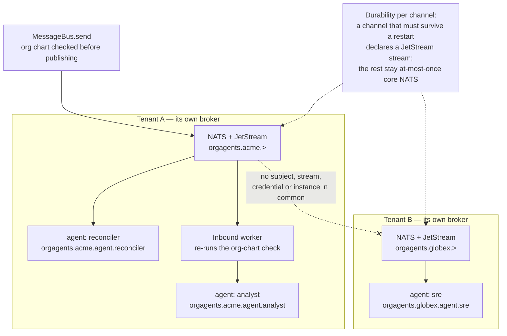
```mermaid
flowchart TB
    subgraph TA["Tenant A — its own broker"]
        natsA["NATS + JetStream<br/>orgagents.acme.>"]
        a1["agent: analyst<br/>orgagents.acme.agent.analyst"]
        a2["agent: reconciler<br/>orgagents.acme.agent.reconciler"]
        wA["Inbound worker<br/>re-runs the org-chart check"]
        natsA --> wA --> a1
        natsA --> a2
    end
    subgraph TB2["Tenant B — its own broker"]
        natsB["NATS + JetStream<br/>orgagents.globex.>"]
        b1["agent: sre<br/>orgagents.globex.agent.sre"]
        natsB --> b1
    end
    send["MessageBus.send<br/>org chart checked before publishing"]
    dur["Durability per channel:<br/>a channel that must survive a restart<br/>declares a JetStream stream;<br/>the rest stay at-most-once core NATS"]

    send --> natsA
    natsA -. "no subject, stream,<br/>credential or instance in common" .-x natsB
    dur -.-> natsA
    dur -.-> natsB
```

Subjects are tenant-prefixed even though each tenant already has its own
broker. The prefix is a second line behind the per-tenant instance, not the
isolation itself: two brokers wrongly merged by an operator would still not
share a subject.

**The wire is not the boundary.** The outbound path refuses an addressed
message the org chart refuses — before the bytes exist, because a refusal after
publishing is not a refusal. The inbound worker then makes *the same check
again*, on its own account, because receiving on a subject is not proof the
sender was allowed to send: a publisher that bypassed our client, or an
operator who mis-scoped a subject, produces bytes that look identical to a
legitimate message. A message addressed to somebody else, or from an agent that
may not reach this one, never reaches the handler; a malformed payload is
refused rather than thrown, because a decode error on a boundary anything can
publish to is an expected event, not a bug.

`requires_response` maps onto NATS request/reply rather than becoming a second
concept, since it already means "I expect an answer".

> **State of play.** The subject namespace, the adapter, the durability
> declaration and the inbound worker are built and tested against a fake
> client. `nats-py` is not a dependency and no client is imported: the client
> is injected. The NATS service is generated into the Compose stack and parsed
> by Docker's own parser — **never started**. Nothing here has spoken to a real
> broker.

---

## 14. Evaluations and the promotion gate

`evaluations_passed` has been a promotion-gate requirement since ADR-0022, and
for a long time it gated on nothing: cases were declared, the requirement was
recorded, and no code ever ran a case. A governance control nobody executes is
a promise. ADR-0060 turned it into evidence, at a price that is stated rather
than hidden.

**A case asserts what a machine can check, or it asserts nothing.** The
assertion is chosen by prefix — `exact:`, `contains:`, `schema:`, `guardrail:`,
`refuses`. An unprefixed expectation is prose written for a human reviewer;
there is no LLM judge in this platform, and inventing one that "sort of" agrees
with prose would give the gate a pass rate nobody could reproduce. Prose is
reported as unsupported: counted in the denominator, never in the numerator.

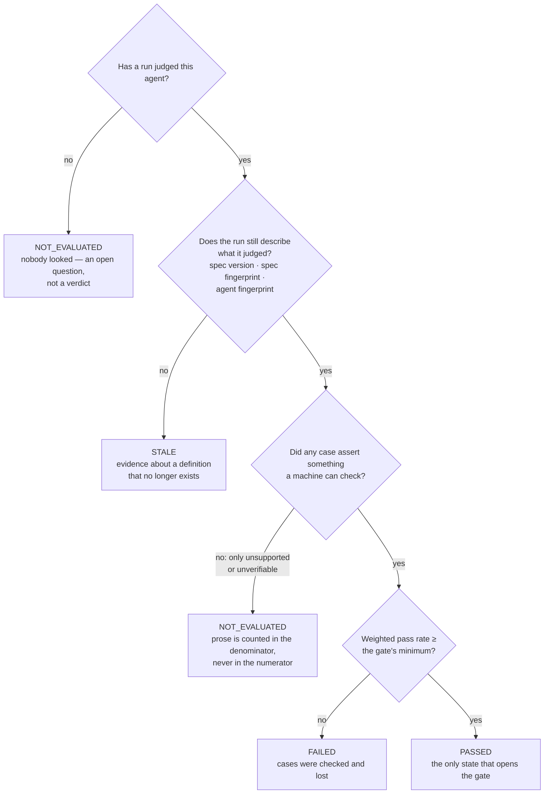
```mermaid
flowchart TB
    runq{"Has a run judged this agent?"}
    notrun["NOT_EVALUATED<br/>nobody looked — an open question,<br/>not a verdict"]
    staleq{"Does the run still describe<br/>what it judged?<br/>spec version · spec fingerprint ·<br/>agent fingerprint"}
    stale["STALE<br/>evidence about a definition<br/>that no longer exists"]
    anyq{"Did any case assert something<br/>a machine can check?"}
    unver["NOT_EVALUATED<br/>prose is counted in the denominator,<br/>never in the numerator"]
    rateq{"Weighted pass rate ≥<br/>the gate's minimum?"}
    failed["FAILED<br/>cases were checked and lost"]
    passed["PASSED<br/>the only state that opens the gate"]

    runq -- no --> notrun
    runq -- yes --> staleq
    staleq -- no --> stale
    staleq -- yes --> anyq
    anyq -- "no: only unsupported<br/>or unverifiable" --> unver
    anyq -- yes --> rateq
    rateq -- no --> failed
    rateq -- yes --> passed
```

Two distinctions in that picture are the whole point. **"Never run" is not
"failed"**: an absent verdict is an open question, and collapsing it into
either answer loses the fact that nobody looked — the same position ADR-0052
takes when it refuses to let a stale observation read as `healthy`. And **a
result older than what it judged is not evidence**: staleness is in the model,
not in a comment, and it has two triggers because two different mistakes
happen. A declared version bump invalidates the evidence because that is what a
reviewer cites; the fingerprints catch the commoner case, an edit shipped
without a bump.

A suite where nothing was checkable reports `NOT_EVALUATED` rather than
`FAILED`. Reporting it as a failure would blame the agent for the suite being
unwritten, and a reviewer chasing a failure that does not exist stops trusting
the gate. It still does not pass.

> **State of play.** The runner executes declared cases, records results and
> answers the gate; `orgagents evaluate` and `orgagents gate` expose it. It
> needs no provider credential, because the default runner is the `echo`
> adapter — which is also the limit: **an echo run proves the wiring, not the
> agent.** Whether a real model would have passed a case has never been
> measured here.

---

## 15. Sandbox providers

The spec says what a boundary must be; how it is enforced is a binding concern,
behind a provider seam (ADR-0054). Four providers are modelled: ordinary
containers, microVMs (`sbx`), NVIDIA OpenShell, and delegating the boundary to
the generated cloud target. A provider that cannot be detected degrades to the
portable floor — containers — and the degradation is reported rather than
silently taken.

```mermaid
flowchart TB
    req["Environment class asks for<br/>a boundary: container, microvm_sbx,<br/>openshell or target_native"]
    factq{"Do the environment facts<br/>support the provider?"}
    resolve["Resolved as asked.<br/>BoundaryStatement records what it claims"]
    degrade["Degraded to the container floor"]
    loud["The degradation is loud:<br/>provider asked, provider given,<br/>and the reason travel together<br/>into MAPPING.md and the README"]
    verified["verified = False, everywhere.<br/>We state the boundary we configured,<br/>never one we measured"]

    req --> factq
    factq -- yes --> resolve --> verified
    factq -- no --> degrade --> loud --> verified
```

### Two levels, and which one you mean

There are two sandboxes and they are not interchangeable (ADR-0068). A
**sandbox environment** is an instance of an environment class: it carries the
policy domains and the network posture, and it hosts agent processes. An
**execution sandbox** is where one agent's harness runs code, per invocation.

Only the second is built. Today an `agent-<id>` service runs *beside* its
sandbox on the platform runtime image, so the boundary around the agent process
is a Docker network — which the container provider's own boundary statement
concedes is a Docker-object boundary and not a kernel one. Where a provider can
host the agent process instead, its policy engine covers the agent itself: its
egress at method and path level, its filesystem, its credentials injected rather
than written to disk. That is the shape ADR-0054 v1.1.0 described OpenShell as
having, and then used one level too low; v1.2.0 corrects it.

```mermaid
flowchart TB
    subgraph tenant["Tenant — absolute boundary (ADR-0050)"]
        subgraph outer["Sandbox environment — an instance of an environment class"]
            pol["Policy: filesystem and process locked at creation,<br/>network and providers hot-reloadable"]
            net["Network connectivity: posture, egress allowlist,<br/>enforced at L7 by the provider's proxy"]
            a1["Agent process: analyst<br/>own filesystem scope"]
            a2["Agent process: reconciler<br/>own filesystem scope"]
            shared["Shared process namespace —<br/>NOT scoped by anything we can express.<br/>Declared in the boundary statement, verified = False"]
        end
        subgraph inner1["Execution sandbox — analyst's harness"]
            e1["Code execution, per invocation,<br/>on the environment class image"]
        end
        subgraph inner2["Execution sandbox — reconciler's harness"]
            e2["Code execution, per invocation"]
        end
    end

    rule["Co-residency is declared, never inferred.<br/>Permitted only when the standing org chart already<br/>connects every pair — mission-lent reach does not count,<br/>because a sandbox outlives a mission window"]

    a1 --> inner1
    a2 --> inner2
    outer -.-> rule
```

### Placement: the org unit is the namespace

An environment class is a *profile* — what an agent needs. Keying sandboxes by
it puts an HR agent and a Finance agent that both need `analysis` in one place,
which groups by kind of work rather than by whose work it is. So a sandbox
environment is an instance of a **placement**: an org unit crossed with an
environment class (ADR-0069). HR × `analysis` and Finance × `analysis` are
different sandboxes with the same shape.

This is the application-platform model, and it is deliberate. A department
wants what a namespace gives an application: a name scope, storage, a network
policy, and reachability from outside only over declared channels. Half of it
was already built and unused at this level — `Team.groups` is "protected-data
reach", `Visibility.PROTECTED` means "shared with every agent in those groups",
and `OrgChart.unit_groups` inherits groups down the chain. Nothing instantiated
a *place* from it.

```mermaid
flowchart TB
    subgraph tenant["Tenant — the absolute boundary (ADR-0050)"]
        subgraph hr["Placement: HR x analysis"]
            hra["hr-analyst"]
            hrb["hr-recruiter"]
            hrv["Shared volume = the PROTECTED plane<br/>for HR's groups. Not a new grant:<br/>no data class the unit did not already share"]
        end
        subgraph fin["Placement: Finance x analysis"]
            fa["fin-analyst"]
            fb["reconciler"]
            fv["Shared volume for Finance's groups"]
        end
        bus["Message bus and channels —<br/>the only path between placements,<br/>re-checked per message"]
    end

    hra --- hrv
    hrb --- hrv
    fa --- fv
    fb --- fv
    hr -- "default deny" --x fin
    hr --> bus
    fin --> bus

    note["Same environment class, different placements.<br/>Keying by class alone would have put<br/>HR and Finance in one sandbox"]
    bus -.-> note
```

Placement is **opt-in and inherits**: a team may declare itself a placement
boundary, a team that does not is placed in its nearest ancestor that did, and
the root always is one — the inheritance shape mandates already use. Four
things follow.

**Co-residency is membership**, not a pairwise check. Agents share a sandbox
because they share a placement.

**The shared volume is the PROTECTED plane made concrete.** It carries exactly
the data classes the unit's groups already share, and is not a new grant: an
agent that may not read a data class does not acquire it by sharing a disk with
someone who may. Without that rule a department volume widens access by
deployment topology.

**Only standing structure becomes a network rule** — manager chain, declared
peers, shared services, the bus. Mission-lent reach never does, because a
generated rule does not expire and a mission window does. Temporary reach goes
over the bus, where `BusWorker` already re-runs the org-chart check per message
(ADR-0059).

**A placement is not a security boundary.** Borrowing the platform model means
borrowing its caveat: namespaces on an application platform share a kernel too.
The tenant stays absolute; a placement is a naming and policy scope whose
isolation strength is whatever the provider reports. Two agents sharing one
still share a filesystem and a process namespace — a lateral path
`can_delegate` does not govern, permissions cannot see, and mandates sit above
entirely — so ADR-0068's rules still bind: one tenant, filesystem-scoped per
agent by the provider, degrading to one agent per sandbox where it cannot
scope.

The shared process namespace is not closed by any of that. Rule 7 documents it
rather than fixing it: co-resident agents are declared to share a process
boundary, in those words, with `verified=False`.

Rules 6 and 8 both turn on two questions the seam can now answer —
`hosts_agent_process` and `scopes_filesystem_per_agent`. Each has four states
rather than two, because "we have never confirmed this" is not "this is not
offered": OpenShell's filesystem policy is locked at sandbox creation and
whether it partitions *per agent inside* one sandbox is simply not documented,
so it answers `unknown`, and a cloud target answers `delegated`. Neither reads
as a yes — the difference is what the report says, not what the platform does.
Today every provider that can actually be run answers `no` to both, so the
effective limit is one agent per sandbox everywhere, and the generated report
states in words that the agent runs beside its sandbox rather than inside it.

What makes the seam worth having is that each provider must state its boundary
in writing: what it enforces, what it does **not**, and how faithfully it can
express "this sandbox belongs to one tenant". The container provider says
plainly that it is a Docker-object boundary and not a kernel one, that a kernel
escape reaches every tenant on the host, and that anyone who can reach the
Docker socket can reach every tenant on it. That statement is generated into
the target's README, so a reader is told the boundary they actually got.

> **State of play.** Every boundary statement carries `verified=False`, and
> that is not modesty: there is no Docker daemon, no `sbx` binary and no
> `openshell` binary in this environment, so each claim is a restatement of a
> vendor's documentation rather than a measurement. The OpenShell adapter
> models the four policy domains in our own types and refuses to serialize to a
> wire format it has not seen — an invented schema that reads as authoritative
> is worse than a stated gap.

---

## 16. Governance: records as build artifacts

```mermaid
flowchart LR
    adr["ADR<br/>a decision"]
    ws["WS<br/>a workstream"]
    code["Code and tests"]
    idx["Generated indexes"]
    val["orgagents records validate"]

    adr -- "decides" --> ws
    ws -- "delivers" --> code
    code -- "verifies" --> adr
    adr --> idx
    ws --> idx
    adr --> val
    ws --> val
    val -- "dangling reference,<br/>version mismatch,<br/>broken supersession" --> fail["Build fails"]
```

Decisions are versioned, superseded symmetrically and machine-validated. A
decision that changes gets a version bump and a changelog row rather than a
quiet edit — the record of *why* survives the change.

---

## 17. Module map

```mermaid
flowchart TB
    subgraph Author["Authoring"]
        specm["spec/<br/>model, validate, loader,<br/>migrations, schema"]
        designer["designer/<br/>repository, rbac, locks,<br/>merge, audit, auth"]
        web["web/<br/>canvas, spec-backed forms,<br/>command centre"]
    end
    subgraph Build["Build"]
        comp["compiler/<br/>ir, engine, registry"]
        diffm["compiler/diff.py<br/>consequence-ranked IR diff"]
        targets["compiler/targets/<br/>local, terraform"]
        phases["phases.py"]
    end
    subgraph Fabric["Fabric"]
        fabricm["fabric/<br/>tenants, deployments,<br/>services, quotas, health"]
    end
    subgraph Run["Runtime and services"]
        rt["runtime/<br/>engine, loader, adapters,<br/>subagents, scheduler"]
        a2am["runtime/a2a.py<br/>+ runtime/endpoints.py"]
        busm["bus.py + runtime/bus_worker.py<br/>NATS, per tenant"]
        guard["guardrails.py<br/>classifiers.py"]
        mem["memory.py<br/>context.py"]
        org["org.py<br/>missions.py"]
        cat["catalogs/<br/>entries, service,<br/>sources, usage"]
        dirm["directory.py"]
        sbx["sandboxes/<br/>provider seam, openshell"]
    end
    subgraph Ports["Ports to other people's systems"]
        tasks["tasks/<br/>port, local backend,<br/>binding, divergence, conformance"]
        chans["channels/<br/>port, binding, approvals,<br/>mattermost, conformance"]
        evals["evaluations.py<br/>cases, runner, the gate"]
    end
    store["store.py — JSON documents over SQLite"]
    records["records.py + docs/"]

    web --> designer --> specm
    specm --> phases --> comp --> targets
    comp --> diffm
    comp --> rt
    fabricm --> comp
    rt --> guard
    rt --> mem
    rt --> org
    rt --> a2am
    rt --> busm
    rt --> sbx
    tasks --> rt
    chans --> rt
    a2am -.-> chans
    evals -.-> specm
    evals -.-> rt
    cat -.-> comp
    dirm -.-> specm
    designer --> store
    fabricm --> store
    rt --> store
    tasks --> store
    evals --> store
    records -.-> Author
    records -.-> Build
    records -.-> Fabric
    records -.-> Ports
```

`tasks/`, `channels/` and `runtime/a2a.py` are all the same shape: a narrow
port, a bind-time refusal, a conformance suite or a fake, and exactly one
adapter that has never met its real counterpart. That is deliberate — the
product is the part that ages, so the seam it sits behind must not encode one
product's habits.

---

## 18. How this maps onto LangChain and deep agents

**Deep agents is the reference runtime; the OpenAI Agents SDK is a supported
binding; the spec still names no framework (ADR-0067).** What follows is the
comparison that decision rests on.

The spec describes agents, harnesses, tools, MCP mounts and sandboxes. So does
the framework underneath, in its own vocabulary, and the two are not the same
shape. Reading them side by side is the fastest way to see which of our
concepts are genuinely ours and which are a second implementation of something
that already exists.

```mermaid
flowchart LR
    subgraph ours["Declared in the spec — one meaning on every runtime"]
        h["Harness<br/>model, tools, grants, limits, policy"]
        t["ToolBinding<br/>+ the decision class it constitutes"]
        mcpw["MCPServerRef<br/>transport, allowed tools, read_only"]
        sbx["Sandbox template + provider seam<br/>tier, network, egress, boundary statement"]
        gr["Guardrails at four boundaries"]
        lim["max_turns, token and wall-clock budget"]
        appr["requires_approval / interrupt_on"]
    end

    subgraph theirs["deep agents and LangChain — the loop's own machinery"]
        hp["HarnessProfile<br/>prompt assembly + tool visibility<br/>(same word, different thing)"]
        bt["BaseTool / StructuredTool"]
        mcpa["langchain-mcp-adapters<br/>MultiServerMCPClient.get_tools()"]
        exec["ShellToolMiddleware +<br/>DockerExecutionPolicy / Codex / Host<br/>SandboxBackendProtocol.execute"]
        pii["PIIMiddleware<br/>block, redact, mask, hash"]
        lm["ModelCallLimitMiddleware(run_limit)<br/>ToolCallLimitMiddleware"]
        hitl["HumanInTheLoopMiddleware<br/>InterruptOnConfig"]
        fsp["FilesystemPermission<br/>operations, paths, allow/deny/interrupt"]
    end

    t --> bt
    mcpw -. not wired .-> mcpa
    sbx -. different layer .-> exec
    gr -. parallel implementation .-> pii
    lim -. we use recursion_limit instead .-> lm
    appr --> hitl
    h -. no relation .-> hp
    sbx -. ungoverned today .-> fsp
```

### The word "harness" means something else there

deep agents has a `HarnessProfile`, and it is **not** our harness. Theirs
governs prompt assembly and tool visibility: a base system prompt, a suffix,
tool description overrides, excluded tools, excluded middleware. Ours is the
whole operable envelope — model, tools, MCP mounts, relational grants, data
grants, limits, approval policy. The overlap is the prompt and the tool list;
everything we consider governance has no counterpart there, and everything
they consider profile composition has none here. Two concepts, one word, and
anybody reading both will conflate them.

### Where the framework is ahead of us

- **Limits.** `ModelCallLimitMiddleware(run_limit=n, exit_behavior="end")` is
  `max_turns`, exactly, in the framework's own terms — now what the adapter
  uses, with the `2n+1` `recursion_limit` demoted to a structural backstop.
  `ToolCallLimitMiddleware` bounds tool calls, per tool if wanted, and is not
  wired.
- **Filesystem governance.** `FilesystemPermission` is
  `{operations: [read|write], paths: [...], mode: allow|deny|interrupt}` — a
  real permission model over the virtual filesystem, with a human-interrupt
  mode. The adapter now derives a rule set from the agent's data grants, and
  the order matters: the first matching rule wins and **an unmatched path is
  allowed**, which is the opposite of ADR-0008, so the deny floor on `/**` is
  written down rather than assumed.
- **Execution policies.** `DockerExecutionPolicy`, `CodexSandboxExecutionPolicy`
  and `HostExecutionPolicy` behind `ShellToolMiddleware` are a working provider
  seam for shell execution, with timeouts and output caps.
- **Boundary handling.** `PIIMiddleware` offers block, redact, mask and hash
  per PII type; `ToolErrorMiddleware`, `ToolRetryMiddleware` and
  `ModelFallbackMiddleware` cover ground our guardrails and model policy
  describe.

### The OpenAI Agents SDK is not the thinner option

It is worth saying plainly, because the middleware list above invites the
opposite conclusion. The OpenAI Agents SDK carries `InputGuardrail`,
`ToolInputGuardrail`, `ToolOutputGuardrail` and `OutputGuardrail` — **the same
four boundaries ADR-0035 declares**, matched one for one, which no LangChain
construct does. It also has native MCP with a per-tool approval hook
(`HostedMCPTool`, `MCPToolApprovalFunction`), `Session` for conversation
state, built-in tracing, and a `max_turns` that means turns.

Where it is genuinely narrower is the harness surface: no filesystem
permission model, no execution-policy seam, no context-editing or
summarization layer. And its hosted tools — `HostedMCPTool`,
`CodeInterpreterTool`, `ComputerTool`, `ApplyPatchTool` — are one vendor's
platform features rather than SDK features, so using them binds a deployment
to that platform and not merely to that library. That is a different kind of
cost from an API that churns, and it is the one that bears on which runtime
should be the reference.

### Where we are ahead, and why the duplication is deliberate

Every middleware above binds to one framework. A permission decided inside
`PIIMiddleware` holds for LangChain and means nothing to the OpenAI Agents SDK
or to a Terraform-generated deployment. Our checks live in the tools and at the
adapter seam, so they hold whichever loop is running and survive swapping it —
which is the whole argument for the seam in §5.

Two things are ours with no counterpart at all: **authority** (a mandate is not
a permission, and no framework models who should have decided something), and
**the boundary statement** — a provider saying in writing what it enforces and
what it does not, with `verified=False` until somebody measures it.

ADR-0067 rule 5 makes this a standing constraint rather than a preference:
permission, delegation legality, mandate and approval decisions stay in the
tools and at the seam. Framework middleware may be layered on top, and may
never be the only check — a check that holds for one framework and means
nothing to the next is not a control, it is a coincidence.

### Where the two layers are different levels, not competitors

Their sandbox is a backend for shell and file tools: a place to `execute()`. Our
sandbox (ADR-0054) is an isolation boundary for the whole agent — tier, network
posture, egress allowlist, tenant fidelity. One could sit inside the other; they
do not replace each other, and describing either as "the sandbox" without saying
which layer is how the two get confused.

### MCP

We resolve `MCPServerRef`s ourselves through `harness/mcp.py`, with a real
client when the `mcp` package is installed and an in-process backend otherwise.
LangChain's idiom is `langchain-mcp-adapters`, whose `MultiServerMCPClient`
returns tools ready to hand to an agent. That package is **not** a dependency
here, so the two paths have never been reconciled — ours carries the
`allowed_tools` allowlist and `read_only` flag that the binding needs, and
theirs carries transport handling that is better tested than ours.

---

## 19. Where the design is ahead of the implementation

Kept here deliberately, so the diagrams above are not read as a description of
what runs today. The ordered list with owners is `docs/ROADMAP.md`; the
alpha-blocking subset is `docs/ALPHA.md`.

Most rows here are one of two shapes. A **contract** is modelled, tested
against a fake, and has never met its real counterpart — honest in isolation,
and worth counting because there are now a lot of them. A **gap** is something
the design describes and the code does not do yet.

| Area | Designed | Actually true today |
|---|---|---|
| Tenant isolation | Absolute, fabric-assigned | Proven by generation tests only; no breach attempt, no running tenant (WS-028 M6) |
| The local Docker stack | A generated tenant that starts and works | Generated, and every Compose file is parsed by Docker's own parser; **never started** — no daemon here |
| Cloud targets | Terraform for three providers | Generated and syntax-checked; never `terraform apply`-ed, never `terraform validate`-ed |
| Operations: health and drift | Live signals from each target | Stub backend only; no adapter has met a target |
| Human channels | A bridge that reaches people and takes their answer | Port, ledger, conformance suite and a **Mattermost adapter** built; run only against a fake transport. No Slack or Teams client. The riskiest wire assumption (obtaining a `trigger_id` for an agent-initiated dialog) is stated, not resolved |
| Task intake | Work assigned in a person's own tool reaches an agent | Port, local reference backend, conformance suite, one-run-per-task and divergence reporting built; **no real product adapter**, and identity never verified against a real service (WS-031 M5/M6) |
| Agent-to-agent (A2A) | An external endpoint is callable | JSON-RPC binding with three operations and card discovery, under the full endpoint check; tested against a fake peer, **never called a real one**. Method and message field names are our model of the wire. gRPC/REST, streaming and the rest raise `UnsupportedOperation` |
| Inbound A2A | Other organizations calling our agents | Not built; the default is that no agent is exposed (WS-019 M5) |
| Message bus | NATS/JetStream, one per tenant | Subject namespace, adapter, durability and the inbound org-chart re-check built against a fake client; the NATS service is generated and parsed, **never started**, and `nats-py` is not a dependency |
| Evaluations | A gate backed by evidence | The runner executes declared cases and answers the gate. It runs on the `echo` adapter, so it proves the wiring, not the agent; prose expectations are reported unverifiable rather than judged |
| Divergence signals | Disagreement reaches somebody | Computed on demand and returned to the caller; nothing routes or stores them (ALPHA B6) |
| Placement | A sandbox environment belongs to an org unit, with a group-scoped volume and network policy from standing structure (ADR-0069) | **Nothing.** Sandboxes are still keyed by environment class, so two departments sharing a profile share a key; a team cannot declare a placement; no volume is generated; and no target emits a network rule derived from the org chart |
| Sandbox environments hosting agents | The agent process runs inside a governed sandbox, and co-residency is declared and scoped (ADR-0068) | Partial. The provider seam now answers both questions — `hosts_agent_process` and `scopes_filesystem_per_agent`, in four states where `unknown` and `delegated` are conservatively not-a-yes — and rule 6's degradation to one agent per sandbox is computed and recorded. Every provider we can run answers `no` to both, so the effective limit is one agent everywhere. A sandbox environment is still not a spec concept and co-residency still cannot be declared |
| Sandbox providers | Prefer a kernel boundary | `container` is the portable floor and the only one available here; `microvm_sbx` and `openshell` are contracts with no binary behind them, and every boundary statement carries `verified=False` |
| Workflow engines | Pluggable, out-of-process engines are egress events | `native` exercised; the Langflow path exercised through a fake transport; LangGraph, LangChain and ADK are binding entries only |
| Reference runtime | Deep agents carries the deep integrations (ADR-0067) | Delivered: limits as `ModelCallLimitMiddleware`, a deny-by-default filesystem permission set, and MCP over the adapter transport behind our own allowlist. A live model still has not answered (ALPHA A5) |
| MCP transport | One mounting path | One policy path, two transports: `langchain-mcp-adapters` carries stdio/SSE/streamable-HTTP and its tools return through our resolution, so the allowlist and `read_only` still apply. The in-process backend remains for tests and the bundled relational server |
| Runtime adapters | Deep agents, OpenAI SDK, LangGraph | **deep agents executes in CI** against the real framework with a scripted chat model — real graph, real middleware, real tool binding — so the seam and the limit translations are exercised. No live model has answered. The OpenAI adapter is asserted against the installed SDK but `Runner` has never run; LangGraph is still untouched |
| Authority: mandates | A declared scope of decision per unit, narrowing down the tree, escalating when exceeded | **Built** (ADR-0065): declared on teams, agents and missions, resolved once at the phase gate, enforced at the tool boundary, escalating to the smallest unit that holds the decision. A capability declares which decision class it constitutes, and most declare none — so an organization gets the checks it wires up, and an unwired capability decides nothing |
| Platform targets | A design compiles to another vendor's agent definitions | **One exists** (`maf`): a `kind: Prompt` file per agent plus a `CONFORMANCE.md` naming every construct that does not travel and who enforces it instead. It is the first target that emits somebody else's format rather than infrastructure that runs ours. What it proved: the authority half of a design has nowhere to go, because no framework has a permission model — and the **tool surface is not in the IR**, since MCP mounts and built-in families are assembled by the harness at run time. The most portable thing in the ecosystem is the part we do not compile |
| Placement | A department is a namespace: its own sandbox environment, volume and network policy | **Built** (ADR-0069): placement is an org unit crossed with an environment class, opt-in and inherited, resolved at the phase gate into the IR. The local target emits one internal network and one shared volume per placement and names the co-resident agents in its README. Three honest limits ship as findings rather than prose — the opt-in default is the widest arrangement, generated policy and the org chart drift silently, and two agents a separation keeps apart may still share a process namespace. It is **not** a security boundary; the tenant is |
| The designer, driven | The UI does what it looks like it does | **Exercised** (`scripts/interaction_check.py`): a palette drag, an inspector edit, a node move, the authority controls and a save that round-trips — twelve checks. It found that a palette kind added after the layout store's enum was written could be dropped, edited and then lost on a 500, because nothing had ever dropped one. Conflict resolution, locks and narrow viewports are still untouched |
| The designer, rendered | A UI somebody can actually use | **Rendered at last.** `scripts/screenshots.py` drives Chromium over the running app and writes the README's screenshots, failing on a page or console error. The first run found four defects 1,400 tests did not, one of them data loss on every keystroke in the agent form. Interaction — drag-and-drop, the inspector forms, locks and conflict resolution — has still never been exercised |
| The publish path | A design goes from the designer to a running system | **Built** (WS-032 M9): `preflight` validates and compiles into a discarded directory under the fabric's platform policy, naming the stage it stopped at; `publish` requires `system.publish`, names a revision and creates a deployment in `requested`. The designer **requests** and never deploys — the tenant is the fabric's to assign and the policy the fabric's to apply. The refusal is the deliverable: a 422 carries the gate's findings and the UI renders them. What remains unbuilt is the other side — nothing yet moves a deployment from `requested` to `generated` automatically |
| Placement: the designer | Drawing the boundary you can define | Regions on the canvas, derived from the spec rather than stored in the layout, with a node test that the JavaScript and the Python resolver place agents identically. The region's border carries the network posture; it is deliberately not a hard bright box, because a placement is not a wall |
| Authority: the designer | Editing a mandate with reference pickers | Built: the palette declares decision classes, people and separations, the mandate and posture controls ask their question outright, and the Authority view shows effective authority for agents and people with the gate's findings beside it |
| Role responsibilities | A promise anchored to the capabilities that keep it | Free-form prose beside checkable capabilities and permissions; a role can promise what it cannot do |
| Agent vocabulary | Kind derived from the tree, service reach encoded once | Five `AgentKind` values of which one changes behaviour, encoded twice; `SUBAGENT` vestigial since ADR-0027. ADR-0063 is accepted and **not yet implemented** |
| Authority: people | A person is a principal for what they may decide, and never for what they may reach | **Built** (ADR-0079): declared once so one human is one principal, holding a mandate bounded by their org unit, covered by separations, reachable by the holder search, and refused outright if they declare a capability or a permission. What is declared is a **claim** — the real delegation of authority lives in an approval matrix this platform does not read, and nothing reconciles the two. Authority also attaches to the individual rather than the position, so it rots when they change jobs |
| Delegated human authority | Undecided | ADR-0064 holds the question open, now narrower: a decision only a board can take lands on a person (ADR-0079), but an agent still acts as itself or not at all (ADR-0057 rule 2), which leaves a personal assistant unable to act for the person it is paired to |
| Guardrails | Pluggable judgement | Works; recall never measured against a labelled corpus |
| Designer identity | OIDC with group mapping | Works, but the JWT verification is hand-rolled RSA because no crypto library imports here — replace before production |
| Knowledge | Declared, governed sources | Not retrieved from; `freshness_seconds` is declared and unenforced |
| Memory recall | Finds what is relevant | Token overlap, not embeddings: it misses paraphrases often enough to matter |
| Human pairings | Named, accountable people | Named individuals that rot; nothing detects a departed employee still listed as an approver (WS-016 M4). A pairing now references a declared person rather than copying one, so the same human cannot appear twice under two ids — which it did, six times, in the worked finance example |

Rows that used to be here and are not any more, because the code caught up: the
command centre (backend and front end are built, with operator roles disjoint
from designer roles); the fabric tenancy core and operational model; the
designer UI editing the runtime model instead of the spec (its design views are
spec-backed now); declared evaluations never being executed; and external agent
endpoints being governed but uncallable.
