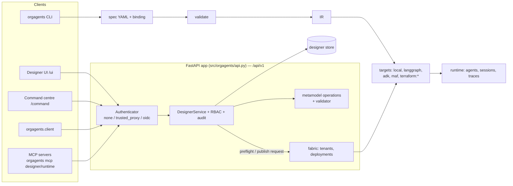

# Developer guide

For people changing the platform, or building on it through its API or MCP
servers. For *using* the designer, see [DESIGNER.md](DESIGNER.md); for the
architecture in depth, [ARCHITECTURE.md](ARCHITECTURE.md); for why things are
the way they are, the ADRs in [decisions/](decisions/index.md).

## 1. What the system is

A design tool and toolchain for **organisations of AI agents**. You describe
an organisation — teams, agents, roles, capabilities, authority, data,
workflows — as a model in a **UML profile** (ADR-0101, ADR-0112). The model is
validated, compiled to an intermediate representation (IR) and generated for a
**target** (Docker on a workstation, LangGraph Platform, Google ADK, Microsoft
Agent Framework, Terraform for AWS/Azure/GCP). A **runtime** runs the result;
a **fabric** (command centre) decides what runs where for which tenant.



Every client is a peer over the same API (ADR-0018): the UI, the Python
client and the MCP servers all pass through the same authenticator, service
layer and RBAC. Nothing gets a side door.

## 2. Local setup

### Designer in Docker (fastest)

```bash
docker compose up -d --build          # UI at http://localhost:8000/ui/, API docs at /docs
ORGAGENTS_SEED=1 docker compose up -d --build   # with the demo organisation
```

The container binds to `127.0.0.1` only and runs in `none` auth mode — it
believes the `X-User` header, so it must not be reachable from other machines
(ADR-0114). `make up`, `make seed`, `make wait`, `make down` wrap the same.

### A virtual environment

```bash
python -m venv .venv
.venv/Scripts/pip install -e ".[dev,mcp]"      # .venv/bin/pip on Linux/macOS
.venv/Scripts/python -m pytest -q              # or: make test PY=.venv/Scripts/python
.venv/Scripts/orgagents serve --port 8000      # the API + UI from source
```

Extras: `dev` (pytest, httpx, jsonschema), `client` (httpx, for
`orgagents.client`), `mcp` (the MCP SDK), `langgraph`, `openai`, `anthropic`.

### Windows notes

- **tzdata.** Windows has no IANA time-zone database, so
  `zoneinfo.ZoneInfo("Europe/London")` fails and the scheduler tests with it.
  `pip install tzdata` into the venv.
- **Encoding.** `orgagents` reads its files as UTF-8 and the example scripts
  (`examples/ayc/*.py`) switch the console to UTF-8 themselves, so neither
  needs `PYTHONUTF8=1`. The test suite still does on Windows (tests read
  files with the platform default); run it in the designer image, below.
- **Git Bash path mangling.** Prefix `docker run` with `MSYS_NO_PATHCONV=1` so
  `/src` is not rewritten to `C:/Program Files/Git/src`.
- **Don't pipe heredocs into `python`** from Git Bash; it can hang waiting on
  the console. Write the script to a file and run the file.
- **Run the suite in the designer image** — the same Python (3.11) and
  dependencies the container ships:

  ```bash
  MSYS_NO_PATHCONV=1 docker run --rm -u root \
    -v "C:/Users/<you>/projects/agentic-organization:/src" -w /src \
    --entrypoint sh orgagents-designer:local -c \
    "/opt/venv/bin/pip install -q pytest httpx 'mcp>=1,<2' >/dev/null 2>&1; \
     PYTHONPATH=/src/src /opt/venv/bin/python -m pytest -q -p no:cacheprovider tests"
  ```

## 3. Repository layout

| Path | What lives there |
|---|---|
| `src/orgagents/spec/` | The System Spec (`model.py`), bindings, loader/migrations, the validator (`validate.py`), the issue catalog (`issue_catalog.yaml`, `issue_codes.py`) |
| `src/orgagents/metamodel/` | The UML profiles, one module per concern (`core.py` … `deployment.py`, in the UML subset of `uml.py`, assembled by `__init__.py`), the completeness check (`completeness.py`), the generated reference (`reference.py`), constraints, **model operations** (`operations.py`), scenarios, the spec→IR transformation trace |
| `src/orgagents/compiler/` | IR (`ir.py`), the engine, the target registry (`base.py`), `targets/` (local, langgraph, adk, maf, terraform, template), IR diff |
| `src/orgagents/runtime/` | Adapters per framework, workflow engines registry (`engines.py`), the worker a generated container runs |
| `src/orgagents/designer/` | `DesignerService`, RBAC for people (`rbac.py`), auth (`auth.py`), repositories, locks and merge, audit, gestures, layout |
| `src/orgagents/fabric/` | Tenants, deployments, quotas, operator RBAC — the command centre's backend |
| `src/orgagents/api.py` | The FastAPI app: every route |
| `src/orgagents/api_contract.py` | Tags, `/api/v1`, the OpenAPI export (ADR-0115) |
| `src/orgagents/client.py` | The typed Python client |
| `src/orgagents/mcp_server/` | The designer and runtime MCP servers |
| `web/` | The designer UI (plain JS: `app.js`, `canvas.js`); `web/command/` the command centre |
| `examples/` | Worked designs; `examples/ayc/` runs end to end in Docker |
| `docs/decisions/`, `docs/workstreams/` | ADRs and workstream records (indexes are generated) |
| `docs/api/openapi.json` | The committed public API schema |
| `scripts/` | Browser checks (Playwright) and the smoke test |
| `tests/` | pytest; UI source tests read `web/*.js` as text |

## 4. Core concepts

- **Spec** — the vendor-neutral description of an organisation
  (`*.system.yaml`, `SystemSpec`). It names no framework (ADR-0004).
- **Binding** — how one spec is realised on one target: models, runtimes,
  servers, sandboxes (`*.binding.yaml`, ADR-0085). A spec has many bindings.
- **UML profiles** — every kind is a stereotype of a UML metaclass and every
  link a UML relationship with multiplicities and the spec field it lives in
  (ADR-0101, ADR-0112). The palette, link rules, constraints and the
  `/api/v1/designer/metamodel` answer are all derived from it.
- **Model operations** — create, update, delete, link, unlink, set_leader on a
  spec, checked against the profile's constraints (ADR-0102). Every canvas
  gesture is exactly one (ADR-0103); so is every MCP `apply_model_operation`.
- **IR** — what the compiler produces from a valid spec + binding; targets
  read only the IR (ADR-0005), and the transformation is traced (ADR-0104).
- **Targets** — generators from IR to files: Compose, Terraform, framework
  code (ADR-0011, ADR-0012, ADR-0086, ADR-0091).
- **Runtime** — agents, sessions, events, traces, workflow engines (ADR-0056).
- **Agent-to-agent** — in a generated stack each agent is a container
  (ADR-0109) on the tenant's NATS as its own broker user. Who may message or
  delegate to whom is computed at compile time (`compiler/links.py`) from team
  leadership, `delegates_to`, interaction flows, the reporting line, unit links
  and missions, written into `agents/<id>.json` and `nats/nats.conf`, and
  refused by the sender, the broker and the receiver (ADR-0118). Tools:
  `send_message`, `delegate` → handle, `check_delegation`
  (`runtime/agent_bus.py`).
- **Designer** — workspaces, designs (stored as "systems"), revisions,
  optimistic concurrency with merge (ADR-0033), people-RBAC (ADR-0032), audit
  (ADR-0043), publish as a *request* to the fabric (ADR-0049).

## 5. How to…

### Add a stereotype or a relationship to the profile

The UML profiles are the source of truth for what the model means
(ADR-0112 §8); `spec/model.py` and `spec/binding.py` are their Python
realisation. Every class, enumeration and field of the models must be
declared in exactly one profile, and `tests/test_metamodel_completeness.py`
fails the build otherwise — in both directions (an undeclared field, or a
declaration the models contradict).

1. Decide which profile the concept belongs to — `core`, `organisation`,
   `authority`, `access`, `data`, `knowledge`, `process`, `assurance` or
   `deployment` (the binding) in `src/orgagents/metamodel/` — and declare it
   there: a `Stereotype(...)` for a thing with identity (name `«Kind»`,
   `kind`, the `MetaClass` it extends, the `collection` it lives in, the spec
   `model` class, `palette=False` if the palette does not offer it), a
   `DataType(...)` for a value, an `Enumeration(...)` with its literals, a
   `Relationship(...)` for every field holding ids (source, target, UML kind,
   multiplicities, `field`), and `props(owner, "name: Type [mult] -- doc")`
   for every field holding a value.
2. Put a relationship or property in a profile that sees both ends: the
   declaring profile or one it imports (`test_metamodel_profiles.py` checks,
   and that imports stay acyclic and nothing imports Deployment).
3. Add the field to `src/orgagents/spec/model.py` (or `binding.py`).
4. Regenerate: `orgagents metamodel docs` (the profile reference
   `docs/metamodel/<profile>.md` and the `.puml` diagrams — never edit them by
   hand), `orgagents metamodel scenarios`, `orgagents metamodel
   transformation` and `orgagents designer gestures`.
5. Run `tests/test_metamodel*.py`, `test_transformation.py`,
   `test_designer_palette_coverage.py` and `test_designer_covers_the_model.py`
   — they hold the models, the palette, link rules, trace and canvas to the
   profiles.

### Add a validator rule and an issue code

1. Emit a `Finding(severity, code, message, where)` from `validate_spec` in
   `src/orgagents/spec/validate.py`.
2. Catalogue the code in `src/orgagents/spec/issue_catalog.yaml`: `number`
   is grouped by section (`1xx` uniqueness, `2xx` mandates, …); take the
   **next free number in the section**; a published number is never reused
   or moved. Fill `title`, `summary`, `explanation`, `why`, `fix`, `refs`.
3. `tests/test_issue_codes.py` fails if a code the validator emits is not
   catalogued, and checks each number sits in its section and is unique.

### Add a compiler target

Implement the `Target` protocol in `src/orgagents/compiler/base.py` (`id`,
`describe()`, `generate(ir) -> list[GeneratedFile]`). Built-ins register in
`register_builtin_targets()`; a third-party package registers through the
`orgagents.targets` entry point (ADR-0091, see the comment in
`pyproject.toml`). Declare what it can carry (`_BUILTIN_SUPPORT` or a
`descriptor()`), so the mapping report says what does not survive. Try it:
`orgagents compile examples/ayc/ayc.system.yaml --target local --out /tmp/out`.

### Add a workflow engine binding

Engines are registered in `src/orgagents/runtime/engines.py`
(`register_engine(EngineDescriptor(...))`); an out-of-process engine is an
egress event (ADR-0056). The designer draws the governed workflow; the
engine builds what happens inside a step (ADR-0110). The designer lists
engines per design at `GET /api/v1/designer/systems/{id}/workflow-engines`.

### Add a UI view

Views live in `web/app.js`, routed by `location.hash` (`#/<view>`); the
canvas is `web/canvas.js`. Call the API with relative `/api/...` paths (the
unversioned aliases are the UI's). Add a source test in
`tests/test_designer_ui.py` and a check in `scripts/view_check.py`; refresh
screenshots with `scripts/screenshots.py`.

## 6. The REST API

- **Contract:** `/api/v1/...` is public and versioned (ADR-0115). The
  unversioned `/api/...` paths are the bundled UI's and may change. A
  breaking change gets `/api/v2` beside v1.
- **Docs:** interactive at `http://localhost:8000/docs`; the committed schema
  is [`docs/api/openapi.json`](api/openapi.json), regenerated with
  `orgagents api schema` (a test fails when it is stale).
- **Auth modes** (`ORGAGENTS_DESIGNER_AUTH`, ADR-0047/0114):

  | Mode | The caller sends | Use |
  |---|---|---|
  | `none` | `X-User: alice` | single-user local; bind to loopback |
  | `trusted_proxy` | `X-User` + `X-Orgagents-Proxy-Secret` (or comes from `ORGAGENTS_PROXY_SOURCES`) | behind an authenticating proxy |
  | `oidc` | `Authorization: Bearer <id token>` | shared installations |

  Roles are never sent: they come from workspace membership or the IdP's
  group mapping. 401 is "who are you?", 403 is "not with your role".

```bash
curl -s localhost:8000/api/v1/designer/whoami -H "X-User: alice"
curl -s -X POST localhost:8000/api/v1/designer/workspaces \
     -H "X-User: alice" -H "Content-Type: application/json" -d '{"name":"Demo"}'
curl -s "localhost:8000/api/v1/designer/issue-codes/OA-1201"
```

```python
from orgagents.client import DesignerClient, ApiError

with DesignerClient("http://127.0.0.1:8000", user="alice") as dc:
    ws = dc.create_workspace("Demo")
    design = dc.create_design(ws["id"], "demo")
    for f in dc.validate(design["id"])["findings"]:
        print(f["issue_id"], f["message"])
    spec = dc.get_design(design["id"])["record"]["spec"]
    step = dc.apply_operation(spec, {"op": "create", "kind": "agent", "id": "lead",
                                     "owner": "root", "attrs": {"name": "Lead"}})
    dc.save_design(design["id"], spec=step["spec"], base_version=design["version"])
    try:
        dc.request_publish(design["id"], tenant_id="acme")
    except ApiError as e:
        print(e.status, e.detail)
```

`DesignerClient.from_env()` reads `ORGAGENTS_API_URL`, `ORGAGENTS_USER`,
`ORGAGENTS_AUTH_MODE`, `ORGAGENTS_TOKEN`, `ORGAGENTS_PROXY_SECRET`.
`RuntimeClient` covers sessions, traces, metrics, alerts and catalogs.

## 7. The MCP servers

Two servers built on the official `mcp` SDK (`pip install -e ".[mcp]"`), each
over **stdio** or **streamable HTTP**. They are clients of `/api/v1` acting
as a named user, so the designer's RBAC decides every call (ADR-0115).

```bash
ORGAGENTS_USER=alice orgagents mcp designer                       # stdio, API at 127.0.0.1:8000
ORGAGENTS_USER=alice orgagents mcp designer --in-process ./my.db  # no running designer needed
ORGAGENTS_USER=alice orgagents mcp runtime --allow-mutations      # adds run/resume/ack
ORGAGENTS_MCP_TOKENS='{"<32+ random chars>":"alice"}' \
  orgagents mcp designer --transport http --port 8765             # http://127.0.0.1:8765/mcp
```

**Designer tools:** `whoami`, `list_workspaces`, `list_designs`,
`get_design` (yaml/json), `validate_design` (findings with `OA-` ids),
`explain_issue`, `list_profile`, `describe_stereotype`,
`apply_model_operation` (optionally saving, with `expected_version`),
`save_design` (`expected_version` required), `diff_versions`,
`compile_preview` (target dry run: verdict + file list), `request_publish`.
**Resources:** `orgagents://issues`, `orgagents://issues/{code}`,
`orgagents://profile`, `orgagents://designs/{design_id}`. **Prompts:**
`review_authority`, `add_agent_to_team`.

**Runtime tools:** `list_agents`, `list_sessions`, `get_session`,
`session_events`, `session_trace`, `ops_metrics`, `ops_alerts`,
`agent_health`, `search_catalogs`, `catalog_entry`, `search_marketplace`;
with `--allow-mutations` also `run_agent`, `resume_session`, `ack_alert`.

### Connecting Claude Code

Copy [`.mcp.json.example`](../.mcp.json.example) to `.mcp.json` at the
repository root (project scope) and set your user, or add it from the CLI:

```bash
claude mcp add orgagents-designer --env ORGAGENTS_USER=alice \
  --env ORGAGENTS_API_URL=http://127.0.0.1:8000 \
  -- /path/to/.venv/bin/orgagents mcp designer
# over HTTP:
claude mcp add --transport http orgagents-designer http://127.0.0.1:8765/mcp \
  --header "Authorization: Bearer <token>"
```

Then `/mcp` in Claude Code lists the server and its tools.

### Connecting Claude Desktop

Add to `claude_desktop_config.json` (Settings → Developer → Edit config):

```json
{
  "mcpServers": {
    "orgagents-designer": {
      "command": "C:\\Users\\<you>\\projects\\agentic-organization\\.venv\\Scripts\\orgagents.exe",
      "args": ["mcp", "designer"],
      "env": {"ORGAGENTS_USER": "alice", "ORGAGENTS_API_URL": "http://127.0.0.1:8000"}
    }
  }
}
```

### Security notes

- **No identity, no server.** stdio needs `ORGAGENTS_USER` (or
  `ORGAGENTS_TOKEN` against an `oidc` designer). HTTP needs
  `ORGAGENTS_MCP_TOKENS` (tokens ≥ 16 characters, mapped to users); requests
  without a known bearer token get 401 before MCP sees them.
- The assistant has **your** role. Give an assistant a user with the role it
  needs (a `viewer` for review work), not your owner account.
- **Not offered:** membership, settings, lock breaking, restore, delete,
  audit reading. Publishing is only ever a *request* the fabric decides on.
- HTTP binds to `127.0.0.1` and keeps the SDK's DNS-rebinding protection. In
  front of a `trusted_proxy` designer the server needs
  `ORGAGENTS_PROXY_SECRET` — it speaks as the proxy, so guard its tokens as
  you would the proxy. It refuses HTTP in front of an `oidc` designer.
- The runtime and catalog routes authorise the caller (ADR-0116): a
  workspace member reads (viewer), resumes (reviewer), runs (editor) or
  manages (admin/owner) the agents of that workspace's designs; fabric
  operators read everything and acknowledge alerts; fabric admins review the
  platform catalog. The runtime MCP server inherits exactly that -- a viewer's
  assistant is refused `run_agent` even with `--allow-mutations`. In `none`
  mode a request naming nobody is the local user and may do everything.

## 8. Testing strategy

| Layer | Where | Run |
|---|---|---|
| Unit and API | `tests/test_*.py` (FastAPI `TestClient`, temp SQLite) | `pytest -q` |
| Contract | `tests/test_api_contract.py`, `tests/test_mcp_servers.py` (SDK in-memory client) | `pytest -q tests/test_api_contract.py tests/test_mcp_servers.py` |
| UI source | `tests/test_designer_ui.py` and friends read `web/*.js` as text | part of `pytest` |
| Browser | `scripts/screenshots.py`, `interaction_check.py`, `view_check.py`, `concurrency_check.py` (Playwright + Chromium) | `PLAYWRIGHT_BROWSERS_PATH=/opt/pw-browsers python3 scripts/view_check.py` |
| Records | ADR/WS front matter and indexes | `orgagents records validate`, `orgagents records index` |
| End to end | AYC compiled for `local` and run in Docker | `make ayc-up`, then `examples/ayc/end_to_end_local.py` ([examples/ayc/README.md](../examples/ayc/README.md)) |
| Bus | edges, broker permissions, refusals, separation across a chain (fake transport); the same against a real `nats-server` | `pytest -q tests/test_agent_bus.py tests/test_agent_bus_nats.py` (the second needs `nats-server` on PATH or Docker; skipped otherwise) |
| Agent-to-agent end to end | CEO → COO → buyer over NATS in Docker | `examples/ayc/local_stack.py e2e-messaging` |
| Smoke | build, start, run one agent | `make smoke` |

## 9. ADRs and commits

- A decision that changes what the platform promises gets an ADR:
  `orgagents records new adr "<the decision as a sentence>"` scaffolds the
  next number from [the template](decisions/_template.md); fill Context,
  Decision, Scope, Implementation, Advantages, **Disadvantages (never
  empty)**, Alternatives, Verification. Then `orgagents records validate` and
  `orgagents records index` (the index is generated; don't hand-edit it).
  Amend an accepted ADR by bumping its `version` and adding a changelog row.
- Comments explain **why**, not what — the reason a line exists, the bug it
  prevents, the ADR it implements.
- Commit subjects say what the change does for a user, with the ADR in
  parentheses: `Canvas filters by relationship kind; side panels resize (ADR-0105)`.
- Regenerate what is generated in the same commit: `docs/api/openapi.json`
  (`orgagents api schema`), `docs/metamodel/*` (`orgagents metamodel docs`,
  `orgagents metamodel
  diagram`), the record indexes.
