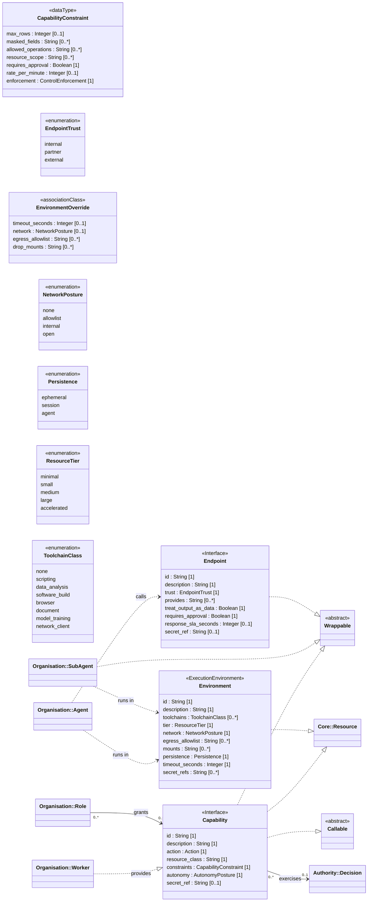

<!-- Generated by `orgagents metamodel docs` from src/orgagents/metamodel/. Do not edit: change the profile and regenerate. -->

# Access profile

What an agent may reach, and the sandboxes it runs in.

- **Version:** 1.0.0
- **Imports:** [Core](core.md), [Organisation](organisation.md), [Authority](authority.md)
- **Imported by:** [Data](data.md), [Deployment](deployment.md)
- **Declares:** 5 stereotypes, 1 DataTypes, 5 enumerations, 15 relationships, 37 properties

## Class diagram

## Stereotypes

| Stereotype | Extends | Spec class | Lives in | Notes |
|---|---|---|---|---|
| «Callable» (`callable`) | Interface | — | — | {isAbstract}; not on the palette; Anything a workflow step may call as a tool: a declared Tool, or a Capability (and its operations, `capability__operation`). |
| «Wrappable» (`wrappable`) | Interface | — | — | {isAbstract}; not on the palette; What a Tool may wrap: a Capability, a SubAgent, a Workflow or an Endpoint (ADR-0029). |
| «Capability» (`capability`) | Interface | `Capability` | `capabilities` | What may be done; an agent that has it provides the interface. |
| «Environment» (`environment`) | ExecutionEnvironment | `EnvironmentClass` | `environments` | A sandbox class. Agents are deployed into it (ADR-0082). |
| «Endpoint» (`endpoint`) | Interface | `AgentEndpoint` | `endpoints` |  |

## Properties

| Owner | Property | Type | Multiplicity | Notes |
|---|---|---|---|---|
| CapabilityConstraint | `max_rows` | Integer | 0..1 |  |
| CapabilityConstraint | `masked_fields` | String | 0..* |  |
| CapabilityConstraint | `allowed_operations` | String | 0..* |  |
| CapabilityConstraint | `resource_scope` | String | 0..* |  |
| CapabilityConstraint | `requires_approval` | Boolean | 1 |  |
| CapabilityConstraint | `rate_per_minute` | Integer | 0..1 |  |
| CapabilityConstraint | `enforcement` | ControlEnforcement | 1 | who enforces these limits (ADR-0073) |
| EnvironmentOverride | `timeout_seconds` | Integer | 0..1 |  |
| EnvironmentOverride | `network` | NetworkPosture | 0..1 |  |
| EnvironmentOverride | `egress_allowlist` | String | 0..* | absent = the class's own |
| EnvironmentOverride | `drop_mounts` | String | 0..* |  |
| «Capability» | `id` | String | 1 |  |
| «Capability» | `description` | String | 1 |  |
| «Capability» | `action` | Action | 1 |  |
| «Capability» | `resource_class` | String | 1 | the kind of system reached, in words |
| «Capability» | `constraints` | CapabilityConstraint | 1 |  |
| «Capability» | `autonomy` | AutonomyPosture | 1 |  |
| «Capability» | `secret_ref` | String | 0..1 | a reference, never a secret (ADR-0015) |
| «Endpoint» | `id` | String | 1 |  |
| «Endpoint» | `description` | String | 1 |  |
| «Endpoint» | `trust` | EndpointTrust | 1 |  |
| «Endpoint» | `provides` | String | 0..* | the operations the external agent offers, by its own names |
| «Endpoint» | `treat_output_as_data` | Boolean | 1 |  |
| «Endpoint» | `requires_approval` | Boolean | 1 |  |
| «Endpoint» | `response_sla_seconds` | Integer | 0..1 |  |
| «Endpoint» | `secret_ref` | String | 0..1 |  |
| «Environment» | `id` | String | 1 |  |
| «Environment» | `description` | String | 1 |  |
| «Environment» | `toolchains` | ToolchainClass | 0..* |  |
| «Environment» | `tier` | ResourceTier | 1 |  |
| «Environment» | `network` | NetworkPosture | 1 |  |
| «Environment» | `egress_allowlist` | String | 0..* |  |
| «Environment» | `mounts` | String | 0..* |  |
| «Environment» | `persistence` | Persistence | 1 |  |
| «Environment» | `timeout_seconds` | Integer | 1 |  |
| «Environment» | `secret_refs` | String | 0..* |  |
| «Person» | `capabilities` | String | 0..0 | refused on sight |

## DataTypes

| DataType | Spec class | Meaning |
|---|---|---|
| CapabilityConstraint | `CapabilityConstraint` | Limits enforced at the capability boundary, never by the model; a tool may narrow them, never widen them. |

## Enumerations

| Enumeration | Literals | Spec enum | Meaning |
|---|---|---|---|
| NetworkPosture | `none`, `allowlist`, `internal`, `open` | `NetworkPosture` | How far an environment may reach over the network. |
| ToolchainClass | `none`, `scripting`, `data_analysis`, `software_build`, `browser`, `document`, `model_training`, `network_client` | `ToolchainClass` | Categories of tooling an environment may need, not concrete images (ADR-0055). |
| ResourceTier | `minimal`, `small`, `medium`, `large`, `accelerated` | `ResourceTier` | Abstract size of an execution environment. |
| Persistence | `ephemeral`, `session`, `agent` | `Persistence` | How long an environment's disk outlives a run. |
| EndpointTrust | `internal`, `partner`, `external` | `EndpointTrust` | How far an external agent endpoint is trusted (ADR-0030). |

## Relationships

| Source | Relationship | Target | Multiplicity | Field | Constraint |
|---|---|---|---|---|---|
| «Agent» | deployment «runs in» | «Environment» | 0..* → 0..* | `agent.environments` (EnvironmentOverride) |  |
| «Worker» | realization «provides» | «Capability» | 0..* → 0..* | `worker.capabilities` |  |
| «Agent» | usage «calls» | «Endpoint» | 0..* → 0..* | `agent.endpoints` |  |
| «Role» | association «grants» | «Capability» | 0..* → 0..* | `role.capabilities` |  |
| «SubAgent» | deployment «runs in» | «Environment» | 0..* → 0..* | `subagent.environments` | {subsets parent.environments} |
| «Capability» | realization | «Wrappable» | 0..* → 0..* | — |  |
| «SubAgent» | realization | «Wrappable» | 0..* → 0..* | — |  |
| «Endpoint» | realization | «Wrappable» | 0..* → 0..* | — |  |
| «Capability» | realization | «Resource» | 0..* → 0..* | — |  |
| «Environment» | realization | «Resource» | 0..* → 0..* | — |  |
| «Capability» | realization | «Callable» | 0..* → 0..* | — |  |
| «Capability» | association «exercises» | «Decision» | 0..* → 0..1 | `capability.decision` |  |
| «Organization» | composition «owns» | «Capability» | 1 → 0..* | `organization.capabilities` |  |
| «Organization» | composition «owns» | «Environment» | 1 → 0..* | `organization.environments` |  |
| «Organization» | composition «owns» | «Endpoint» | 1 → 0..* | `organization.endpoints` |  |
