<!-- Generated by `orgagents metamodel docs` from src/orgagents/metamodel/. Do not edit: change the profile and regenerate. -->

# Assurance profile

Guardrails, contracts, evaluations and the release, cost and operational policies.

- **Version:** 1.0.0
- **Imports:** [Core](core.md), [Organisation](organisation.md), [Data](data.md), [Process](process.md)
- **Imported by:** [Deployment](deployment.md)
- **Declares:** 3 stereotypes, 8 DataTypes, 10 enumerations, 13 relationships, 71 properties

## Class diagram

```mermaid
classDiagram
  direction LR
  class AlertCondition["AlertCondition"] {
    <<dataType>>
    id : String [1]
    description : String [1]
    expression : String [1]
    severity : AlertSeverity [1]
  }
  class AlertSeverity["AlertSeverity"] {
    <<enumeration>>
    info
    warning
    error
    critical
  }
  class BreachAction["BreachAction"] {
    <<enumeration>>
    warn
    throttle
    halt
  }
  class Budget["Budget"] {
    <<dataType>>
    id : String [1]
    scope_kind : BudgetScopeKind [1]
    period : BudgetPeriod [1]
    limit_usd : Real [1]
    on_breach : BreachAction [1]
  }
  class BudgetPeriod["BudgetPeriod"] {
    <<enumeration>>
    daily
    weekly
    monthly
  }
  class BudgetScopeKind["BudgetScopeKind"] {
    <<enumeration>>
    system
    team
    agent
  }
  class Compliance["Compliance"] {
    <<dataType>>
    frameworks : String [0..*]
    data_residency : String [0..*]
    audit_retention_days : Integer [1]
    require_approval_for : Action [0..*]
    permission_review_days : Integer [1]
  }
  class GateRequirement["GateRequirement"] {
    <<enumeration>>
    evaluations_passed
    human_approval
    security_review
    cost_within_budget
    owner_assigned
    permissions_reviewed
  }
  class GuardrailAction["GuardrailAction"] {
    <<enumeration>>
    block
    redact
    flag
    escalate
  }
  class GuardrailCheck["GuardrailCheck"] {
    <<enumeration>>
    pii
    secrets
    prompt_injection
    data_class
    url_allowlist
    schema
    pattern
    max_length
  }
  class GuardrailKind["GuardrailKind"] {
    <<enumeration>>
    input
    output
    tool_input
    tool_output
  }
  class Lifecycle["Lifecycle"] {
    <<dataType>>
    stage : LifecycleStage [1]
    owner : String [1]
    gates : PromotionGate [0..*]
    review_cadence_days : Integer [1]
    retire_after_idle_days : Integer [0..1]
  }
  class LifecycleStage["LifecycleStage"] {
    <<enumeration>>
    draft
    development
    staging
    production
    retired
  }
  class ModelPolicy["ModelPolicy"] {
    <<dataType>>
    classes : ModelClass [0..*]
    allow : String [0..*]
    deny : String [0..*]
    max_cost_per_million_tokens : Real [0..1]
    min_context_tokens : Integer [0..1]
    require_no_training_on_data : Boolean [1]
    require_regions : String [0..*]
    subagent_classes : ModelClass [0..*]
    allow_fallback : Boolean [1]
  }
  class Observability["Observability"] {
    <<dataType>>
    traces : Boolean [1]
    metrics : Boolean [1]
    logs : Boolean [1]
    propagate_across_delegation : Boolean [1]
    retention_days : Integer [1]
    sample_rate : Real [1]
    alerts : AlertCondition [0..*]
  }
  class OutputViolationAction["OutputViolationAction"] {
    <<enumeration>>
    retry
    block
    flag
  }
  class PromotionGate["PromotionGate"] {
    <<dataType>>
    to_stage : LifecycleStage [1]
    requires : GateRequirement [0..*]
    min_pass_rate : Real [1]
    approvers : String [0..*]
  }
  class Resilience["Resilience"] {
    <<dataType>>
    checkpoint_each_step : Boolean [1]
    resume_on_failure : Boolean [1]
    idempotent_triggers : Boolean [1]
    max_run_seconds : Integer [1]
  }
  class Evaluation["Evaluation"] {
    <<Constraint>>
    id : String [1]
    description : String [1]
    given : String [1]
    expect : String [1]
    must_not : String [0..*]
    weight : Real [1]
  }
  class Guardrail["Guardrail"] {
    <<Constraint>>
    id : String [1]
    description : String [1]
    applies_to : GuardrailKind [0..*]
    checks : GuardrailCheck [0..*]
    on_violation : GuardrailAction [1]
    patterns : String [0..*]
    allowed_urls : String [0..*]
    max_length : Integer [0..1]
    enabled : Boolean [1]
    classifier : ModelClass [0..1]
  }
  class OutputContract["OutputContract"] {
    <<Constraint>>
    id : String [1]
    description : String [1]
    schema_ : Map [1]
    required : String [0..*]
    on_violation : OutputViolationAction [1]
    max_retries : Integer [1]
  }
  class Agent["Organisation::Agent"]
  Agent "0..*" --> "0..*" Guardrail : guarded by
  class Worker["Organisation::Worker"]
  Worker "0..*" --> "0..1" OutputContract : returns
  class DataClass["Data::DataClass"]
  Guardrail "0..*" --> "0..*" DataClass : protects
  Evaluation "0..*" --> "0..*" Agent : evaluates
  class Channel["Process::Channel"]
  Guardrail "0..*" --> "0..1" Channel : escalates on
  Budget "0..*" --> "0..1" Channel : notifies
  Resilience "0..*" --> "0..1" Channel : dead letters to
  Compliance "0..*" --> "0..*" DataClass : redacts
  Observability "0..*" --> "0..*" DataClass : redacts
  class Resource["Core::Resource"]
  Budget "0..*" --> "0..1" Resource : caps
```

## Stereotypes

| Stereotype | Extends | Spec class | Lives in | Notes |
|---|---|---|---|---|
| «Guardrail» (`guardrail`) | Constraint | `Guardrail` | `guardrails` |  |
| «OutputContract» (`output_contract`) | Constraint | `OutputContract` | `output_contracts` |  |
| «Evaluation» (`evaluation`) | Constraint | `EvaluationCase` | `lifecycle.evaluations` |  |

## Properties

| Owner | Property | Type | Multiplicity | Notes |
|---|---|---|---|---|
| AlertCondition | `id` | String | 1 |  |
| AlertCondition | `description` | String | 1 |  |
| AlertCondition | `expression` | String | 1 |  |
| AlertCondition | `severity` | AlertSeverity | 1 |  |
| Budget | `id` | String | 1 |  |
| Budget | `scope_kind` | BudgetScopeKind | 1 |  |
| Budget | `period` | BudgetPeriod | 1 |  |
| Budget | `limit_usd` | Real | 1 |  |
| Budget | `on_breach` | BreachAction | 1 |  |
| Compliance | `frameworks` | String | 0..* |  |
| Compliance | `data_residency` | String | 0..* |  |
| Compliance | `audit_retention_days` | Integer | 1 |  |
| Compliance | `require_approval_for` | Action | 0..* |  |
| Compliance | `permission_review_days` | Integer | 1 |  |
| Lifecycle | `stage` | LifecycleStage | 1 |  |
| Lifecycle | `owner` | String | 1 | a contact, in words |
| Lifecycle | `gates` | PromotionGate | 0..* |  |
| Lifecycle | `review_cadence_days` | Integer | 1 |  |
| Lifecycle | `retire_after_idle_days` | Integer | 0..1 |  |
| ModelPolicy | `classes` | ModelClass | 0..* |  |
| ModelPolicy | `allow` | String | 0..* | model ids |
| ModelPolicy | `deny` | String | 0..* | model ids |
| ModelPolicy | `max_cost_per_million_tokens` | Real | 0..1 |  |
| ModelPolicy | `min_context_tokens` | Integer | 0..1 |  |
| ModelPolicy | `require_no_training_on_data` | Boolean | 1 |  |
| ModelPolicy | `require_regions` | String | 0..* |  |
| ModelPolicy | `subagent_classes` | ModelClass | 0..* |  |
| ModelPolicy | `allow_fallback` | Boolean | 1 |  |
| Observability | `traces` | Boolean | 1 |  |
| Observability | `metrics` | Boolean | 1 |  |
| Observability | `logs` | Boolean | 1 |  |
| Observability | `propagate_across_delegation` | Boolean | 1 |  |
| Observability | `retention_days` | Integer | 1 |  |
| Observability | `sample_rate` | Real | 1 |  |
| Observability | `alerts` | AlertCondition | 0..* |  |
| PromotionGate | `to_stage` | LifecycleStage | 1 |  |
| PromotionGate | `requires` | GateRequirement | 0..* |  |
| PromotionGate | `min_pass_rate` | Real | 1 |  |
| PromotionGate | `approvers` | String | 0..* | who signs, by contact |
| Resilience | `checkpoint_each_step` | Boolean | 1 |  |
| Resilience | `resume_on_failure` | Boolean | 1 |  |
| Resilience | `idempotent_triggers` | Boolean | 1 |  |
| Resilience | `max_run_seconds` | Integer | 1 |  |
| «Evaluation» | `id` | String | 1 |  |
| «Evaluation» | `description` | String | 1 |  |
| «Evaluation» | `given` | String | 1 |  |
| «Evaluation» | `expect` | String | 1 |  |
| «Evaluation» | `must_not` | String | 0..* |  |
| «Evaluation» | `weight` | Real | 1 |  |
| «Guardrail» | `id` | String | 1 |  |
| «Guardrail» | `description` | String | 1 |  |
| «Guardrail» | `applies_to` | GuardrailKind | 0..* |  |
| «Guardrail» | `checks` | GuardrailCheck | 0..* |  |
| «Guardrail» | `on_violation` | GuardrailAction | 1 |  |
| «Guardrail» | `patterns` | String | 0..* |  |
| «Guardrail» | `allowed_urls` | String | 0..* |  |
| «Guardrail» | `max_length` | Integer | 0..1 |  |
| «Guardrail» | `enabled` | Boolean | 1 |  |
| «Guardrail» | `classifier` | ModelClass | 0..1 |  |
| «OutputContract» | `id` | String | 1 |  |
| «OutputContract» | `description` | String | 1 |  |
| «OutputContract» | `schema_` | Map | 1 | a JSON Schema, written `schema` |
| «OutputContract» | `required` | String | 0..* |  |
| «OutputContract» | `on_violation` | OutputViolationAction | 1 |  |
| «OutputContract» | `max_retries` | Integer | 1 |  |
| «Agent» | `model_policy` | ModelPolicy | 0..1 |  |
| «System» | `model_policy` | ModelPolicy | 1 |  |
| «System» | `budgets` | Budget | 0..* |  |
| «System» | `compliance` | Compliance | 1 |  |
| «System» | `resilience` | Resilience | 1 |  |
| «System» | `observability` | Observability | 1 |  |

## DataTypes

| DataType | Spec class | Meaning |
|---|---|---|
| Lifecycle | `Lifecycle` | Stages, gates and the review cadence for the whole system (ADR-0022); its evaluations are Evaluation elements. |
| PromotionGate | `PromotionGate` | What must hold before an agent enters a stage (ADR-0022). |
| Compliance | `Compliance` | Obligations that constrain placement, retention and disclosure. |
| Observability | `Observability` | The contract every target must satisfy (ADR-0016). |
| AlertCondition | `AlertCondition` | A condition the observability sink raises an alert on. |
| Resilience | `Resilience` | Durability properties a target must provide (ADR-0025). |
| Budget | `Budget` | A spend ceiling with a mandatory action on breach (ADR-0022). |
| ModelPolicy | `ModelPolicy` | Which models an agent is permitted to run on (ADR-0040). |

## Enumerations

| Enumeration | Literals | Spec enum | Meaning |
|---|---|---|---|
| GuardrailKind | `input`, `output`, `tool_input`, `tool_output` | `GuardrailKind` | Where a guardrail sits in the loop (ADR-0035). |
| GuardrailCheck | `pii`, `secrets`, `prompt_injection`, `data_class`, `url_allowlist`, `schema`, `pattern`, `max_length` | `GuardrailCheck` | Named checks, so a guardrail is reviewable. |
| GuardrailAction | `block`, `redact`, `flag`, `escalate` | `GuardrailAction` | What happens when a check trips. |
| OutputViolationAction | `retry`, `block`, `flag` | `OutputViolationAction` | What happens when an output breaks its contract (ADR-0037). |
| LifecycleStage | `draft`, `development`, `staging`, `production`, `retired` | `LifecycleStage` | Where a design is in its release life (ADR-0022). |
| GateRequirement | `evaluations_passed`, `human_approval`, `security_review`, `cost_within_budget`, `owner_assigned`, `permissions_reviewed` | `GateRequirement` | What must be true before an agent advances a stage (ADR-0022). |
| BreachAction | `warn`, `throttle`, `halt` | `BreachAction` | What a budget does when it is exceeded. |
| BudgetScopeKind | `system`, `team`, `agent` | *a named Literal* | What a budget caps. |
| BudgetPeriod | `daily`, `weekly`, `monthly` | *a named Literal* | The period a budget resets over. |
| AlertSeverity | `info`, `warning`, `error`, `critical` | *a named Literal* | How loudly an alert is raised. |

## Relationships

| Source | Relationship | Target | Multiplicity | Field | Constraint |
|---|---|---|---|---|---|
| «Agent» | association «guarded by» | «Guardrail» | 0..* → 0..* | `agent.guardrails` |  |
| «Worker» | association «returns» | «OutputContract» | 0..* → 0..1 | `worker.output_contract` |  |
| «Guardrail» | association «protects» | «DataClass» | 0..* → 0..* | `guardrail.data_classes` |  |
| «Evaluation» | association «evaluates» | «Agent» | 0..* → 0..* | `evaluation.applies_to` |  |
| «Guardrail» | association «escalates on» | «Channel» | 0..* → 0..1 | `guardrail.escalate_channel` |  |
| Budget | association «notifies» | «Channel» | 0..* → 0..1 | `Budget.notify_channel` |  |
| Resilience | association «dead letters to» | «Channel» | 0..* → 0..1 | `Resilience.dead_letter_channel` |  |
| Compliance | association «redacts» | «DataClass» | 0..* → 0..* | `Compliance.redact_data_classes` |  |
| Observability | association «redacts» | «DataClass» | 0..* → 0..* | `Observability.redact_data_classes` |  |
| Budget | association «caps» | «Resource» | 0..* → 0..1 | `Budget.scope` | {kind given by scope_kind; empty when scope_kind = system} |
| «Organization» | composition «owns» | «Guardrail» | 1 → 0..* | `organization.guardrails` |  |
| «Organization» | composition «owns» | «OutputContract» | 1 → 0..* | `organization.output_contracts` |  |
| «System» | composition «owns» | «Evaluation» | 1 → 0..* | `system.lifecycle.evaluations` |  |
