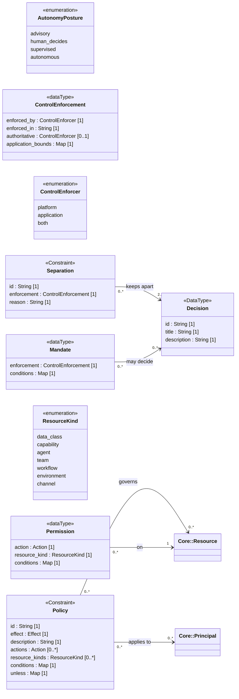

<!-- Generated by `orgagents metamodel docs` from src/orgagents/metamodel/. Do not edit: change the profile and regenerate. -->

# Authority profile

What may be decided, by whom, and what a rule allows or denies.

- **Version:** 1.0.0
- **Imports:** [Core](core.md), [Organisation](organisation.md)
- **Imported by:** [Access](access.md), [Process](process.md), [Deployment](deployment.md)
- **Declares:** 3 stereotypes, 3 DataTypes, 3 enumerations, 8 relationships, 29 properties

## Class diagram

## Stereotypes

| Stereotype | Extends | Spec class | Lives in | Notes |
|---|---|---|---|---|
| «Decision» (`decision`) | DataType | `DecisionClass` | `decisions` |  |
| «Separation» (`separation`) | Constraint | `SeparationRule` | `separations` |  |
| «Policy» (`policy`) | Constraint | `PolicyRule` | `policies` |  |

## Properties

| Owner | Property | Type | Multiplicity | Notes |
|---|---|---|---|---|
| ControlEnforcement | `enforced_by` | ControlEnforcer | 1 |  |
| ControlEnforcement | `enforced_in` | String | 1 | what kind of system, in words; the binding names the product |
| ControlEnforcement | `authoritative` | ControlEnforcer | 0..1 | which side wins when enforced_by is both |
| ControlEnforcement | `application_bounds` | Map | 1 | what the application is claimed to enforce |
| Mandate | `enforcement` | ControlEnforcement | 1 | who enforces the conditions |
| Mandate | `conditions` | Map | 1 | bounds that make a decision class finite; they accumulate down the tree |
| Permission | `action` | Action | 1 |  |
| Permission | `resource_kind` | ResourceKind | 1 |  |
| Permission | `conditions` | Map | 1 |  |
| «Decision» | `id` | String | 1 |  |
| «Decision» | `title` | String | 1 |  |
| «Decision» | `description` | String | 1 |  |
| «Policy» | `id` | String | 1 |  |
| «Policy» | `effect` | Effect | 1 | deny always wins |
| «Policy» | `description` | String | 1 |  |
| «Policy» | `actions` | Action | 0..* |  |
| «Policy» | `resource_kinds` | ResourceKind | 0..* |  |
| «Policy» | `conditions` | Map | 1 | evaluated by security.rbac (ADR-0008) |
| «Policy» | `unless` | Map | 1 |  |
| «Separation» | `id` | String | 1 |  |
| «Separation» | `enforcement` | ControlEnforcement | 1 | who enforces the separation |
| «Separation» | `reason` | String | 1 |  |
| «Agent» | `mandate` | Mandate | 0..1 |  |
| «Agent» | `autonomy` | Map | 1 | activity → AutonomyPosture (ADR-0072) |
| «Mission» | `mandate` | Mandate | 0..1 | lent for the mission's duration, bounded by the sponsor's own |
| «Person» | `mandate` | Mandate | 0..1 |  |
| «Person» | `permissions` | Permission | 0..0 | refused on sight: a person is a principal for authority, never for access (ADR-0079) |
| «Role» | `permissions` | Permission | 0..* |  |
| «Team» | `mandate` | Mandate | 0..1 |  |

## DataTypes

| DataType | Spec class | Meaning |
|---|---|---|
| Mandate | `Mandate` | A bounded scope of decision held by a unit, an agent, a person or a mission (ADR-0065). Acting outside it escalates. |
| Permission | `Permission` | `(action, resource)` with optional conditions (ADR-0008); granted by a role, or held by a person for authority (ADR-0079). |
| ControlEnforcement | `ControlEnforcement` | Who enforces a control, and what is being trusted to them (ADR-0073). |

## Enumerations

| Enumeration | Literals | Spec enum | Meaning |
|---|---|---|---|
| ControlEnforcer | `platform`, `application`, `both` | `ControlEnforcer` | Who actually enforces a control (ADR-0073). |
| AutonomyPosture | `advisory`, `human_decides`, `supervised`, `autonomous` | `AutonomyPosture` | How much of an activity an agent does without a person (ADR-0072). |
| ResourceKind | `data_class`, `capability`, `agent`, `team`, `workflow`, `environment`, `channel` | `ResourceKind` | The kinds of «Resource» a permission or policy can address: the stereotypes that realise Resource. |

## Relationships

| Source | Relationship | Target | Multiplicity | Field | Constraint |
|---|---|---|---|---|---|
| «Separation» | association «keeps apart» | «Decision» | 0..* → 2..* | `separation.decisions` |  |
| «Policy» | association «applies to» | «Principal» | 0..* → 0..* | `policy.subjects` | {'*' = every principal} |
| «Policy» | association «governs» | «Resource» | 0..* → 0..* | `policy.resources` | {kind given by resource_kinds; '*' = every} |
| Mandate | association «may decide» | «Decision» | 0..* → 0..* | `Mandate.decisions` |  |
| Permission | association «on» | «Resource» | 0..* → 1 | `Permission.resource` | {kind given by resource_kind; an id or a glob; '*' = every} |
| «Organization» | composition «owns» | «Decision» | 1 → 0..* | `organization.decisions` |  |
| «Organization» | composition «owns» | «Separation» | 1 → 0..* | `organization.separations` |  |
| «Organization» | composition «owns» | «Policy» | 1 → 0..* | `organization.policies` |  |
