<!-- Generated by `orgagents metamodel docs` from src/orgagents/metamodel/. Do not edit: change the profile and regenerate. -->

# Core profile

The Model and what every concern shares.

- **Version:** 1.0.0
- **Imports:** UML only
- **Imported by:** [Organisation](organisation.md), [Authority](authority.md), [Access](access.md), [Data](data.md), [Knowledge](knowledge.md), [Process](process.md), [Assurance](assurance.md), [Deployment](deployment.md)
- **Declares:** 4 stereotypes, 2 DataTypes, 6 enumerations, 0 relationships, 13 properties

## Class diagram

```mermaid
classDiagram
  direction LR
  class Action["Action"] {
    <<enumeration>>
    read
    write
    query
    invoke
    delegate
    publish
    approve
    administer
  }
  class ChannelClass["ChannelClass"] {
    <<enumeration>>
    direct
    async_bus
    team_chat
    mail
    webhook
  }
  class DeploymentSpec["DeploymentSpec"] {
    <<dataType>>
    targets : String [0..*]
    regions : String [0..*]
    high_availability : Boolean [1]
    binding : String [0..1]
  }
  class Effect["Effect"] {
    <<enumeration>>
    allow
    deny
  }
  class Metadata["Metadata"] {
    <<dataType>>
    name : String [1]
    spec_version : String [1]
    version : String [1]
    description : String [1]
    owner : String [1]
    environment : SpecEnvironment [1]
    labels : Map [1]
  }
  class ModelClass["ModelClass"] {
    <<enumeration>>
    frontier_reasoning
    balanced
    fast_cheap
    long_context
    vision
    code
    embedding
    on_premises
  }
  class SharingScope["SharingScope"] {
    <<enumeration>>
    private
    protected
    public
  }
  class SpecEnvironment["SpecEnvironment"] {
    <<enumeration>>
    development
    staging
    production
  }
  class Note["Note"] {
    <<Comment>>
  }
  class Principal["Principal"] {
    <<abstract>>
  }
  class Resource["Resource"] {
    <<abstract>>
  }
  class System["System"] {
    <<Model>>
    metadata : Metadata [1]
    deployment : DeploymentSpec [1]
  }
```

## Stereotypes

| Stereotype | Extends | Spec class | Lives in | Notes |
|---|---|---|---|---|
| «Principal» (`principal`) | Interface | — | — | {isAbstract}; not on the palette; Anything a policy can be about: an agent, a team, a role. |
| «Resource» (`resource`) | Interface | — | — | {isAbstract}; not on the palette; Anything a permission or policy can govern (ADR-0008). |
| «Note» (`note`) | Comment | — | — |  |
| «System» (`system`) | Model | `SystemSpec` | — | not on the palette; The Model: one organisation design, owning every element in it. |

## Properties

| Owner | Property | Type | Multiplicity | Notes |
|---|---|---|---|---|
| DeploymentSpec | `targets` | String | 0..* | target names, resolved by the compiler |
| DeploymentSpec | `regions` | String | 0..* |  |
| DeploymentSpec | `high_availability` | Boolean | 1 |  |
| DeploymentSpec | `binding` | String | 0..1 | the path of the binding document |
| Metadata | `name` | String | 1 |  |
| Metadata | `spec_version` | String | 1 |  |
| Metadata | `version` | String | 1 |  |
| Metadata | `description` | String | 1 |  |
| Metadata | `owner` | String | 1 | a contact, in words |
| Metadata | `environment` | SpecEnvironment | 1 |  |
| Metadata | `labels` | Map | 1 |  |
| «System» | `metadata` | Metadata | 1 |  |
| «System» | `deployment` | DeploymentSpec | 1 |  |

## DataTypes

| DataType | Spec class | Meaning |
|---|---|---|
| Metadata | `Metadata` | The design's name, versions, owner and labels. |
| DeploymentSpec | `DeploymentSpec` | Which targets and regions the design compiles for, and where its binding is. The binding itself is the Deployment profile's. |

## Enumerations

| Enumeration | Literals | Spec enum | Meaning |
|---|---|---|---|
| SharingScope | `private`, `protected`, `public` | `SharingScope` | How widely something may travel: its owner only, named groups, or everyone in the organisation. |
| Action | `read`, `write`, `query`, `invoke`, `delegate`, `publish`, `approve`, `administer` | `Action` | What may be done to a resource: the verb of a capability, a permission or a policy. |
| Effect | `allow`, `deny` | `Effect` | A policy's verdict. Deny always wins. |
| ModelClass | `frontier_reasoning`, `balanced`, `fast_cheap`, `long_context`, `vision`, `code`, `embedding`, `on_premises` | `ModelClass` | What an agent needs from a model, not which model it gets (ADR-0040). |
| ChannelClass | `direct`, `async_bus`, `team_chat`, `mail`, `webhook` | `ChannelClass` | Abstract communication surfaces; the binding picks the product. |
| SpecEnvironment | `development`, `staging`, `production` | *a named Literal* | Which environment a design is written for; rules tighten towards production. |
