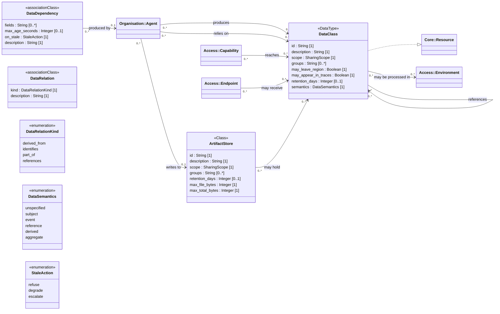

<!-- Generated by `orgagents metamodel docs` from src/orgagents/metamodel/. Do not edit: change the profile and regenerate. -->

# Data profile

The conceptual data model: classes, their relations, producers and consumers.

- **Version:** 1.0.0
- **Imports:** [Core](core.md), [Organisation](organisation.md), [Access](access.md)
- **Imported by:** [Knowledge](knowledge.md), [Process](process.md), [Assurance](assurance.md), [Deployment](deployment.md)
- **Declares:** 2 stereotypes, 0 DataTypes, 3 enumerations, 15 relationships, 21 properties

## Class diagram

## Stereotypes

| Stereotype | Extends | Spec class | Lives in | Notes |
|---|---|---|---|---|
| «DataClass» (`data_class`) | DataType | `DataClass` | `data_classes` |  |
| «ArtifactStore» (`artifact_store`) | Class | `ArtifactStore` | `artifact_stores` | not on the palette; A workspace agents read and write files in (ADR-0036). Owned by the System: where work is kept, not what the organisation is. |

## Properties

| Owner | Property | Type | Multiplicity | Notes |
|---|---|---|---|---|
| DataDependency | `fields` | String | 0..* | the fields relied on |
| DataDependency | `max_age_seconds` | Integer | 0..1 | the freshness window |
| DataDependency | `on_stale` | StaleAction | 1 |  |
| DataDependency | `description` | String | 1 |  |
| DataRelation | `kind` | DataRelationKind | 1 | which of the four relationships the link is |
| DataRelation | `description` | String | 1 |  |
| «ArtifactStore» | `id` | String | 1 |  |
| «ArtifactStore» | `description` | String | 1 |  |
| «ArtifactStore» | `scope` | SharingScope | 1 |  |
| «ArtifactStore» | `groups` | String | 0..* |  |
| «ArtifactStore» | `retention_days` | Integer | 0..1 |  |
| «ArtifactStore» | `max_file_bytes` | Integer | 1 |  |
| «ArtifactStore» | `max_total_bytes` | Integer | 1 |  |
| «DataClass» | `id` | String | 1 |  |
| «DataClass» | `description` | String | 1 |  |
| «DataClass» | `scope` | SharingScope | 1 |  |
| «DataClass» | `groups` | String | 0..* | directory groups that may see it when protected |
| «DataClass» | `may_leave_region` | Boolean | 1 |  |
| «DataClass» | `may_appear_in_traces` | Boolean | 1 |  |
| «DataClass» | `retention_days` | Integer | 0..1 |  |
| «DataClass» | `semantics` | DataSemantics | 1 |  |

## Enumerations

| Enumeration | Literals | Spec enum | Meaning |
|---|---|---|---|
| DataSemantics | `unspecified`, `subject`, `event`, `reference`, `derived`, `aggregate` | `DataSemantics` | What a class of data *is*, as distinct from how it is protected; shown as a stereotype label on the Data diagram. |
| DataRelationKind | `derived_from` (Abstraction «derive»), `identifies` (Association «identifies»), `part_of` (Composition), `references` (Association) | `DataRelationKind` | How one class of data relates to another. Each literal is one of the profile's relationships (ADR-0111). |
| StaleAction | `refuse`, `degrade`, `escalate` | `StaleAction` | What to do when data is older than the agent said it could rely on (ADR-0099). |

## Relationships

| Source | Relationship | Target | Multiplicity | Field | Constraint |
|---|---|---|---|---|---|
| «Agent» | association «produces» | «DataClass» | 0..* → 0..* | `agent.produces_data` |  |
| «Agent» | association «relies on» | «DataClass» | 0..* → 0..* | `agent.data_dependencies` (DataDependency) |  |
| «Capability» | association «reaches» | «DataClass» | 0..* → 0..* | `capability.data_classes` |  |
| «Endpoint» | association «may receive» | «DataClass» | 0..* → 0..* | `endpoint.send_data_classes` |  |
| «DataClass» | realization | «Resource» | 0..* → 0..* | — |  |
| «DataClass» | abstraction «derive» | «DataClass» | 0..* → 0..* | `data_class.relations` (DataRelation) where `kind = derived_from` | {a restriction of the target holds for the source} |
| «DataClass» | composition «part of» | «DataClass» | 0..* → 0..* | `data_class.relations` (DataRelation) where `kind = part_of` | {the source is the part, the target the whole} |
| «DataClass» | association «identifies» | «DataClass» | 0..* → 0..* | `data_class.relations` (DataRelation) where `kind = identifies` |  |
| «DataClass» | association «references» | «DataClass» | 0..* → 0..* | `data_class.relations` (DataRelation) where `kind = references` |  |
| «DataClass» | association «may be processed in» | «Environment» | 0..* → 0..* | `data_class.allowed_environments` | {empty = any environment} |
| DataDependency | association «produced by» | «Agent» | 0..* → 0..1 | `DataDependency.produced_by` |  |
| «Agent» | association «writes to» | «ArtifactStore» | 0..* → 0..1 | `agent.artifact_store` |  |
| «ArtifactStore» | association «may hold» | «DataClass» | 0..* → 0..* | `artifact_store.data_classes` |  |
| «Organization» | composition «owns» | «DataClass» | 1 → 0..* | `organization.data_classes` |  |
| «System» | composition «owns» | «ArtifactStore» | 1 → 0..* | `system.artifact_stores` |  |
