<!-- Generated by `orgagents metamodel docs` from src/orgagents/metamodel/. Do not edit: change the profile and regenerate. -->

# Deployment profile

The binding: targets, servers, runtimes and one binding per spec concern.

- **Version:** 1.0.0
- **Imports:** [Core](core.md), [Organisation](organisation.md), [Authority](authority.md), [Access](access.md), [Data](data.md), [Knowledge](knowledge.md), [Process](process.md), [Assurance](assurance.md)
- **Imported by:** nothing
- **Declares:** 3 stereotypes, 5 DataTypes, 0 enumerations, 11 relationships, 89 properties

## Class diagram

```mermaid
classDiagram
  direction LR
  class CapabilityBinding["CapabilityBinding"] {
    <<associationClass>>
    server_name : String [1]
    transport : String [1]
    command : String [0..1]
    args : String [0..*]
    url : String [0..1]
    engine : String [0..1]
    dsn_secret_ref : String [0..1]
    options : Map [1]
  }
  class ChannelBinding["ChannelBinding"] {
    <<associationClass>>
    provider : String [1]
    address : String [1]
    workspace : String [1]
    bot_identity_ref : String [0..1]
    thread_replies : Boolean [1]
    options : Map [1]
  }
  class EnvironmentBinding["EnvironmentBinding"] {
    <<associationClass>>
    image : String [1]
    packages : String [0..*]
    cpu : String [1]
    memory : String [1]
    disk : String [1]
    accelerator : String [0..1]
    node_selector : Map [1]
  }
  class InfrastructureBinding["InfrastructureBinding"] {
    <<dataType>>
    provider : String [1]
    region : String [1]
    project : String [1]
    state_backend : String [1]
    network : String [1]
    labels : Map [1]
    options : Map [1]
  }
  class KnowledgeBinding["KnowledgeBinding"] {
    <<associationClass>>
    provider : String [1]
    location : String [1]
    index : String [1]
    secret_ref : String [0..1]
    options : Map [1]
  }
  class MemoryBinding["MemoryBinding"] {
    <<dataType>>
    session_store : String [1]
    long_term_store : String [1]
    index : String [1]
    embedding_model : String [1]
    secret_ref : String [0..1]
    options : Map [1]
  }
  class ModelBinding["ModelBinding"] {
    <<dataType>>
    provider : String [1]
    model : String [1]
    subagent_model : String [0..1]
    temperature : Real [1]
    max_tokens : Integer [1]
  }
  class ProtocolBinding["ProtocolBinding"] {
    <<associationClass>>
    protocol : String [1]
    transport : String [1]
    protocol_version : String [1]
    base_url : String [1]
    options : Map [1]
  }
  class RuntimeBinding["RuntimeBinding"] {
    <<dataType>>
    adapter : String [1]
    options : Map [1]
  }
  class ScheduleBinding["ScheduleBinding"] {
    <<dataType>>
    provider : String [1]
    queue : String [1]
    dead_letter : String [1]
    max_concurrency : Integer [1]
    options : Map [1]
  }
  class WorkflowBinding["WorkflowBinding"] {
    <<associationClass>>
    engine : String [1]
    mode : String [1]
    endpoint : String [0..1]
    flow : String [1]
    editor_url : String [0..1]
    secret_ref : String [0..1]
    tenant : String [1]
    trust : String [1]
    requires_approval : Boolean [1]
    options : Map [1]
  }
  class Binding["Binding"] {
    <<Artifact>>
    version : String [1]
  }
  class Server["Server"] {
    <<Node>>
    id : String [1]
    kind : String [1]
    description : String [1]
    transport : String [1]
    command : String [0..1]
    args : String [0..*]
    url : String [0..1]
    engine : String [0..1]
    dsn_secret_ref : String [0..1]
    options : Map [1]
    secret_ref : String [0..1]
    trust : String [1]
    egress_allowlist : String [0..*]
  }
  class Target["Target"] {
    <<DeploymentSpecification>>
    target : String [1]
    model : ModelBinding [1]
    runtime : RuntimeBinding [1]
    infrastructure : InfrastructureBinding [1]
    scheduler : ScheduleBinding [0..1]
    memory : MemoryBinding [0..1]
    secrets_backend : String [1]
    observability_sink : String [1]
    agent_overrides : Map [1]
  }
  class System["Core::System"]
  Binding "0..*" --> "1" System : binds
  Binding "1" *-- "0..*" Target : target
  Target "1" *-- "0..*" Server : server
  class Capability["Access::Capability"]
  Target ..> Capability : binds
  class Environment["Access::Environment"]
  Target ..> Environment : binds
  class Channel["Process::Channel"]
  Target ..> Channel : binds
  class Knowledge["Knowledge::Knowledge"]
  Target ..> Knowledge : binds
  class Workflow["Process::Workflow"]
  Target ..> Workflow : binds
  class Endpoint["Access::Endpoint"]
  Target ..> Endpoint : binds
  CapabilityBinding ..> Server : deployed on
  class DataClass["Data::DataClass"]
  WorkflowBinding "0..*" --> "0..*" DataClass : may send
```

## Stereotypes

| Stereotype | Extends | Spec class | Lives in | Notes |
|---|---|---|---|---|
| «Binding» (`binding`) | Artifact | `Binding` | — | not on the palette; A binding document: how one spec is realised on one or more targets. |
| «Target» (`target`) | DeploymentSpecification | `TargetBinding` | — | not on the palette; Everything one target needs beyond the spec. |
| «Server» (`server`) | Node | `ServerBinding` | — | not on the palette; A backing enterprise system, declared once and shared by the capabilities deployed on it (ADR-0085). |

## Properties

| Owner | Property | Type | Multiplicity | Notes |
|---|---|---|---|---|
| CapabilityBinding | `server_name` | String | 1 |  |
| CapabilityBinding | `transport` | String | 1 | stdio or http |
| CapabilityBinding | `command` | String | 0..1 |  |
| CapabilityBinding | `args` | String | 0..* |  |
| CapabilityBinding | `url` | String | 0..1 |  |
| CapabilityBinding | `engine` | String | 0..1 |  |
| CapabilityBinding | `dsn_secret_ref` | String | 0..1 |  |
| CapabilityBinding | `options` | Map | 1 |  |
| ChannelBinding | `provider` | String | 1 |  |
| ChannelBinding | `address` | String | 1 |  |
| ChannelBinding | `workspace` | String | 1 |  |
| ChannelBinding | `bot_identity_ref` | String | 0..1 |  |
| ChannelBinding | `thread_replies` | Boolean | 1 |  |
| ChannelBinding | `options` | Map | 1 |  |
| EnvironmentBinding | `image` | String | 1 |  |
| EnvironmentBinding | `packages` | String | 0..* |  |
| EnvironmentBinding | `cpu` | String | 1 |  |
| EnvironmentBinding | `memory` | String | 1 |  |
| EnvironmentBinding | `disk` | String | 1 |  |
| EnvironmentBinding | `accelerator` | String | 0..1 |  |
| EnvironmentBinding | `node_selector` | Map | 1 |  |
| InfrastructureBinding | `provider` | String | 1 |  |
| InfrastructureBinding | `region` | String | 1 |  |
| InfrastructureBinding | `project` | String | 1 |  |
| InfrastructureBinding | `state_backend` | String | 1 |  |
| InfrastructureBinding | `network` | String | 1 |  |
| InfrastructureBinding | `labels` | Map | 1 |  |
| InfrastructureBinding | `options` | Map | 1 |  |
| KnowledgeBinding | `provider` | String | 1 |  |
| KnowledgeBinding | `location` | String | 1 |  |
| KnowledgeBinding | `index` | String | 1 |  |
| KnowledgeBinding | `secret_ref` | String | 0..1 |  |
| KnowledgeBinding | `options` | Map | 1 |  |
| MemoryBinding | `session_store` | String | 1 |  |
| MemoryBinding | `long_term_store` | String | 1 |  |
| MemoryBinding | `index` | String | 1 |  |
| MemoryBinding | `embedding_model` | String | 1 |  |
| MemoryBinding | `secret_ref` | String | 0..1 |  |
| MemoryBinding | `options` | Map | 1 |  |
| ModelBinding | `provider` | String | 1 |  |
| ModelBinding | `model` | String | 1 |  |
| ModelBinding | `subagent_model` | String | 0..1 |  |
| ModelBinding | `temperature` | Real | 1 |  |
| ModelBinding | `max_tokens` | Integer | 1 |  |
| ProtocolBinding | `protocol` | String | 1 |  |
| ProtocolBinding | `transport` | String | 1 |  |
| ProtocolBinding | `protocol_version` | String | 1 |  |
| ProtocolBinding | `base_url` | String | 1 |  |
| ProtocolBinding | `options` | Map | 1 |  |
| RuntimeBinding | `adapter` | String | 1 |  |
| RuntimeBinding | `options` | Map | 1 |  |
| ScheduleBinding | `provider` | String | 1 |  |
| ScheduleBinding | `queue` | String | 1 |  |
| ScheduleBinding | `dead_letter` | String | 1 |  |
| ScheduleBinding | `max_concurrency` | Integer | 1 |  |
| ScheduleBinding | `options` | Map | 1 |  |
| WorkflowBinding | `engine` | String | 1 |  |
| WorkflowBinding | `mode` | String | 1 |  |
| WorkflowBinding | `endpoint` | String | 0..1 | where the engine is reached |
| WorkflowBinding | `flow` | String | 1 | the engine's own id for the body |
| WorkflowBinding | `editor_url` | String | 0..1 | for Open in (ADR-0110) |
| WorkflowBinding | `secret_ref` | String | 0..1 |  |
| WorkflowBinding | `tenant` | String | 1 |  |
| WorkflowBinding | `trust` | String | 1 |  |
| WorkflowBinding | `requires_approval` | Boolean | 1 |  |
| WorkflowBinding | `options` | Map | 1 |  |
| «Binding» | `version` | String | 1 |  |
| «Server» | `id` | String | 1 |  |
| «Server» | `kind` | String | 1 |  |
| «Server» | `description` | String | 1 |  |
| «Server» | `transport` | String | 1 | stdio or http |
| «Server» | `command` | String | 0..1 |  |
| «Server» | `args` | String | 0..* |  |
| «Server» | `url` | String | 0..1 |  |
| «Server» | `engine` | String | 0..1 |  |
| «Server» | `dsn_secret_ref` | String | 0..1 |  |
| «Server» | `options` | Map | 1 |  |
| «Server» | `secret_ref` | String | 0..1 |  |
| «Server» | `trust` | String | 1 |  |
| «Server» | `egress_allowlist` | String | 0..* |  |
| «Target» | `target` | String | 1 | the target's name |
| «Target» | `model` | ModelBinding | 1 |  |
| «Target» | `runtime` | RuntimeBinding | 1 |  |
| «Target» | `infrastructure` | InfrastructureBinding | 1 |  |
| «Target» | `scheduler` | ScheduleBinding | 0..1 |  |
| «Target» | `memory` | MemoryBinding | 0..1 |  |
| «Target» | `secrets_backend` | String | 1 |  |
| «Target» | `observability_sink` | String | 1 |  |
| «Target» | `agent_overrides` | Map | 1 | agent id → overrides |

## DataTypes

| DataType | Spec class | Meaning |
|---|---|---|
| ModelBinding | `ModelBinding` | Which model serves an agent loop. |
| RuntimeBinding | `RuntimeBinding` | Which agent framework executes the loop (ADR-0013). |
| InfrastructureBinding | `InfrastructureBinding` | Provider-side choices for the neutral resource set (ADR-0012). |
| ScheduleBinding | `ScheduleBinding` | Which scheduler fires the triggers (ADR-0020). |
| MemoryBinding | `MemoryBinding` | Where the two memory tiers live (ADR-0028). |

## Relationships

| Source | Relationship | Target | Multiplicity | Field | Constraint |
|---|---|---|---|---|---|
| «Binding» | association «binds» | «System» | 0..* → 1 | `binding.spec` |  |
| «Binding» | composition «target» | «Target» | 1 → 0..* | `binding.targets` |  |
| «Target» | composition «server» | «Server» | 1 → 0..* | `target.servers` |  |
| «Target» | deployment «binds» | «Capability» | 0..* → 0..* | `target.capabilities` (CapabilityBinding) |  |
| «Target» | deployment «binds» | «Environment» | 0..* → 0..* | `target.environments` (EnvironmentBinding) |  |
| «Target» | deployment «binds» | «Channel» | 0..* → 0..* | `target.channels` (ChannelBinding) |  |
| «Target» | deployment «binds» | «Knowledge» | 0..* → 0..* | `target.knowledge` (KnowledgeBinding) |  |
| «Target» | deployment «binds» | «Workflow» | 0..* → 0..* | `target.workflows` (WorkflowBinding) |  |
| «Target» | deployment «binds» | «Endpoint» | 0..* → 0..* | `target.protocols` (ProtocolBinding) |  |
| CapabilityBinding | deployment «deployed on» | «Server» | 0..* → 0..1 | `CapabilityBinding.server` | {empty = the binding mounts its own server} |
| WorkflowBinding | association «may send» | «DataClass» | 0..* → 0..* | `WorkflowBinding.send_data_classes` |  |
