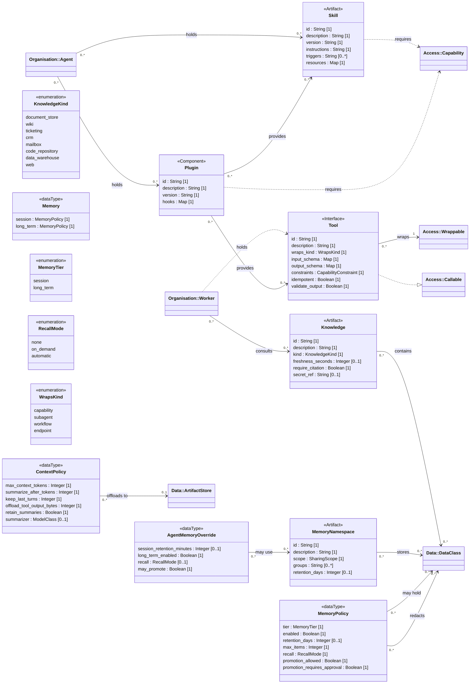

<!-- Generated by `orgagents metamodel docs` from src/orgagents/metamodel/. Do not edit: change the profile and regenerate. -->

# Knowledge profile

What an agent knows and carries: knowledge, memory, skills, plugins and tools.

- **Version:** 1.0.0
- **Imports:** [Core](core.md), [Organisation](organisation.md), [Data](data.md)
- **Imported by:** [Deployment](deployment.md)
- **Declares:** 5 stereotypes, 4 DataTypes, 4 enumerations, 21 relationships, 51 properties

## Class diagram

## Stereotypes

| Stereotype | Extends | Spec class | Lives in | Notes |
|---|---|---|---|---|
| «Skill» (`skill`) | Artifact | `SkillSpec` | `skills` |  |
| «Plugin» (`plugin`) | Component | `PluginSpec` | `plugins` |  |
| «Tool» (`tool`) | Interface | `ToolSpec` | `tools` |  |
| «Knowledge» (`knowledge`) | Artifact | `KnowledgeSource` | `knowledge` |  |
| «MemoryNamespace» (`memory_namespace`) | Artifact | `MemoryNamespace` | `memory.namespaces` |  |

## Properties

| Owner | Property | Type | Multiplicity | Notes |
|---|---|---|---|---|
| AgentMemoryOverride | `session_retention_minutes` | Integer | 0..1 |  |
| AgentMemoryOverride | `long_term_enabled` | Boolean | 1 |  |
| AgentMemoryOverride | `recall` | RecallMode | 0..1 |  |
| AgentMemoryOverride | `may_promote` | Boolean | 1 |  |
| ContextPolicy | `max_context_tokens` | Integer | 1 |  |
| ContextPolicy | `summarize_after_tokens` | Integer | 1 |  |
| ContextPolicy | `keep_last_turns` | Integer | 1 |  |
| ContextPolicy | `offload_tool_output_bytes` | Integer | 1 |  |
| ContextPolicy | `retain_summaries` | Boolean | 1 |  |
| ContextPolicy | `summarizer` | ModelClass | 0..1 |  |
| Memory | `session` | MemoryPolicy | 1 |  |
| Memory | `long_term` | MemoryPolicy | 1 |  |
| MemoryPolicy | `tier` | MemoryTier | 1 |  |
| MemoryPolicy | `enabled` | Boolean | 1 |  |
| MemoryPolicy | `retention_days` | Integer | 0..1 |  |
| MemoryPolicy | `max_items` | Integer | 1 |  |
| MemoryPolicy | `recall` | RecallMode | 1 |  |
| MemoryPolicy | `promotion_allowed` | Boolean | 1 |  |
| MemoryPolicy | `promotion_requires_approval` | Boolean | 1 |  |
| «Knowledge» | `id` | String | 1 |  |
| «Knowledge» | `description` | String | 1 |  |
| «Knowledge» | `kind` | KnowledgeKind | 1 |  |
| «Knowledge» | `freshness_seconds` | Integer | 0..1 |  |
| «Knowledge» | `require_citation` | Boolean | 1 |  |
| «Knowledge» | `secret_ref` | String | 0..1 |  |
| «MemoryNamespace» | `id` | String | 1 |  |
| «MemoryNamespace» | `description` | String | 1 |  |
| «MemoryNamespace» | `scope` | SharingScope | 1 |  |
| «MemoryNamespace» | `groups` | String | 0..* |  |
| «MemoryNamespace» | `retention_days` | Integer | 0..1 |  |
| «Plugin» | `id` | String | 1 |  |
| «Plugin» | `description` | String | 1 |  |
| «Plugin» | `version` | String | 1 |  |
| «Plugin» | `hooks` | Map | 1 |  |
| «Skill» | `id` | String | 1 |  |
| «Skill» | `description` | String | 1 |  |
| «Skill» | `version` | String | 1 |  |
| «Skill» | `instructions` | String | 1 |  |
| «Skill» | `triggers` | String | 0..* | phrases that call for it |
| «Skill» | `resources` | Map | 1 | named files the skill ships |
| «Tool» | `id` | String | 1 |  |
| «Tool» | `description` | String | 1 |  |
| «Tool» | `wraps_kind` | WrapsKind | 1 |  |
| «Tool» | `input_schema` | Map | 1 |  |
| «Tool» | `output_schema` | Map | 1 |  |
| «Tool» | `constraints` | CapabilityConstraint | 1 | may narrow what it wraps, never widen it |
| «Tool» | `idempotent` | Boolean | 1 |  |
| «Tool» | `validate_output` | Boolean | 1 |  |
| «Agent» | `memory` | AgentMemoryOverride | 0..1 |  |
| «Agent» | `context` | ContextPolicy | 0..1 |  |
| «System» | `context` | ContextPolicy | 1 |  |

## DataTypes

| DataType | Spec class | Meaning |
|---|---|---|
| Memory | `Memory` | The two-tier memory contract for the system (ADR-0028); its namespaces are MemoryNamespace elements. |
| MemoryPolicy | `MemoryPolicy` | How one memory tier behaves (ADR-0028). |
| AgentMemoryOverride | `AgentMemoryOverride` | An agent's narrowing of the system memory contract. |
| ContextPolicy | `ContextPolicy` | How a long run keeps its context usable and affordable (ADR-0036). |

## Enumerations

| Enumeration | Literals | Spec enum | Meaning |
|---|---|---|---|
| KnowledgeKind | `document_store`, `wiki`, `ticketing`, `crm`, `mailbox`, `code_repository`, `data_warehouse`, `web` | `KnowledgeKind` | Classes of grounding source, not products (ADR-0023). |
| MemoryTier | `session`, `long_term` | `MemoryTier` | Where a memory lives (ADR-0028). |
| RecallMode | `none`, `on_demand`, `automatic` | `RecallMode` | How remembered items come back into a run. |
| WrapsKind | `capability`, `subagent`, `workflow`, `endpoint` | *a named Literal* | What kind of «Wrappable» a tool wraps. |

## Relationships

| Source | Relationship | Target | Multiplicity | Field | Constraint |
|---|---|---|---|---|---|
| «Worker» | association «consults» | «Knowledge» | 0..* → 0..* | `worker.knowledge` |  |
| «Agent» | association «holds» | «Skill» | 0..* → 0..* | `agent.skills` |  |
| «Agent» | association «holds» | «Plugin» | 0..* → 0..* | `agent.plugins` |  |
| «Worker» | usage «holds» | «Tool» | 0..* → 0..* | `worker.tools` |  |
| «Knowledge» | association «contains» | «DataClass» | 0..* → 0..* | `knowledge.data_classes` |  |
| «MemoryNamespace» | association «stores» | «DataClass» | 0..* → 0..* | `memory_namespace.data_classes` |  |
| «Skill» | usage «requires» | «Capability» | 0..* → 0..* | `skill.requires_capabilities` |  |
| «Plugin» | usage «requires» | «Capability» | 0..* → 0..* | `plugin.requires_capabilities` |  |
| «Plugin» | association «provides» | «Skill» | 0..* → 0..* | `plugin.provides_skills` |  |
| «Plugin» | association «provides» | «Tool» | 0..* → 0..* | `plugin.provides_tools` |  |
| «Tool» | association «wraps» | «Wrappable» | 0..* → 1 | `tool.wraps` | {kind given by wraps_kind} |
| «Tool» | realization | «Callable» | 0..* → 0..* | — |  |
| MemoryPolicy | association «may hold» | «DataClass» | 0..* → 0..* | `MemoryPolicy.data_classes` |  |
| MemoryPolicy | association «redacts» | «DataClass» | 0..* → 0..* | `MemoryPolicy.redact_data_classes` |  |
| AgentMemoryOverride | association «may use» | «MemoryNamespace» | 0..* → 0..* | `AgentMemoryOverride.namespaces` |  |
| ContextPolicy | association «offloads to» | «ArtifactStore» | 0..* → 0..1 | `ContextPolicy.offload_to` |  |
| «Organization» | composition «owns» | «Skill» | 1 → 0..* | `organization.skills` |  |
| «Organization» | composition «owns» | «Plugin» | 1 → 0..* | `organization.plugins` |  |
| «Organization» | composition «owns» | «Tool» | 1 → 0..* | `organization.tools` |  |
| «Organization» | composition «owns» | «Knowledge» | 1 → 0..* | `organization.knowledge` |  |
| «Organization» | composition «owns» | «MemoryNamespace» | 1 → 0..* | `organization.memory.namespaces` |  |
