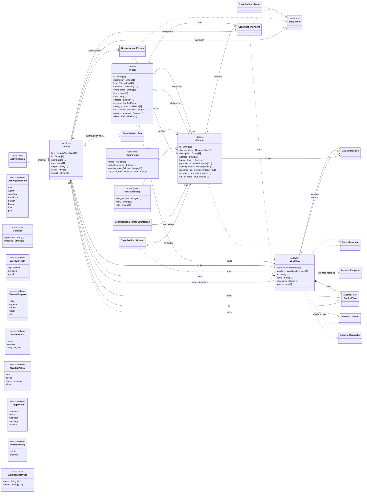

<!-- Generated by `orgagents metamodel docs` from src/orgagents/metamodel/. Do not edit: change the profile and regenerate. -->

# Process profile

How work happens: workflows as Activities, triggers and channels.

- **Version:** 1.0.0
- **Imports:** [Core](core.md), [Organisation](organisation.md), [Authority](authority.md), [Data](data.md)
- **Imported by:** [Assurance](assurance.md), [Deployment](deployment.md)
- **Declares:** 6 stereotypes, 5 DataTypes, 7 enumerations, 38 relationships, 47 properties

## Class diagram

## Stereotypes

| Stereotype | Extends | Spec class | Lives in | Notes |
|---|---|---|---|---|
| «Action» (`action`) | Action | `ActivityNode` | — | not on the palette; A step of a workflow (ADR-0102). |
| «ControlFlow» (`control_flow`) | ControlFlow | `ControlFlow` | — | not on the palette; An edge between two steps of a workflow. |
| «StepOwner» (`step_owner`) | Interface | — | — | {isAbstract}; not on the palette; Whoever may own a workflow step: an agent, a team or a person (ADR-0110). |
| «Workflow» (`workflow`) | Activity | `WorkflowSpec` | `workflows` |  |
| «Trigger» (`trigger`) | Event | `TriggerSpec` | `triggers` |  |
| «Channel» (`channel`) | Class | `ChannelSpec` | `channels` |  |

## Properties

| Owner | Property | Type | Multiplicity | Notes |
|---|---|---|---|---|
| Cadence | `expression` | String | 1 | cron |
| Cadence | `timezone` | String | 1 |  |
| EscalationStep | `after_minutes` | Integer | 1 |  |
| EscalationStep | `notify` | String | 1 | a human contact, an agent id or a team id |
| EscalationStep | `note` | String | 1 |  |
| FailurePolicy | `retries` | Integer | 1 |  |
| FailurePolicy | `backoff_seconds` | Integer | 1 |  |
| FailurePolicy | `escalate_after_failures` | Integer | 1 |  |
| FailurePolicy | `halt_after_consecutive_failures` | Integer | 1 |  |
| WorkflowInterface | `inputs` | String | 0..* |  |
| WorkflowInterface | `outputs` | String | 0..* |  |
| «Action» | `kind` | ActivityNodeKind | 1 |  |
| «Action» | `id` | String | 1 |  |
| «Action» | `expr` | String | 1 | a transform's or branch's expression |
| «Action» | `args` | Map | 1 |  |
| «Action» | `output` | String | 1 | the state key it writes |
| «Action» | `cases` | Any | 1 | a branch's case → step map |
| «Action» | `default` | String | 1 | the step a branch takes when no case matches, by id |
| «Channel» | `id` | String | 1 |  |
| «Channel» | `channel_class` | ChannelClass | 1 |  |
| «Channel» | `description` | String | 1 |  |
| «Channel» | `address` | String | 1 |  |
| «Channel» | `human_facing` | Boolean | 1 |  |
| «Channel» | `purposes` | ChannelPurpose | 0..* |  |
| «Channel» | `working_hours` | WorkingHours | 0..1 |  |
| «Channel» | `response_sla_minutes` | Integer | 0..1 |  |
| «Channel» | `escalation` | EscalationStep | 0..* |  |
| «Channel» | `out_of_hours` | OutOfHours | 1 |  |
| «Trigger» | `id` | String | 1 |  |
| «Trigger» | `description` | String | 1 |  |
| «Trigger» | `kind` | TriggerKind | 1 |  |
| «Trigger» | `cadence` | Cadence | 0..1 | required for a schedule |
| «Trigger» | `event_class` | String | 1 | an abstract event, for kind event |
| «Trigger» | `filters` | Map | 1 |  |
| «Trigger» | `input` | Map | 1 |  |
| «Trigger» | `enabled` | Boolean | 1 |  |
| «Trigger» | `overlap` | OverlapPolicy | 1 |  |
| «Trigger» | `catch_up` | CatchUpPolicy | 1 |  |
| «Trigger» | `max_runtime_seconds` | Integer | 1 |  |
| «Trigger» | `requires_approval` | Boolean | 1 |  |
| «Trigger» | `failure` | FailurePolicy | 1 |  |
| «Workflow» | `body` | WorkflowBody | 1 | graph unless the body is built in an engine |
| «Workflow» | `interface` | WorkflowInterface | 1 | composite: the workflow owns its interface |
| «Workflow» | `id` | String | 1 |  |
| «Workflow» | `name` | String | 1 |  |
| «Workflow» | `description` | String | 1 |  |
| «Workflow» | `inputs` | Map | 1 | the input schema |

## DataTypes

| DataType | Spec class | Meaning |
|---|---|---|
| WorkflowInterface | `WorkflowInterface` | The seam between a governed workflow and a body built in an engine: what goes in and out, what it calls and which data it touches. Its references are the workflow's `interface calls`, `interface reaches`, `receives` and `returns` (ADR-0110). |
| ActivityGraph | `ActivityGraph` | A workflow's steps and the flow between them: the Activity's nodes and edges (ADR-0102). |
| Cadence | `Cadence` | When a schedule fires, readable by humans and targets. |
| FailurePolicy | `FailurePolicy` | What happens when a triggered run fails (ADR-0020). |
| EscalationStep | `EscalationStep` | Who to try next when nobody answers on a channel, and when. |

## Enumerations

| Enumeration | Literals | Spec enum | Meaning |
|---|---|---|---|
| ActivityNodeKind | `tool` (CallOperationAction), `agent` (CallBehaviorAction), `workflow` (CallBehaviorAction), `transform` (OpaqueAction), `branch` (DecisionNode), `human` (AcceptEventAction), `fork` (ForkNode), `join` (JoinNode) | `ActivityNodeKind` | What a workflow step is: which UML ActivityNode it stands for. |
| WorkflowBody | `graph`, `external` | `WorkflowBody` | Where a workflow's insides live: drawn here as an Activity, or built in an engine the binding names (ADR-0110). |
| TriggerKind | `schedule`, `event`, `webhook`, `message`, `manual` | `TriggerKind` | What starts a run (ADR-0020). |
| OverlapPolicy | `skip`, `queue`, `cancel_previous`, `allow` | `OverlapPolicy` | What to do when a run is still going and the next is due. |
| CatchUpPolicy | `skip_missed`, `run_once`, `run_all` | `CatchUpPolicy` | What to do about runs missed while the system was down. |
| ChannelPurpose | `notify`, `approve`, `handoff`, `report`, `ask` | `ChannelPurpose` | Why an agent contacts a human on a channel (ADR-0021). |
| OutOfHours | `queue`, `escalate`, `notify_anyway` | *a named Literal* | What a human-facing channel does outside working hours. |

## Relationships

| Source | Relationship | Target | Multiplicity | Field | Constraint |
|---|---|---|---|---|---|
| «Agent» | usage «runs» | «Workflow» | 0..* → 0..* | `agent.workflows` |  |
| «Trigger» | association «fires» | «Agent» | 0..* → 1 | `trigger.agent` |  |
| «Trigger» | association «starts» | «Workflow» | 0..* → 0..1 | `trigger.workflow` |  |
| «Channel» | association «includes» | «Agent» | 0..* → 0..* | `channel.members` |  |
| «Workflow» | realization | «Wrappable» | 0..* → 0..* | — |  |
| «Workflow» | realization | «Resource» | 0..* → 0..* | — |  |
| «Channel» | realization | «Resource» | 0..* → 0..* | — |  |
| «Workflow» | composition «step» | «Action» | 1 → 0..* | `workflow.graph.nodes` |  |
| «Workflow» | composition «edge» | «ControlFlow» | 1 → 0..* | `workflow.graph.edges` |  |
| «ControlFlow» | association «from» | «Action» | 0..* → 1 | `control_flow.source` |  |
| «ControlFlow» | association «to» | «Action» | 0..* → 0..1 | `control_flow.target` | {'END' = the ActivityFinalNode} |
| «Action» | usage «calls» | «Callable» | 0..* → 0..1 | `action.tool` | {kind = tool; 'c__op' = operation op of c} |
| «Action» | association «delegates to» | «Agent» | 0..* → 0..1 | `action.agent` | {kind = agent} |
| «Action» | association «invokes» | «Workflow» | 0..* → 0..1 | `action.workflow` | {kind = workflow} |
| «Agent» | realization | «StepOwner» | 0..* → 0..* | — |  |
| «Team» | realization | «StepOwner» | 0..* → 0..* | — |  |
| «Person» | realization | «StepOwner» | 0..* → 0..* | — |  |
| «Action» | association «owned by» | «StepOwner» | 0..* → 0..1 | `action.owner` | {an agent step defaults to its agent} |
| «Action» | association «approved by» | «Person» | 0..* → 0..1 | `action.person` | {kind = human} |
| «Action» | association «approved by role» | «Role» | 0..* → 0..1 | `action.role` | {kind = human} |
| «Workflow» | usage «interface calls» | «Callable» | 0..* → 0..* | `workflow.interface.tools` | {'c__op' = operation op of c} |
| «Workflow» | usage «interface reaches» | «Endpoint» | 0..* → 0..* | `workflow.interface.endpoints` |  |
| «Workflow» | association «receives» | «DataClass» | 0..* → 0..* | `workflow.interface.receives_data_classes` |  |
| «Workflow» | association «returns» | «DataClass» | 0..* → 0..* | `workflow.interface.returns_data_classes` |  |
| «Workflow» | association «interrupts before» | «Action» | 0..* → 0..* | `workflow.interrupt_before` |  |
| ActivityGraph | association «enters at» | «Action» | 0..* → 0..1 | `ActivityGraph.entry` | {empty = the first step} |
| «Trigger» | association «listens on» | «Channel» | 0..* → 0..1 | `trigger.channel` | {kind = message} |
| «Trigger» | association «delivers to» | «Channel» | 0..* → 0..* | `trigger.deliver_to` |  |
| FailurePolicy | association «notifies» | «Channel» | 0..* → 0..1 | `FailurePolicy.notify_channel` |  |
| «Channel» | association «forbids» | «DataClass» | 0..* → 0..* | `channel.forbid_data_classes` |  |
| EscalationStep | association «on» | «Channel» | 0..* → 0..1 | `EscalationStep.channel` |  |
| «Person» | association «reached on» | «Channel» | 0..* → 0..1 | `person.channel` |  |
| HumanCounterpart | association «reached on» | «Channel» | 0..* → 0..1 | `HumanCounterpart.channel` |  |
| «Mission» | association «works on» | «Channel» | 0..* → 0..1 | `mission.channel` |  |
| «Mission» | usage «runs» | «Workflow» | 0..* → 0..* | `mission.workflows` |  |
| «Organization» | composition «owns» | «Workflow» | 1 → 0..* | `organization.workflows` |  |
| «Organization» | composition «owns» | «Trigger» | 1 → 0..* | `organization.triggers` |  |
| «Organization» | composition «owns» | «Channel» | 1 → 0..* | `organization.channels` |  |
