# Model scenarios

Generated by `orgagents metamodel scenarios` from `orgagents/metamodel/scenarios.py` (ADR-0102). Each is played on the model alone, from the same small base organisation, by the test suite; the diagram is the model afterwards.

## Hire an agent into a team

Ops takes on a second analyst. The new agent is a part of Ops: it belongs to exactly one team, and nothing else about it is implied.

| Step | Model's answer |
|---|---|
| create Agent analyst_2 in Team ops | accepted |

Then: analyst_2 is a member of ops.

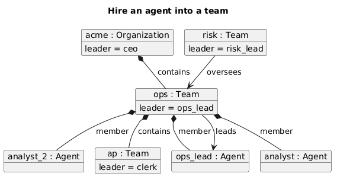

## Hire an agent whose id is taken

Risk tries to hire an 'analyst'. An agent is in exactly one team, so a second instance with the same id is refused, not merged.

| Step | Model's answer |
|---|---|
| create Agent analyst in Team risk | refused — [ids_are_unique] agent:analyst: a second agent with id 'analyst' |

Then: analyst is still only in ops.

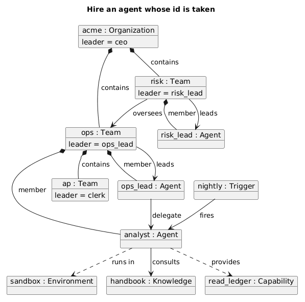

## Move an agent to another team

The analyst moves from Ops to Risk. Membership is composition: linking the part to a new whole moves it, and every association it has — its trigger, its flow, its knowledge — goes with it untouched.

| Step | Model's answer |
|---|---|
| link Team risk —member→ Agent analyst | accepted |

Then: analyst is in risk and not ops; the nightly trigger still fires analyst; ops_lead still delegates to analyst.

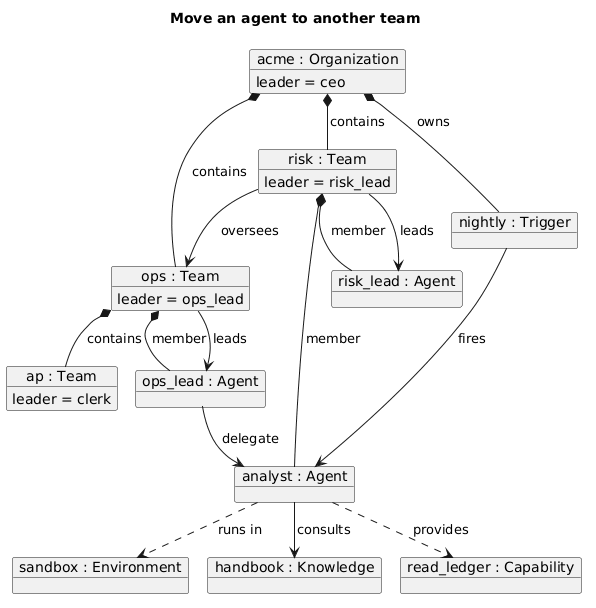

## Move a team's leader out

Ops's leader moves to Risk. The leader {subsets members}, so leaving the team ends the leadership — said as an effect, not left dangling.

| Step | Model's answer |
|---|---|
| link Team risk —member→ Agent ops_lead | accepted: 'ops_lead' no longer leads 'ops' |

Then: ops has no leader.

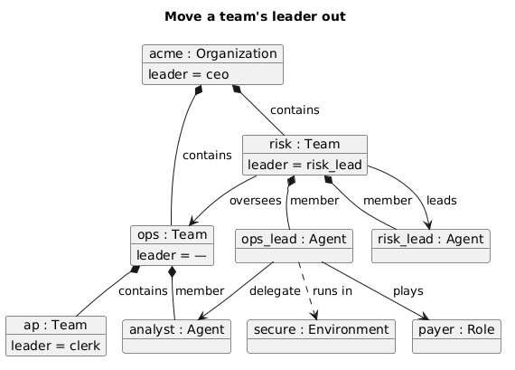

## Share one knowledge source between agents

The handbook is associated with the analyst and the risk lead. An association, not a part: one Knowledge instance, two links, and neither agent owns it.

| Step | Model's answer |
|---|---|
| link Agent risk_lead —consults→ Knowledge handbook | accepted |

Then: both agents consult the handbook; there is still one handbook.

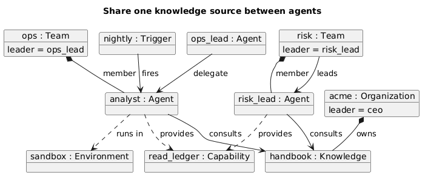

## Deploy an agent into a second environment, then undeploy

The analyst is deployed into the secure sandbox with its own network setting — a DeploymentSpecification — and later undeployed from the ordinary one.

| Step | Model's answer |
|---|---|
| deploy Agent analyst → Environment secure {network: none} | accepted |
| undeploy Agent analyst from Environment sandbox | accepted: analyst no longer runs in 'sandbox' [environments] |

Then: analyst runs only in secure, with its setting.

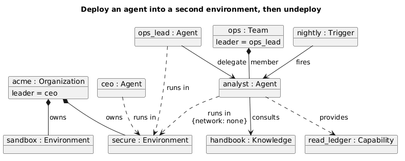

## Give an agent a sub-agent within its reach

The analyst gets a summariser that reads the ledger in its sandbox. A SubAgent is a Worker, not an Agent: a part of the analyst, run under its identity, and no wider than it.

| Step | Model's answer |
|---|---|
| create SubAgent summariser in Agent analyst {read_ledger; sandbox} | accepted |

Then: analyst owns summariser.

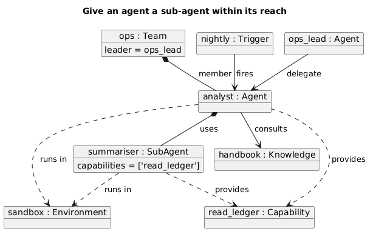

## Give a sub-agent more than its parent has

The analyst's sub-agent is given pay_supplier, which the analyst does not hold, and the secure sandbox, which it does not run in.

| Step | Model's answer |
|---|---|
| create SubAgent payer_bot {pay_supplier} in Agent analyst | refused — [subagent_within_parent] subagent:payer_bot: holds ['pay_supplier'], which its parent 'analyst' does not |
| create SubAgent vault_bot {secure} in Agent analyst | refused — [subagent_within_parent] subagent:vault_bot: runs in ['secure'], which its parent 'analyst' does not |

Then: analyst still has no sub-agents.

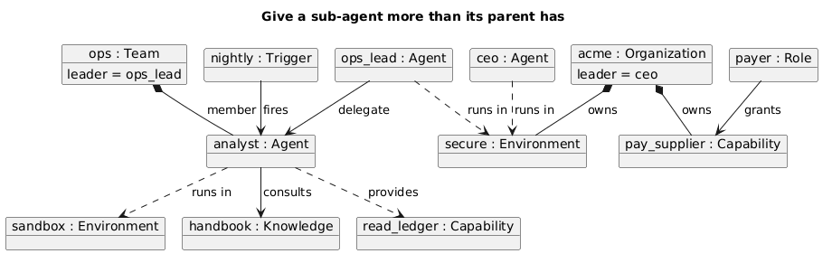

## A sub-agent may use what its parent's role grants

The ops lead holds pay_supplier only through the payer role. Its sub-agent may still use it: the parent's reach is what it holds effectively, roles included.

| Step | Model's answer |
|---|---|
| create SubAgent remitter {pay_supplier} in Agent ops_lead | accepted |

Then: ops_lead owns remitter.

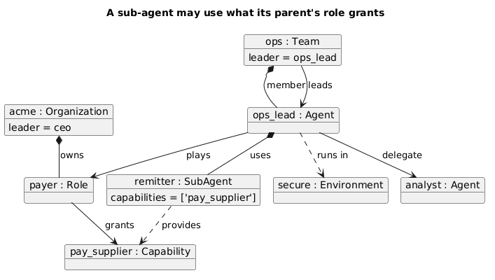

## A unit overseeing the unit that contains it

Accounts Payable, inside Ops, is set to oversee Ops. An overseer inside what it oversees is not oversight.

| Step | Model's answer |
|---|---|
| link Team ap —oversees→ Team ops | refused — [unit_links_respect_containment] unit_link:ap->ops: an overseer inside what it oversees |

Then: no link from ap.

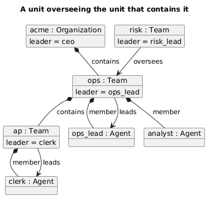

## A unit escalating to its own sub-team

Ops is set to escalate to Accounts Payable. An escalation must leave the unit, or it goes nowhere.

| Step | Model's answer |
|---|---|
| link Team ops —escalates_to→ Team ap | refused — [unit_links_respect_containment] unit_link:ops->ap: an escalation that lands in the escalating unit's own subtree |

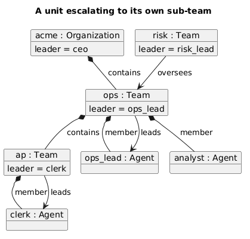

## Replace a leader, and refuse one who is not a member

Ops's leadership passes to the analyst; then Risk's lead is proposed for Ops, and refused — the leader {subsets members}.

| Step | Model's answer |
|---|---|
| set Team ops leader := analyst | accepted: 'ops_lead' no longer leads 'ops' |
| set Team ops leader := risk_lead | refused — [leader_is_member] team:ops: leader 'risk_lead' is not a member |

Then: analyst leads ops.

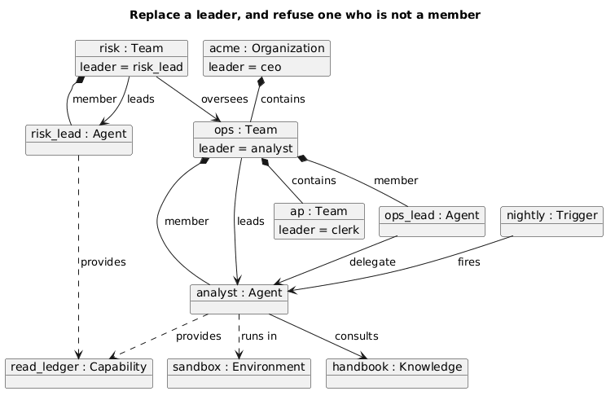

## Give one agent both halves of a separation

The ops lead may approve payments; being given release as well would let one agent do both halves of four-eyes.

| Step | Model's answer |
|---|---|
| add Decision release_payment to Agent ops_lead's mandate | refused — [separations_hold] agent:ops_lead: holds ['approve_payment', 'release_payment'], which 'four_eyes' keeps apart |

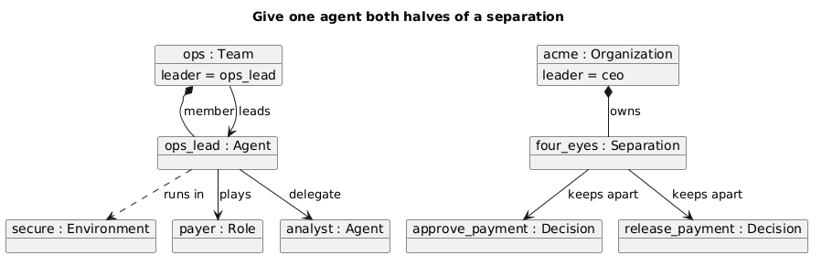

## Delete a capability that a role still grants

pay_supplier is retired. Its links are destroyed with it — the payer role no longer grants it — and the role itself survives. Narrowing is safe, so it is done and said, not refused.

| Step | Model's answer |
|---|---|
| delete Capability pay_supplier | accepted: payer no longer grants 'pay_supplier' [capabilities] |

Then: payer grants nothing; the payer role remains.

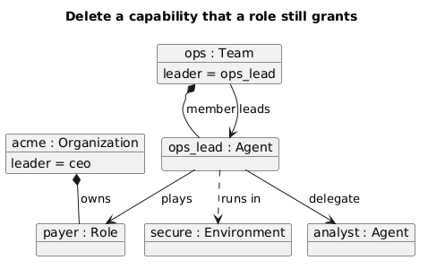

## Delete an agent a trigger must fire

Deleting the analyst is refused while the nightly trigger fires it: a trigger fires exactly one agent, so that link is not destroyed and the dangling reference names the trigger. Deleting the trigger is not enough either: month_end's first step calls the analyst, and a step that calls an agent must name one.

| Step | Model's answer |
|---|---|
| delete Agent analyst | refused — [references_resolve] trigger:nightly: fires [agent] names 'analyst', which is not a agent; [actions_name_what_they_call] action:month_end.reconcile: a agent step that names no agent |
| delete Trigger nightly | accepted |
| delete Agent analyst | refused — [actions_name_what_they_call] action:month_end.reconcile: a agent step that names no agent |

Then: analyst is still there — month_end still calls it.

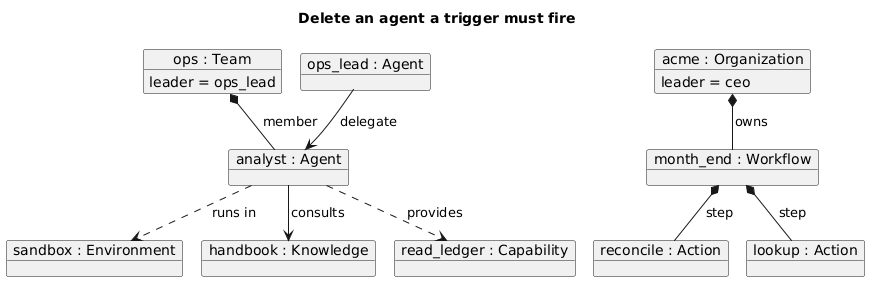

## Delete an agent nothing requires

The clerk leaves. Its team loses a member and its leader; nothing else referred to it.

| Step | Model's answer |
|---|---|
| delete Agent clerk | accepted: 'clerk' no longer leads 'ap' |

Then: clerk is gone; ap has no leader.

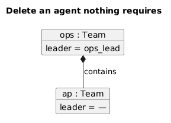

## Delete a tool a workflow step calls

Deleting ledger_lookup would leave month_end's lookup step calling nothing, so it is refused and names the step.

| Step | Model's answer |
|---|---|
| delete Tool ledger_lookup | refused — [actions_name_what_they_call] action:month_end.lookup: a tool step that names no tool |

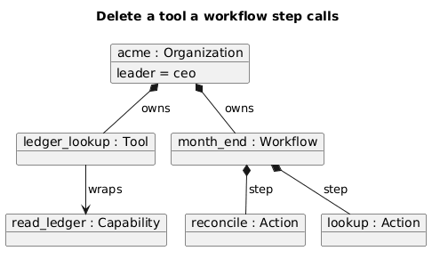

## A policy about a role, and one about nobody

A deny on the ledger for the payer role is accepted: a Role is a Principal and a DataClass a Resource. One naming a subject that does not exist is refused.

| Step | Model's answer |
|---|---|
| create Policy no_ledger_for_payers {deny payer → ledger} | accepted |
| create Policy ghost_rule {deny ghost} | refused — [references_resolve] policy:ghost_rule: applies to [subjects] names 'ghost', which is not a principal |

Then: the deny is added and the ghost is not.

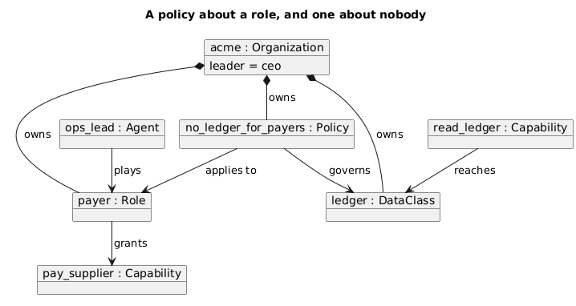

## A separation that keeps one decision apart

A separation keeps two or more decisions apart; one naming a single decision separates nothing.

| Step | Model's answer |
|---|---|
| create Separation lonely {approve_payment} | refused — [multiplicities_hold] separation:lonely: keeps apart [decisions] holds 1; 2..* required |

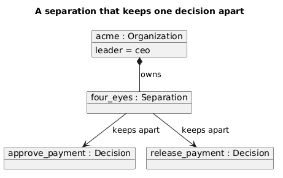

## Name a successor, and refuse an agent as its own

The analyst stands in for the ops lead; the ops lead cannot stand in for itself.

| Step | Model's answer |
|---|---|
| set Agent ops_lead successor := analyst | accepted |
| set Agent analyst successor := analyst | refused — [no_self_successor] agent:analyst: its own successor |

Then: ops_lead's successor is analyst.

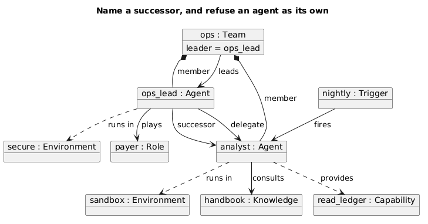

## Stop the organisation being a placement boundary

Every agent must have exactly one placement; the root always declares one, so it cannot be switched off.

| Step | Model's answer |
|---|---|
| set Organization acme placement := false | refused — [root_places] organization:acme: the organisation must declare placement (ADR-0069) |

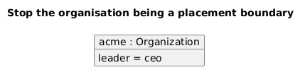

## A workflow edge to a step that does not exist

month_end is given an edge from lookup to a step nobody declared.

| Step | Model's answer |
|---|---|
| add ControlFlow lookup → publish to Workflow month_end | refused — [control_flow_ends] workflow:month_end: an edge lookup→publish names 'publish', which is not a step |

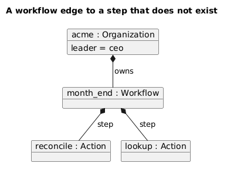

## A flow from an agent to itself

The analyst is set to consult itself. A flow joins two agents.

| Step | Model's answer |
|---|---|
| link Agent analyst —consult→ Agent analyst | refused — [flows_join_two_agents] flow:analyst->analyst: an agent in a flow with itself |

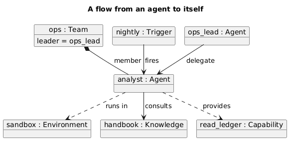
